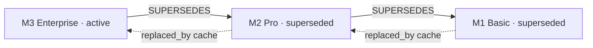
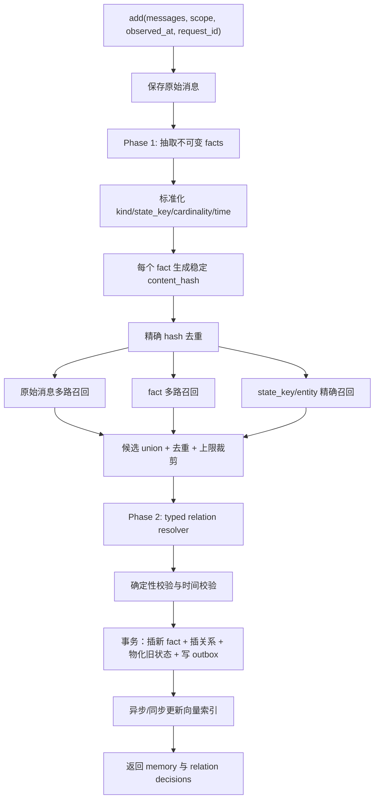

# ADD-only 记忆系统的 Supersede 双向关联落地方案

> 版本：v1.0
>
> 日期：2026-08-13
>
> 适用对象：当前采用 single-pass、ADD-only fact extraction 的长期记忆系统
>
> 设计目标：保持事实正文不可变，同时可靠表达新旧状态演化、当前事实视图、历史回溯和关系撤销

## 1. 结论先行

针对当前 ADD-only 管线，建议采用“**不可变事实节点 + 单向权威关系边 + 双向物化视图**”，而不是实现传统双向链表。

权威关系只保存一次：

```text
new_memory_id --SUPERSEDES--> old_memory_id
```

双向读取通过投影实现：

```text
旧侧：old.replaced_by = new.id        # 快速读取缓存
新侧：new.supersedes = [old.id, ...]  # 从关系表查询或缓存
```

核心原则：

1. `memory_relation` 是唯一事实来源；
2. `old.replaced_by` 只是可重建的物化字段，不允许业务直接写；
3. 新事实始终创建新的 memory ID，不覆盖旧正文；
4. 更新旧记忆的生命周期元数据不违反 ADD-only；ADD-only 约束的是事实内容，而不是索引和状态永远不可变；
5. 写入候选必须使用“原始消息召回 ∪ 抽取 fact 召回 ∪ state_key/entity 精确召回”，避免只用一个 Top-K 造成漏链；
6. 关系解析必须区分 `RELATED`、`CONTINUES`、`SUPERSEDES`、`RETRACTS`、`MERGES_INTO` 和 `CONTRADICTS`；
7. `latest_only` 根据生命周期投影过滤，而不是让回答模型在新旧矛盾中临场猜测；
8. 所有关系写入、旧状态更新和 outbox 事件必须在一个数据库事务内完成；
9. 显式提供 `undo_relation`，不要用“删除新节点”隐式撤销 Supersede；
10. 第一阶段只对白名单单值状态槽自动 Supersede，其余关系先 shadow 记录。

推荐最终形态：



## 2. 当前 ADD-only 管线的具体缺口

当前 OSS 风格管线大致是：

```text
原始消息
→ 原始消息 embedding 召回 Top 10 旧记忆
→ 单次 LLM 抽取新 facts，并输出可选 linked_memory_ids
→ 新 facts 批量 embedding
→ 对召回候选做 exact hash 去重
→ 向量库批量插入新 memory
→ 写 ADD history
→ entity linking
```

现有实现已经具备两个基础：

- 将候选旧记忆 UUID 映射成短 ID，降低模型生成错误 ID 的风险；
- Prompt 要求新 fact 输出 `linked_memory_ids`。

但写入代码目前没有真正消费这两个结果：

```text
uuid_mapping 创建后未用于关系落库
extracted_memory.linked_memory_ids 未进入 memory payload 或关系存储
所有返回事件仍然只有 ADD
```

关键位置：

- 候选召回与 UUID 映射：[`main.py#L879-L894`](https://github.com/mem0ai/mem0/blob/739534c0a3232e4b5ae6b4349ae4e50fc00df614/mem0/memory/main.py#L879-L894)
- LLM 抽取：[`main.py#L896-L940`](https://github.com/mem0ai/mem0/blob/739534c0a3232e4b5ae6b4349ae4e50fc00df614/mem0/memory/main.py#L896-L940)
- 新记录构造：[`main.py#L961-L999`](https://github.com/mem0ai/mem0/blob/739534c0a3232e4b5ae6b4349ae4e50fc00df614/mem0/memory/main.py#L961-L999)
- 批量持久化：[`main.py#L1001-L1040`](https://github.com/mem0ai/mem0/blob/739534c0a3232e4b5ae6b4349ae4e50fc00df614/mem0/memory/main.py#L1001-L1040)
- Prompt 中的 Memory Linking：[`prompts.py#L692-L701`](https://github.com/mem0ai/mem0/blob/739534c0a3232e4b5ae6b4349ae4e50fc00df614/mem0/configs/prompts.py#L692-L701)

因此，当前最小修复不是修改 Prompt，而是补齐：

```text
link ID 还原
→ link 安全校验
→ typed relation 分类
→ 关系落库
→ 生命周期事务更新
→ 读路径过滤
→ 撤销与审计
```

## 3. ADD-only 的边界定义

ADD-only 不应被理解成“数据库中任何字段都不可修改”。建议定义为：

### 3.1 不可变内容

以下字段写入后不可原地修改：

```text
memory.id
memory.text
memory.normalized_fact
memory.source_message_ids
memory.observed_at
memory.content_hash
```

如果事实文本抽错，创建一个新事实并建立 `RETRACTS` 或 `CORRECTS` 关系，而不是修改旧正文。

### 3.2 可变系统投影

以下属于状态、索引和服务缓存，可以事务化更新：

```text
lifecycle_state
replaced_by
valid_to
relation_revision
index_status
last_retrieved_at
retrieval_count
```

这个区分非常重要：

```text
旧事实正文不变       → 保留历史证据
旧事实当前状态改变   → 防止污染当前回答
```

## 4. 关系模型：不是双向链表，而是有类型关系图

### 4.1 关系方向

所有生命周期关系统一采用“新事实指向旧事实”：

```text
source_memory_id = new
target_memory_id = old
```

例如：

```text
M2(plan=Pro) --SUPERSEDES--> M1(plan=Basic)
```

原因：

- 一条新事实可以同时取代多条旧事实；
- `delete_linked`、chain audit 和 provenance 都自然从新向旧遍历；
- 旧侧 `replaced_by` 可以由入边唯一投影；
- 后续可扩展 `MERGES_INTO`、`RETRACTS`、`SUPPORTS` 等关系。

### 4.2 关系类型

建议第一版至少支持：

| relation_type | 含义 | 是否改变旧生命周期 | 是否进入 delete-chain |
| --- | --- | ---: | ---: |
| `SUPERSEDES` | 旧状态过去成立，新状态从某时开始取代它 | 是：`superseded` | 是 |
| `RETRACTS` | 旧事实从源头就是错的 | 是：`retracted` | 可配置，默认否 |
| `MERGES_INTO` | 语义重复或新节点被 canonical 节点吸收 | 是：`merged` | 否 |
| `RELATED` | 同实体/主题，但不是版本更新 | 否 | 否 |
| `CONTINUES` | 后续事件或叙事延续 | 否 | 否 |
| `CONTRADICTS` | 存在冲突但证据不足以裁决 | 可选：`disputed` | 否 |
| `SUPPORTS` | 新证据支持旧事实 | 否 | 否 |

不要用一个无类型 `linked_memory_ids` 数组承担所有语义。它可以继续作为 LLM 的候选输出，但必须在持久化前转换成 typed relation。

### 4.3 链、分叉和多边

理想单值槽形成线性链：

```text
M3 → M2 → M1
```

但通用关系必须允许一对多：

```text
M4: 用户家庭和邮寄地址都迁到杭州
  ├── SUPERSEDES → M1: 家庭地址在上海
  └── SUPERSEDES → M2: 邮寄地址在上海
```

第一版建议禁止“一个旧节点同时被两个 active 新节点 primary-supersede”。如果并发产生两个后继，转为 `CONTRADICTS/DISPUTED`，不要静默最后写入覆盖。

## 5. 推荐数据模型

### 5.1 `memory`：事实内容表

如果现有事实只在向量库，建议逐步引入关系型 System of Record；向量库降为检索索引。

```sql
CREATE TABLE memory (
  id                    uuid PRIMARY KEY,
  tenant_id             text NOT NULL,
  owner_type            text NOT NULL,
  owner_id              text NOT NULL,
  run_id                text,

  text                  text NOT NULL,
  normalized_fact       jsonb,
  content_hash          text NOT NULL,
  memory_kind           text NOT NULL DEFAULT 'UNKNOWN',
  state_key             text,
  cardinality           text,          -- single / set / timeline

  observed_at           timestamptz,
  valid_from            timestamptz,
  valid_to              timestamptz,
  ingested_at           timestamptz NOT NULL,

  lifecycle_state       text NOT NULL DEFAULT 'active',
  replaced_by           uuid,
  relation_revision     bigint NOT NULL DEFAULT 0,
  index_status          text NOT NULL DEFAULT 'pending',

  source_message_ids    jsonb NOT NULL,
  extraction_model      text,
  extraction_version    text,
  extraction_confidence double precision,
  metadata              jsonb NOT NULL DEFAULT '{}'
);
```

索引：

```sql
CREATE INDEX idx_memory_scope_state
  ON memory (tenant_id, owner_type, owner_id, state_key, lifecycle_state);

CREATE INDEX idx_memory_replaced_by ON memory (replaced_by);
CREATE INDEX idx_memory_validity ON memory (valid_from, valid_to);

CREATE UNIQUE INDEX uq_memory_scope_hash
  ON memory (tenant_id, owner_type, owner_id, content_hash)
  WHERE lifecycle_state <> 'deleted';
```

### 5.2 `memory_relation`：唯一权威关系表

```sql
CREATE TABLE memory_relation (
  id                    uuid PRIMARY KEY,
  tenant_id             text NOT NULL,
  owner_type            text NOT NULL,
  owner_id              text NOT NULL,

  source_memory_id      uuid NOT NULL REFERENCES memory(id),
  target_memory_id      uuid NOT NULL REFERENCES memory(id),
  relation_type         text NOT NULL,
  is_primary            boolean NOT NULL DEFAULT false,

  confidence            double precision,
  reason_code           text,
  explanation           text,
  evidence_message_ids  jsonb NOT NULL,
  resolver_model        text,
  resolver_version      text NOT NULL,

  created_at            timestamptz NOT NULL,
  invalidated_at        timestamptz,
  invalidated_by        text,

  CHECK (source_memory_id <> target_memory_id)
);

CREATE UNIQUE INDEX uq_relation_active
  ON memory_relation (source_memory_id, target_memory_id, relation_type)
  WHERE invalidated_at IS NULL;

CREATE INDEX idx_relation_from
  ON memory_relation (source_memory_id, relation_type)
  WHERE invalidated_at IS NULL;

CREATE INDEX idx_relation_to
  ON memory_relation (target_memory_id, relation_type)
  WHERE invalidated_at IS NULL;
```

对白名单单值槽，可以增加一个活跃 primary 后继约束：

```sql
CREATE UNIQUE INDEX uq_one_primary_successor
  ON memory_relation (target_memory_id)
  WHERE relation_type = 'SUPERSEDES'
    AND is_primary = true
    AND invalidated_at IS NULL;
```

### 5.3 `memory_resolution_run`：解析审计

```sql
CREATE TABLE memory_resolution_run (
  id                    uuid PRIMARY KEY,
  request_id            text NOT NULL,
  new_memory_id         uuid,
  candidate_ids         jsonb NOT NULL,
  decision_payload      jsonb,
  status                text NOT NULL,
  resolver_version      text NOT NULL,
  latency_ms            integer,
  token_usage           jsonb,
  error_code            text,
  created_at            timestamptz NOT NULL
);
```

用途：离线评估、坏例回放、模型升级对比和错误关系撤销。

### 5.4 `outbox`：数据库与向量索引一致性

```sql
CREATE TABLE memory_outbox (
  id                    uuid PRIMARY KEY,
  aggregate_id          uuid NOT NULL,
  event_type            text NOT NULL,
  payload               jsonb NOT NULL,
  created_at            timestamptz NOT NULL,
  processed_at          timestamptz,
  retry_count           integer NOT NULL DEFAULT 0
);
```

关系数据库是 System of Record，向量库 payload 是服务索引。通过 outbox 更新：

```text
UPSERT_MEMORY_VECTOR
UPDATE_LIFECYCLE_PAYLOAD
REMOVE_FROM_CURRENT_INDEX
REBUILD_RELATION_CACHE
```

## 6. 写入全流程

推荐版将当前 single-pass 管线改成“两阶段推理 + 一次事务提交”。



### 6.1 Phase 1：只抽取新 facts

Extractor 不负责选择旧 ID，只输出来源明确的结构化事实：

```json
{
  "facts": [
    {
      "text": "用户自 2026-08-01 起的当前订阅套餐是 Pro",
      "subject": "user:u123",
      "predicate": "subscription.current_plan",
      "object": "Pro",
      "memory_kind": "STATE",
      "state_key": "user:u123:subscription.current_plan",
      "cardinality": "single",
      "valid_from": "2026-08-01T00:00:00Z",
      "transition_from": "Basic",
      "correction_mode": "state_change",
      "evidence_message_ids": ["msg-88"]
    }
  ]
}
```

关键要求：

- `text` 必须自包含；
- `state_key` 尽量来自受控 ontology，不完全交给模型自由生成；
- 区分 `state_change` 与 `factual_correction`；
- relative time 必须以 `observed_at` 解析；
- 保留 evidence message IDs 和原文 span；
- 一次消息抽取多个 fact 时，每个 fact 独立解析关系。

### 6.2 精确去重

先执行确定性去重：

```python
content_hash = sha256(normalize(text, normalized_fact, scope))
```

若 scope 内已有相同活跃或历史节点：

- 完全相同且无新 provenance：返回 NOOP；
- 完全相同但需要保留新来源：只新增 evidence/source relation，不新增 memory；
- 文本不同但结构化三元组相同：交给 Resolver 判断 `MERGES_INTO`。

### 6.3 候选召回：三路 union

不要复刻只用原始消息 Top 10 的弱点。推荐：

```text
C_raw   = hybrid_search(raw_messages, top_k=20)
C_fact  = hybrid_search(extracted_fact.text, top_k=20)
C_slot  = exact_lookup(scope, state_key, active + recent historical, limit=20)
C_ent   = entity_lookup(subject/predicate/object, limit=20)

C = dedupe(C_raw ∪ C_fact ∪ C_slot ∪ C_ent)
```

裁剪前先保证：

```text
所有同 state_key active heads 必须保留
明确 transition_from 匹配项必须保留
exact entity + predicate 匹配项必须保留
```

再按融合分数裁剪到 Resolver 可承受的上限，例如 40 条。

候选分数示意：

```text
score = 0.35 * semantic
      + 0.20 * bm25
      + 0.20 * entity_match
      + 0.20 * state_key_match
      + 0.05 * recency
```

这些权重必须通过坏例集校准，不应写死为最终值。

### 6.4 Phase 2：Typed Relation Resolver

Resolver 输入：

```text
new fact structured JSON
new fact evidence spans / raw source messages
candidate old memories
candidate lifecycle + state_key + validity
observation time
relation policy
```

输出严格 JSON：

```json
{
  "decisions": [
    {
      "old_memory_id": "M1",
      "relation_type": "SUPERSEDES",
      "confidence": 0.97,
      "reason_code": "SAME_SINGLE_VALUE_STATE_CHANGED",
      "same_state_key": true,
      "old_was_true": true,
      "effective_at": "2026-08-01T00:00:00Z",
      "explanation": "The current subscription changed from Basic to Pro."
    }
  ]
}
```

Resolver 必须同时读取 structured fact 和原始 evidence，但不得从 raw message 生成候选列表之外的 memory ID。

### 6.5 确定性校验

LLM 输出不能直接写库。必须校验：

```text
old_memory_id 在 candidate whitelist 中
新旧 memory 属于同 tenant/owner scope
不能 self-link
关系类型在 enum 中
confidence 合法
SUPERSEDES 只允许单值或明确变化的状态
EVENT 默认不能 supersede 另一个 EVENT
set 类型默认并存，除非明确 remove/retract
时间顺序合理
不会形成 supersede cycle
每个新 fact 的关系数不超过上限
```

建议自动执行阈值：

| 条件 | 行为 |
| --- | --- |
| `state_key` 精确一致、single、置信度 ≥ 0.90 | 自动 SUPERSEDES |
| 置信度 0.70–0.90 | 保存 CONTRADICTS/DISPUTED，进入 shadow 或复核 |
| 无 state_key 但 transition_from 精确匹配、置信度 ≥ 0.95 | 自动 SUPERSEDES |
| 其他 | 两者保持 active，仅保存 RELATED/CONTINUES 或不建边 |

阈值应配置化并按 memory kind 分桶。

## 7. 事务写入算法

### 7.1 基本事务

```python
def commit_fact_and_relations(new_fact, decisions, request_id):
    with db.transaction(isolation="serializable"):
        assert_idempotent_request(request_id)

        new_id = insert_immutable_memory(new_fact)

        target_ids = sorted(d.old_memory_id for d in decisions)
        old_rows = lock_memories_for_update(target_ids)

        validated = revalidate_against_locked_rows(new_fact, decisions, old_rows)

        for decision in validated:
            relation_id = insert_relation(
                source_memory_id=new_id,
                target_memory_id=decision.old_memory_id,
                relation_type=decision.relation_type,
                confidence=decision.confidence,
                reason_code=decision.reason_code,
            )

            if decision.relation_type == "SUPERSEDES":
                materialize_superseded(
                    old_id=decision.old_memory_id,
                    replaced_by=new_id,
                    valid_to=decision.effective_at,
                )
            elif decision.relation_type == "RETRACTS":
                materialize_retracted(old_id=decision.old_memory_id)

        write_resolution_audit(request_id, new_id, validated)
        write_outbox_events(new_id, target_ids)

    return new_id
```

### 7.2 幂等性

至少提供两层幂等：

```text
request_id 唯一：同一次 add 重试不会新增第二批 fact
scope + content_hash 唯一：相同 fact 不重复创建
relation unique index：同一边不重复插入
```

批量消息需要稳定的 `fact_key`：

```text
fact_key = hash(request_id + evidence_message_ids + normalized_fact)
```

### 7.3 并发写入

并发输入：

```text
当前 Basic
请求 A：改成 Pro
请求 B：改成 Enterprise
```

不能让 A、B 都静默将 Basic 标为自己的 predecessor。建议：

1. 按 `scope + state_key` 获取 advisory lock，或锁定当前 active head；
2. 在事务内重新读取 head；
3. 比较 `observed_at`，不是比较处理完成时间；
4. 同一有效时间出现互斥值时建立 `CONTRADICTS` 并标 `disputed`；
5. 不允许 last-write-wins 静默裁决事实真伪。

### 7.4 乱序到达

例子：

```text
先收到 3 月 Enterprise
后收到 2 月 Pro
数据库已有 1 月 Basic
```

正确时间线应插链：

```text
Enterprise → Pro → Basic
```

算法：

1. 按 `state_key + valid_from` 找 predecessor 和 successor；
2. 新节点指向 predecessor；
3. successor 原来指向 predecessor 的边失效；
4. successor 新增指向新节点的边；
5. 重新物化 `replaced_by` 和 `valid_to`；
6. 所有变更在同一事务中完成。

MVP 如果不实现插链，至少检测乱序并进入人工/异步 reconcile，不得用 ingestion time 错排。

## 8. 双向投影与一致性

### 8.1 唯一事实来源

```text
memory_relation 是权威
memory.replaced_by 是缓存
new.supersedes 是查询结果或缓存
```

禁止：

```text
业务直接写 old.replaced_by
业务直接写 new.linked_memory_ids
两个字段分别更新、没有共同事务
```

### 8.2 `replaced_by` 重建

```sql
SELECT source_memory_id
FROM memory_relation
WHERE target_memory_id = :old_id
  AND relation_type = 'SUPERSEDES'
  AND is_primary = true
  AND invalidated_at IS NULL;
```

定期一致性检查：

```text
old.replaced_by 是否等于权威 primary 入边 source
superseded 节点是否存在有效 SUPERSEDES 入边
active 节点是否错误持有 replaced_by
是否有关系指向不存在/已硬删除节点
是否存在 cycle
同一 single state_key 是否有多个 active head
```

### 8.3 向量库 payload

为提高搜索过滤性能，可以在向量 payload 中镜像：

```json
{
  "lifecycle_state": "superseded",
  "replaced_by": "M2",
  "relation_revision": 17
}
```

但该 payload 不是权威数据。搜索结果返回前，按风险选择：

- 普通场景：直接信任 payload，提高速度；
- 高价值场景：批量回表校验 lifecycle；
- `relation_revision` 落后时：回表并异步修复索引。

## 9. 读取与召回设计

### 9.1 三种读取视图

| 视图 | 过滤规则 | 用途 |
| --- | --- | --- |
| `current` | active + disputed policy | 当前用户画像、Agent prompt |
| `history` | active + superseded + retracted | 审计、事实演化 |
| `as_of(t)` | `valid_from <= t < valid_to` | 时间问答 |

API 建议：

```http
GET  /memories/{id}?include_relations=true
POST /memories/search { "view": "current" }
POST /memories/search { "view": "history" }
POST /memories/search { "view": "as_of", "reference_time": "..." }
GET  /memories/{id}/relations
GET  /memories/{id}/chain
```

单条 GET 返回：

```json
{
  "id": "M1",
  "memory": "User's plan was Basic",
  "lifecycle_state": "superseded",
  "replaced_by": "M2",
  "supersedes": [],
  "relations": [
    {
      "direction": "incoming",
      "type": "SUPERSEDES",
      "memory_id": "M2"
    }
  ]
}
```

新节点返回：

```json
{
  "id": "M2",
  "memory": "User's current plan is Pro",
  "lifecycle_state": "active",
  "replaced_by": null,
  "supersedes": ["M1"]
}
```

### 9.2 当前事实召回

推荐顺序：

```text
向量/BM25/entity 候选
→ lifecycle current filter
→ state_key 分组
→ 每组选择 current head
→ temporal rerank
→ evidence-aware rerank
→ prompt compression
```

不要只在最终 prompt 层让 LLM 看见新旧两条后自己判断。

### 9.3 历史与时间问答

对于“之前是什么”“什么时候改变”类问题：

```text
查询 current head
→ 沿 SUPERSEDES 边向旧遍历
→ 结合 valid_from/valid_to 排序
→ 返回带来源的时间线
```

## 10. 删除、撤销和纠错

### 10.1 不要用删除代替关系撤销

显式提供：

```http
POST /memory-relations/{relation_id}/invalidate
POST /memories/{id}/undo-supersede
DELETE /memories/{id}?mode=node_only
DELETE /memories/{id}?mode=purge_superseded_chain
```

语义：

- `invalidate relation`：撤销错误边，重新计算旧节点生命周期；
- `node_only`：删除节点，但必须同步处理相关边，禁止悬空引用；
- `purge_superseded_chain`：沿 `SUPERSEDES` 权威边递归硬删除或软删除；
- `RETRACTS`：表示旧事实从来不对，不应伪装成普通状态变化。

### 10.2 撤销算法

撤销 M2→M1：

1. 锁定 relation、M1、M2 和相同 state_key head；
2. 将 relation 标记 `invalidated_at`；
3. 检查 M1 是否还有其他有效 primary supersede 入边；
4. 若没有，依据时间线和业务规则恢复 M1 为 active，或保持 historical；
5. 重建 `replaced_by/valid_to`；
6. 写审计和 outbox；
7. 更新向量索引。

所有步骤必须在事务内完成，避免出现 `replaced_by` 指向已删除节点。

## 11. 快速版与推荐版

### 11.1 快速版：在当前单次 LLM 管线后补关系落库

适合 1–2 周验证。

改动：

1. 读取 `extracted_memory.linked_memory_ids`；
2. 用 `uuid_mapping` 还原为真实 UUID；
3. 严格 whitelist 校验；
4. 对每个候选 pair 运行轻量 typed classifier；
5. 新增 `memory_relation` 和 `memory_lifecycle` store；
6. 新 memory 插入后事务写 relation 和旧状态；
7. 搜索增加 `latest_only/current view`；
8. 增加 chain inspect 和 relation invalidate。

优点：

- 改动小；
- 保留一次主要 LLM 调用；
- 可以快速收集 shadow decisions。

缺点：

- 仍受原始消息 Top-K 漏召回影响；
- Prompt 中的 link 是宽泛关系，需要额外 classifier；
- 向量库和关系库的一致性改造仍不可省略。

### 11.2 推荐版：抽取与关系解析解耦

适合正式生产。

```text
Call 1: fact extraction
→ 双路/多路 candidate retrieval
→ Call 2: batch typed relation resolution
→ transaction commit
```

可以通过以下方式控制成本：

- 无历史候选或 exact duplicate 时跳过 Resolver；
- state_key 精确一致的简单规则先行；
- 一次 Resolver 批量处理同一 add 中所有新 facts；
- 低风险 EVENT 只做 related，不调用复杂 Resolver；
- 结果缓存按 fact/candidate hashes + resolver_version 命中。

## 12. 代码结构建议

```text
mem0/
  memory/
    main.py                       # ADD-only orchestration
    relation_models.py            # relation/lifecycle schemas
    relation_store.py             # authoritative relation CRUD
    relation_resolver.py          # prompt + parsing + validation
    candidate_retriever.py        # raw/fact/state/entity union
    lifecycle_service.py          # transaction + projections
    lifecycle_reconciler.py       # repair/rebuild
    outbox_worker.py               # vector payload sync
  configs/
    relation_prompts.py
  migrations/
    00xx_memory_relations.sql
```

建议接口：

```python
class CandidateRetriever:
    def retrieve_for_fact(self, fact, raw_messages, scope) -> list[Candidate]: ...

class RelationResolver:
    def resolve_batch(self, facts, candidates, evidence) -> list[Decision]: ...

class RelationStore:
    def insert(self, relation: MemoryRelation) -> None: ...
    def incoming(self, memory_id, relation_type=None): ...
    def outgoing(self, memory_id, relation_type=None): ...
    def invalidate(self, relation_id, actor, reason): ...
    def traverse_older(self, memory_id, relation_type="SUPERSEDES"): ...

class LifecycleService:
    def commit_add(self, facts, decisions, request_id): ...
    def undo_relation(self, relation_id, actor, reason): ...
    def rebuild_projection(self, memory_ids): ...
```

## 13. 分阶段实施计划

### Phase 0：Schema 与可观测性，1 周

- 建 `memory_relation`、`resolution_run`、outbox；
- 给现有 memory 增加 lifecycle projection；
- 不改变线上检索；
- 记录 candidate recall、LLM link 和最终 decision。

验收：所有 ADD 行为保持兼容，关系层可独立关闭。

### Phase 1：Shadow Resolver，1–2 周

- 运行双路候选召回；
- Resolver 只记录，不修改 lifecycle；
- 构建 200–500 个真实 badcase 标注集；
- 统计 precision/recall、漏召回和错误关系类型。

验收建议：

```text
SUPERSEDES precision ≥ 98%
白名单单值槽 recall ≥ 90%
跨用户错误关联 = 0
cycle = 0
```

### Phase 2：高置信度自动 Supersede，1 周

仅开放：

```text
current subscription
current residence
current employer/role
明确 current configuration
明确 from→to transition
```

要求：精确 state_key、single cardinality、置信度 ≥ 0.90。

检索端先提供 opt-in `view=current`，默认行为不变。

### Phase 3：双视图与撤销，1–2 周

- current/history/as_of；
- chain inspection；
- relation invalidation；
- lifecycle reconciliation；
- Dashboard 或内部审核工具。

### Phase 4：默认 current view 与扩大类型

在 shadow 指标稳定后：

- Agent prompt 默认 current；
- 扩展 preference、relationship、plan；
- EVENT 仍默认 append-only；
- 逐步处理 disputed 和乱序插链。

### Phase 5：历史回填

不要直接对全量历史自动建高风险边。流程：

```text
按 scope + state_key/entity 分桶
→ 时间排序
→ 离线候选解析
→ 高置信度 shadow
→ 抽样审核
→ 分批提交 relation
→ rebuild lifecycle projection
```

每批必须可回滚。

## 14. 测试矩阵与验收标准

### 14.1 关系语义测试

| 旧事实 | 新事实 | 预期 |
| --- | --- | --- |
| plan=Basic | plan=Pro | SUPERSEDES |
| lives=Shanghai | moved to Hangzhou | SUPERSEDES |
| owns dog Max | Max vaccinated | RELATED/CONTINUES，双方 active |
| likes coffee | also likes tea | 双方 active |
| visited Paris in 2024 | visited Tokyo in 2025 | 两个 EVENT，双方 active |
| lives=Shanghai | never lived in Shanghai | RETRACTS |
| birthday=A | birthday=B，证据不足 | CONTRADICTS/DISPUTED |

### 14.2 候选召回测试

必须覆盖已经在 Mem0 黑盒实验中暴露的情形：

```text
raw query 目标排名 > K
fact query 目标排名 <= K
→ union 后必须包含目标旧记忆
```

另外覆盖：

- BM25 命中但 embedding 不命中；
- embedding 命中但无共享词；
- state_key 精确命中；
- 同名不同实体；
- 1 万条、100 万条 scope 噪声；
- Top-K 边界第 K/K+1。

### 14.3 一致性测试

```text
relation 存在 → replaced_by 正确
relation 撤销 → replaced_by 重建
删除 source → 不留悬空 target.replaced_by
delete chain → 只遍历 SUPERSEDES，不遍历 RELATED
vector payload revision 落后 → 回表并修复
事务失败 → memory/relation/lifecycle 不出现半提交
outbox 重试 → 幂等
```

### 14.4 并发测试

- 两个新值同时 supersede 同一旧值；
- 同一 request 重试；
- 两个 worker 重复消费 outbox；
- 删除与 supersede 同时发生；
- undo 与新 supersede 同时发生；
- 乱序事实插入时间线；
- 多条旧事实被一个新 fact supersede。

### 14.5 召回答案测试

至少测：

```text
现在是什么？ → current head
之前是什么？ → predecessor
何时发生变化？ → transition timestamp + evidence
用户从未有过旧状态 → retracted 不作为历史真相回答
关系 disputed → 回答中表达不确定性
```

## 15. 监控指标

写入质量：

```text
candidate_recall_by_route
resolver_relation_type_count
auto_supersede_rate
disputed_rate
no_relation_rate
exact_dedup_rate
relation_precision_sampled
```

一致性：

```text
dangling_replaced_by_count
projection_mismatch_count
supersede_cycle_count
multiple_active_head_count
outbox_lag_seconds
vector_revision_lag
```

业务效果：

```text
current_query_stale_answer_rate
historical_query_loss_rate
memory_prompt_conflict_rate
manual_undo_rate
resolver_badcase_rate
```

建议对每个自动关系保留：

```text
candidate set
model decision
reason code
confidence
evidence messages
resolver version
final policy action
```

## 16. 失败策略

关系解析失败时必须 fail open：

```text
新 fact 仍按 ADD-only 写入 active
旧 fact 不自动降级
记录 resolution_failed
进入异步重试或离线 reconcile
```

不要因为关系服务故障丢失新记忆，也不要在低置信度时自动隐藏旧事实。

向量索引更新失败：

```text
DB 事务仍是权威
index_status=pending
outbox 重试
高价值查询回表校验
```

## 17. 最终建议

当前 ADD-only 最适合按以下顺序落地：

```text
第一步：把 relation table 和审计建起来，先 shadow
第二步：fact 抽取后增加第二路召回，和 raw 候选做 union
第三步：只对白名单 single state_key 自动 SUPERSEDES
第四步：用事务同时写 new→old 边和 old.replaced_by 投影
第五步：上线 current/history/as_of 三种视图
第六步：上线显式 relation undo 和一致性 reconciler
```

最重要的三个工程选择：

1. **不要维护两份权威指针。** 关系表是唯一真相，双向字段只是投影；
2. **不要只用原始消息 Top-K。** 原始消息、fact、state_key/entity 候选必须 union；
3. **不要把文本 UPDATE 当作关系修复。** 事实不可变，错误关系通过 invalidate/undo 修复。

这套方案保留了 ADD-only 的历史完整性，同时把“当前真相”从不稳定的召回排序问题，提升为可查询、可审计、可撤销、可事务化的数据关系问题。

## 18. 相关文档

- [Mem0 商业版 Supersede 实现全流程与实验取证](./Mem0商业版Supersede实现全流程与实验取证_2026-08.md)
- [Dream Supersede 记忆冲突解决与召回设计](./Dream-Supersede记忆冲突解决与召回设计_2026-08.md)
- [Mem0 商业版 Supersede 冲突解决机制调研](./Mem0商业版Supersede冲突解决机制调研_2026-08.md)
