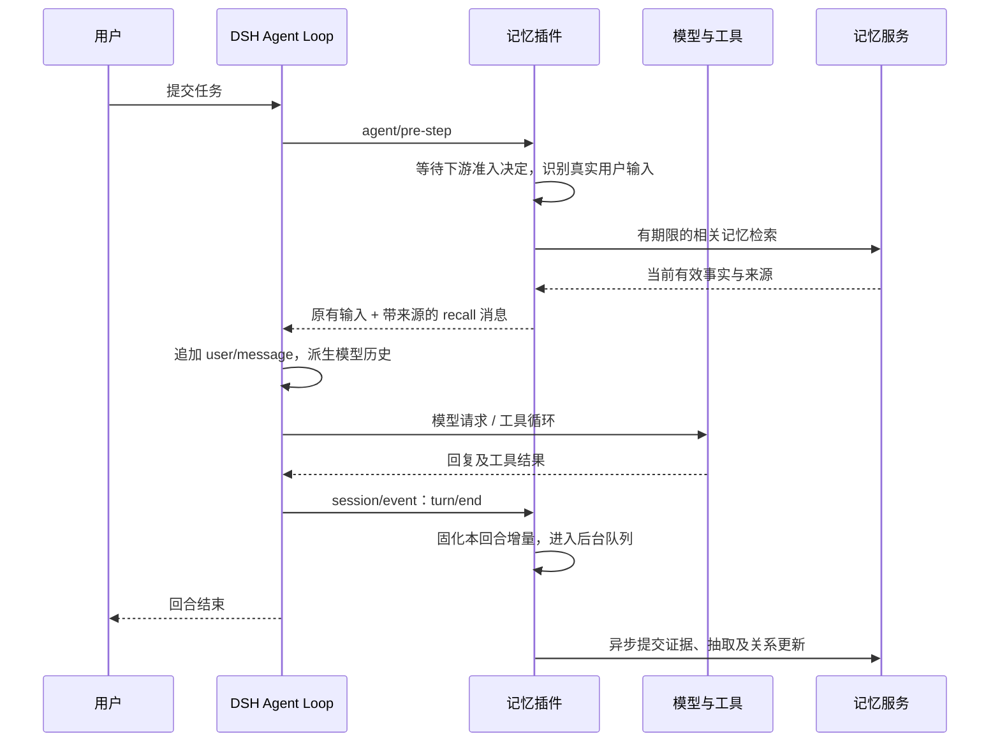
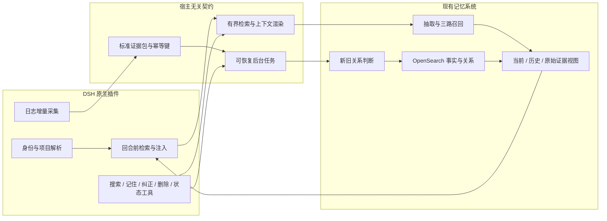

# DeepSeek Harness 场景化记忆接入：背景、生态与实施方案

> 调研日期：2026-09-07。面向已有类似 mem0 的 Agent Memory 系统，目标是形成可交付的 DSH 场景产品。
>
> 证据范围：官方文档、固定提交的源码与测试文件静态审阅；本次没有安装运行记忆插件，也没有进行模型调用或端到端效果测试。源码中的版本号不等于 npm 最新发布版本。
>
> 现有系统的确定信息是“已有类似 mem0 的记忆系统”。本仓库的 OpenSearch-only、两阶段关联更新与关系感知召回文档作为设计基线，不能据此认定这些能力都已上线。

## 1. 决策摘要

**建议做一个 DSH 原生 Cordis 薄插件，复用现有记忆服务；以跨会话编码协作为首个场景，交付自动召回、后台采集、显式管理工具和可追溯证据。** MVP 不要求重写存储，也不需要 fork DSH。

四个直接影响决策的发现：

1. **Harness 是模型外的任务运行设施。** DSH 是 DeepSeek 对这种设施的一种具体实现，特色是通过 Cordis 组合模型、工具、循环、会话和 UI。不能把“一切皆插件”当作所有 harness 的定义。[DSH 官方说明][S1]
2. **mem0 已有官方原生 DSH 插件。** `integrations/deepseek-plugin` 的包名为 `@mem0/deepseek-plugin`，源码版本 `0.1.1`；它注册 `search_memory`、`add_memory` 两个工具。自动召回和自动采集在该提交仍属于计划功能。因此，“mem0 已接入”成立，“它已经自动记住 DSH 所有对话”不成立。[包与状态][S6] [实现][S7]
3. **自动记忆闭环已有可参考实现。** MemOS local 和 Mem9 都使用 DSH 生命周期接入自动检索与后台写入，比 mem0 当前 DSH 工具插件更接近完整场景产品。[MemOS 实现][S10] [Mem9 实现][S13]
4. **你们的差异化应放在有效记忆和任务收益上。** 接口接通只是起点；更有价值的是项目隔离、决策更新、失败经验复用，以及能解释“为什么想起这条、原始证据在哪里”。这是基于生态与本仓库设计的产品判断，不是已验证的竞争优势。

建议的第一版产品承诺：

> 同一用户再次进入同一项目时，Agent 能按当前任务找回仍然有效的项目决策、操作经验和偏好；每条记忆都能查看来源、纠正或删除，记忆服务暂时不可用时仍能继续工作。

## 2. Harness 是什么，记忆处于哪一层

### 2.1 从一次真实任务理解

用户说“修复登录问题”，模型可以提出修改方案和工具调用。但读取仓库、执行测试、把结果送回模型、决定下一步是否继续、保存会话及处理取消，都需要模型外的软件完成。承担这些职责的运行设施，通常称为 **agent harness**。

可以用以下职责划分理解，而不必把它当成统一的行业标准：

| 层次 | 核心职责 | 对记忆系统的意义 |
|---|---|---|
| Model | 根据当前输入推理、生成内容及工具调用 | 使用被放入上下文的记忆 |
| Harness | 驱动任务循环，提供工具、会话、上下文和运行环境 | 决定何时检索、何时采集、如何呈现 |
| Memory service | 抽取、保存、检索、更新、隔离与追溯长期信息 | 提供跨会话、跨宿主的可复用能力 |
| 业务场景策略 | 定义什么值得记、什么时候有用、如何验证收益 | 将通用记忆能力转化为用户体验 |

“Framework”常强调开发抽象，“runtime”常强调执行，“harness”常强调模型完成任务所需的整套外部条件；三者存在重叠，不适合机械划定互斥类别。这里讨论的是运行 Agent 的 harness，不是仅用于评测模型的 test/evaluation harness。

### 2.2 不同的“记忆”不能混为一谈

| 能力 | 解决的问题 | 与长期记忆的边界 |
|---|---|---|
| 会话日志与恢复 | 重建某次运行，接着同一会话做事 | 保存了历史，不代表会自动跨会话筛选事实 |
| 上下文压缩 | 长会话超出上下文时保留摘要 | 主要维护当前会话连续性，不等于长期记忆治理 |
| AGENTS.md 等指令文件 | 加载维护者约定的项目规则 | 可长期存在，但默认不是自动抽取的用户/经验数据库 |
| 文档 RAG | 找回文档、代码和知识片段 | 通常不负责用户偏好演变和旧结论失效 |
| 长期记忆服务 | 跨会话保留并更新用户、项目与经验事实 | 需要身份、时效、证据和读写策略 |

DSH 已有会话日志、压缩和指令文件加载能力，因此不宜宣传“DSH 完全没有记忆”。更精确的机会是补充**面向场景的跨会话记忆抽取、召回和生命周期管理**。[会话机制][S3] [指令加载][S4] [压缩机制][S5]

## 3. DeepSeek Harness 的背景与原理

### 3.1 核实后的项目边界

官方项目是 [deepseek-ai/deepseek-harness](https://github.com/deepseek-ai/deepseek-harness)，命令名 `dsh`，运行入口之一是 `npx @deepseek-ai/dsh web`。它是开源 Agent Harness，采用 MIT 许可证，官方仍明确标注 developer preview，并提示兼容性可能发生破坏性变化。[S1]

本次固定读取提交 `d347e703908d0406b7a7ef80e3a0e594d86b2215`，该提交时间为 2026-09-04，`apps/cli/package.json` 中版本为 `0.1.3-alpha.1`。**这只是本报告的源码基线，不宣称是最新稳定版或所有插件已兼容的版本。** [CLI 包定义][S2]

DSH 与 DeepSeek 模型应分别看待：为 mem0 配置 DeepSeek 作为抽取模型，是模型供应商接入；把记忆工具或生命周期钩子挂进 DSH，才是本文要做的 harness 接入。[Mem0 DeepSeek provider 文档][S9]

### 3.2 Cordis：插件为什么能组合起来

Cordis 是 DSH 使用的通用插件框架。理解它需要五个概念：[Cordis primer][S15]

| 概念 | 工作方式 | 对记忆插件的落地含义 |
|---|---|---|
| Plugin | 通过模块入口或 Service 实现贡献行为 | 独立包导出 `apply(ctx, config)` |
| Context / Service | 通过上下文中的服务名访问能力 | 使用 `ctx.tools`、`ctx.sessions` 等，不依赖具体实现 |
| Dependency injection | `inject` 声明必需服务，依赖就绪后激活 | 明确需要哪些宿主服务 |
| Typed events | 事件有类型及不同调度语义 | 检索拦截与日志观察使用不同入口 |
| Reversible effects | 卸载时清理注册、监听和其他受管效果 | 热重载不应留下重复工具、监听或后台任务 |

“时间可组合”可以理解为能力可以随生命周期挂载、卸载；“空间可组合”涉及作用域、服务依赖和不同插件组合。**可逆的是受管注册与效果，不是已经发生的外部业务写入。** 卸载插件不会自动撤销写入 OpenSearch 的记忆，也不会回滚已经执行的命令。

### 3.3 Profile、Bundle、Preset 分别解决什么

| 对象 | 用途 | 推荐做法 |
|---|---|---|
| Profile | 一次宿主启动的插件组合及用户配置 | 首版验证 `web`，随后验证 `headless` |
| Bundle | 分发代码和 Cordis 配置补丁 | 将你们的插件发布为独立 DSH bundle |
| Agent preset | 特定 Agent 的能力与行为组合 | 明确主 Agent、子 Agent 是否启用记忆 |

配置层依次应用 bundle、profile 补丁、home 补丁和命令行 overlay。覆盖一个已有 row 的 `config` 是整体替换，不能假设深度合并。新增 row 要使用相应的插入格式。发布时应检查 `--dump-config` 的实际组合结果。[启动与组合][S16]

### 3.4 一次 turn 内部发生什么

`step` 是一次模型请求及其工具执行；`turn` 可以包含多个 step。工具返回后，模型往往还要继续下一步。采集策略不能把每个 step 都视为一个完整用户任务。[运行类型][S17]



图中前台检索与后台采集是**建议接入流程**；不是 DSH 默认自带的长期记忆流程。

### 3.5 最重要的接口约束

| 需求 | 当前源码入口 | 注意事项 |
|---|---|---|
| 本步模型前检索 | `ctx.on('agent/pre-step', …)` | waterfall；调用并等待 `next()`，检查准入决定 |
| 添加可追溯上下文 | 在准入消息中加入 `createUserMessage(...)` | 标记 `source.kind: 'plugin'`、`form: 'recall'` |
| 观察已提交记录 | `ctx.on('session/event', (session, event) => …)` | `turn/end` 是其中一种持久事件，不是随意注册的独立 hook |
| 排队注入未来上下文 | `agent.inject(message)` | 不唤醒 Agent；可能赶不上已经领取输入的本次请求 |
| 注册显式工具 | `ctx.tools.register(...)` | 参数、结果、取消与错误行为遵循宿主工具契约 |
| 持久化检查点 | `session/flush` | 宿主会等待监听器；不适合等待远程抽取 LLM |
| 卸载 | Cordis 受管清理效果 | 停止接收任务，有界清理，未完成工作可恢复 |

来源：[Agent 类型和钩子][S17]、[Session 事件声明][S18]、[消息来源类型][S19]、[官方 time-context 注入示例][S20]。

**两条实现纪律：**

- 模型可见内容要能从日志重建。不要在 HTTP 代理或 `agent/request` 里偷偷改消息数组；当前 `agent/request` 契约用于调用配置，不允许在那里修改模型可见消息。[S3] [S17]
- 重建准入结果时使用 `{ ...decision, messages }`。当前结果还可能带 `startsRequestSeries`；只返回 `{ kind: 'enter', messages }` 会丢掉其他语义字段。[S17] [S20]

## 4. Mem0 究竟怎样对接 DSH

### 4.1 结论与证据等级

本次直接读取 mem0 官方仓库提交 `dae67f74f5cc7bf138c7d7d6f9cec5ce4b4373b3`，证实存在原生插件。证据来自 `integrations/deepseek-plugin` 的 README、package、入口、scoping、formatting、配置示例和测试；无需依赖第三方插件目录的“兼容”标签。[S6] [S7] [S8]

```text
DSH 模型决定调用记忆工具
  → Cordis tools registry
  → @mem0/deepseek-plugin
  → mem0ai MemoryClient
  → Mem0 Platform
  → 格式化后的工具结果回到 DSH
```

### 4.2 源码级调用链

| 环节 | 已实现行为 | 对你们的启示 |
|---|---|---|
| 激活 | `inject = ['tools']`；验证 API key 与默认 `userId` | 最小接入可以只依赖工具注册服务 |
| 检索 | `search_memory` → `client.search(query, { filters, topK })` | 将身份过滤和检索参数封装在适配层 |
| 写入 | `add_memory` → `client.add([{ role: 'user', content: text }], params)` | 当前写入内容是工具传入的事实，不是宿主自动捕获的完整回合 |
| 作用域 | 搜索使用 `filters.user_id/agent_id/run_id`；写入使用 SDK 顶层 camelCase 参数 | 不能盲目把读写参数原样互换 |
| 返回 | 搜索结果压缩为分类、正文、时间和记忆 ID；写入识别 `PENDING` | “已入队”与“已经可检索”应明确区分 |
| 错误 | 捕获异常并返回失败说明字符串 | 你们可进一步使用结构化错误，便于 Agent 和 UI 判断 |

来源：[工具调用实现][S7]、[作用域转换][S8]、[结果格式化][S21]。

### 4.3 当前边界，不能用其他宿主的能力补齐想象

- 该插件当前只有两个显式工具，README 将 auto-capture 和 auto-recall 列为计划；没有在入口注册自动采集的 session hook。[S6] [S7]
- 它使用 Mem0 **Platform** 的 `MemoryClient`；`host` 是专有/私有化 Platform 地址覆盖，不等于切换到 Mem0 OSS REST server。[S6]
- 工具允许模型传入覆盖默认值的 `userId/agentId/runId`。这是一种工具参数能力，不是服务端权限证明。你们的租户与用户隔离应由可信身份控制，不能直接照搬为授权方式。[S7] [S8]
- mem0 的 Claude Code 插件有后台 capture/flush/recall，但这是另一套宿主集成，不能据此声称 DSH 插件具有同样行为。[Claude Code 官方文档][S22]

### 4.4 分发与兼容性判断

该提交 README 的试用路径是先构建插件，再以补丁加载构建后的入口；`package.json` 没有 `dsh.bundle.patch`。因此不能仅凭包名就保证 `dsh plugin add github:mem0ai/mem0` 能自动正确装载这个 monorepo 内的插件。[S6] [配置示例][S23]

此外，该包开发依赖中的 `dsh-tools` 是较早的 `0.0.1-rc.1`，而本报告读取的 DSH CLI 为 `0.1.3-alpha.1`。这说明**有实现证据，但没有本次运行兼容性证据**。安装或复用前应固定版本、编译并做宿主烟测。

## 5. 其他记忆系统如何接入 DSH

### 5.1 横向比较

| 系统 / 插件 | 实现主体与证据 | 前台读取 | 写入 | 值得借鉴 |
|---|---|---|---|---|
| Mem0 DSH plugin | mem0 官方；源码核实 | 两个工具中的显式 search | 显式 add，服务端异步处理 | 最小 SDK 适配、正确解释 pending |
| MemOS local | MemTensor 官方；入口与 bridge 核实 | 接受的直接用户回合自动 recall，另有工具 | 按 session 排队后台 capture | 有界前台、采集不阻塞下个回合、复用 MemoryCore |
| Mem9 DSH plugin | mem9 官方仓库；入口与包核实 | 用户回合首步 recall，另有五个工具 | completed turn 后 smart ingest | 完整 bundle、默认排除子 Agent、来源标签 |
| dsh-memory-openviking | 社区维护者；README 核实 | profile 与逐输入 recall | session/event write-behind，flush 有界等待 | 后端服务与工具层拆分、重试和证据反馈 |

这里的“官方”指所属记忆项目维护者仓库，并不表示 DeepSeek 官方认证。OpenViking 适配器的 README 不足以证明其所有行为在当前 DSH 主线可运行。[S6] [S10] [S11] [S12] [S13] [S14]

### 5.2 MemOS：复用核心，适配生命周期

入口将 `MemoryCore` 包装为 DSH bridge，注册 `agent/pre-step`、`session/event`、session disposal 和工具；recall 使用 plugin 来源的 `form: recall` 消息。[S10]

bridge 先读取 `await next()` 后的准入输入，排除非真实用户来源；对同一逻辑 turn 记录是否已尝试 recall，并执行有截止时间的检索。它在 `turn/end` 将工作放入每个 session 的后台队列。**前台只读取当时已提交的状态，不等待上个回合的抽取完成。** [S11]

这对你们最有借鉴价值：宿主适配处理事件语义和运行时约束，记忆内核继续负责自己的抽取、关联与索引。MemOS 文档提及的旧 rc 兼容目标也说明，生态实现必须与宿主版本一起验收，不能只看包能否安装。[MemOS 适配说明][S12]

### 5.3 Mem9：适合作为 bundle 和回合处理的参考

Mem9 在包内声明 `dsh.bundle.patch`，补丁插入 `mem9` row。代码在 `agent/pre-step` 的首步检索，回合写入只处理 `reason.kind === 'completed'`；默认仅对顶层 Agent 启用，写入队列按 session 串行。[S13] [包与补丁][S24]

其默认自动检索超时在 README 中为 15 秒；这不能直接当作你们的体验预算。你们应根据首响应延迟目标自行限制前台时间。[S25]

另一个静态兼容性提醒：本次读取的 Mem9 和 MemOS 代码片段在重建准入结果时使用 `{ kind: 'enter', messages }`；当前 DSH 已有 `startsRequestSeries` 字段。因此参考实现也要按新契约调整，不能照抄。**这是代码审阅发现的潜在语义丢失点，不是本次复现的线上故障。** [S11] [S13] [S17]

### 5.4 OpenViking 社区适配：服务层抽象值得参考

该项目描述了记忆服务、工具、自动注入和后台采集的分层，并使用 `session/flush` 做有界 drain。与 MemOS 不把远端采集绑定在 flush 上的策略相比，它更强调检查点时推进写入，需要评估宿主等待时间。[S14]

它还提出通用 `MemoryBackend` / `ctx.memory` 方向，但这是社区设计，不是本次核实的 DSH 官方统一记忆 API。可以学习接口分层，不应把它写成已经确立的生态标准。

### 5.5 原生插件与 MCP 怎样选择

DSH 的 MCP client 已支持 stdio 和 Streamable HTTP，并将工具桥接到宿主工具注册表；当前文档明确只桥接 tools，不支持 MCP resources/prompts。[MCP 实现说明][S26]

| 路线 | 优点 | 局限 | 建议 |
|---|---|---|---|
| 仅 MCP 工具 | 易复用已有 MCP 服务，跨宿主 | 不会仅因连接成功就自动采集/自动召回 | 已有 MCP 时做早期工具验证或兼容出口 |
| 原生工具插件 | 直接对接宿主工具协议 | 仍取决于模型是否主动调用 | 类似 mem0 当前 DSH 集成，适合短期 PoC |
| 原生生命周期插件 + 工具 | 可控制检索时机、采集完整性与失败降级 | 要维护 DSH 版本契约 | **推荐正式 MVP** |
| fork DSH / 改模型请求代理 | 能改内部行为 | 维护成本高，容易破坏日志一致性 | 首版不采用 |

## 6. 你们应该先做哪些场景

首个场景建议定义为**同一用户在同一项目里的多次编码会话**。它同时有重复解释的痛点、可采集的工具证据和可检查的任务结果；比泛化“记住一切”更容易验证价值。这是方案建议。

| 优先级 | 场景 | 应记内容 | 应避免的误用 | 验收示例 |
|---|---|---|---|---|
| P0 | 项目约定与决策 | 测试入口、兼容约束、为什么选某方案 | 将其他仓库约定带入；覆盖当前明确规则 | 新会话正确使用指定测试命令 |
| P0 | 故障与修复经验 | 症状、环境、尝试、结果、有效修复 | 把“尝试过”当成“成功过” | 重现类似错误时先检查已知原因 |
| P0 | 个人工作偏好 | 语言、解释深度、工具偏好 | 将一次任务指令永久泛化 | 跨会话遵守偏好，允许更正 |
| P1 | 长任务交接 | 已完成、待办、分支、产物和下一步 | 记忆替代 Git、测试与任务状态真相源 | 重新进入前先验证仓库现状再续做 |
| P1 | 技术决策历史 | 旧方案、新方案、变更原因和时间 | 默认召回旧结论；历史查询只给最新状态 | 区分“现在怎么做”和“当时为何这么做” |
| P2 | 团队经验共享 | 经审核的项目公共事实 | 自动公开个人记忆或跨租户数据 | 明确共享后团队成员才可召回 |

**三种内容的不同处理：**

- 用户明确偏好：作为候选长期事实，记录作用范围和原始表达。
- Agent 的推测与计划：先记为未验证观察或短期任务状态；没有工具证据不能升级成“已修复”。
- 命令、测试与文件变化：保留结构化结果和来源引用；长输出只留必要摘录及可回查证据。

知识库、代码索引和长期记忆可以共同服务任务，但首版不必把整个仓库重新灌入记忆库。

## 7. 初步架构：DSH adapter + 场景策略 + 现有内核



### 7.1 责任划分

| 组件 | 负责什么 | MVP 交付 |
|---|---|---|
| DSH adapter | hook、事件归一化、工具注册、取消与卸载 | 独立 TypeScript 包及版本兼容测试 |
| 场景策略 | 编码记忆类型、采集过滤、召回预算、注入格式 | 可配置的 coding 场景策略 |
| Memory API façade | 统一身份、幂等、状态、证据协议 | 对现有 API 的薄封装 |
| 现有 Memory Core | 抽取、三路召回、关系与时效处理 | 按已实现能力复用，缺口按阶段补齐 |
| 管理与观测 | 命中原因、写入进度、纠正/删除 | 先提供工具及日志，再做 Web 设置页 |

不要为一个 DSH 接入把现有 Python/其他语言服务迁移到 Node。TypeScript adapter 通过 HTTP 调用已有服务即可。

### 7.2 与本仓库现有设计衔接

已有参考设计：

- [两阶段 LLM 新旧记忆关联更新方案 v4](./两阶段LLM新旧记忆关联更新方案_v4_2026-08.md)：抽取后写入 OpenSearch，再判断 `NONE / REPLACE / MERGE`。
- [记忆关系感知召回方案 v1](./记忆关系感知召回方案_v1_2026-08.md)：基于 `linked / replaced_by / merge`，支持默认、最新、指定时间、历史和证据查询。

DSH 接入应保留这些语义：默认召回当前 canonical fact；问“为什么以前那样做”再展开历史；`RAW_EVIDENCE` 定位原始 DSH 回合和工具证据。不要为了适配器简单，退化成只把相似文本 TopK 拼接给模型。

**异步的边界要说清楚：**宿主前台不等抽取，是 adapter 的异步；一份后台任务内部依然可以顺序完成抽取、关系判断和提交。它与“先把事实暴露给检索，随后异步补关系”不是同一件事。后者存在新旧事实暂时共存的问题，需要在服务层定义可见状态。

如果继续 OpenSearch-only，可沿用 v4 的任务状态、确定性 ID、乐观并发控制与补偿恢复方向。多文档 bulk 不是跨文档事务，不能写成“全局原子提交”。服务端应对关系未完成或断链结果降级/过滤，避免当前答案同时注入相互冲突的结论。

## 8. 接口与数据设计

以下均为**建议契约**，不是 DSH 或现有系统已经提供的 API。

### 8.1 必需的五类能力

| 建议接口 | 输入 | 返回 / 行为 |
|---|---|---|
| `POST /v1/memory/recall` | query、可信 scope、mode、预算、请求上下文 | answer_memories、evidence_memories、read_revision |
| `POST /v1/memory/ingestions` | 回合增量证据、scope、幂等键 | `202` + ingestion_id，表示可靠接收 |
| `GET /v1/memory/ingestions/{id}` | ingestion_id | accepted / processing / ready / failed |
| `POST /v1/memory/corrections` | memory_id、纠正内容、证据及版本 | 创建更正事实/关系，返回状态 |
| `DELETE /v1/memory/{id}` | 授权 scope 与 memory_id | 删除/墓碑、缓存失效、审计结果 |

如现有系统有等价接口，直接映射，不必为了命名一致重写。`ready` 必须意味着索引可查询且约定的关系处理已完成；只写入数据库或拿到 HTTP 200 不够。

### 8.2 标准化证据包示例

```json
{
  "schema_version": 1,
  "scope": {
    "tenant_id": "tenant-a",
    "user_id": "user-17",
    "project_id": "project-payments",
    "visibility": "private"
  },
  "source": {
    "harness": "dsh",
    "host_instance_id": "host-01",
    "session_id": "session-123",
    "turn_id": 8,
    "event_seq_range": [121, 138],
    "agent_id": "agent-123",
    "parent_session_id": null,
    "repository_revision": "git-commit-if-known"
  },
  "idempotency_key": "hash(scope,host,session,event-range,schema-version)",
  "outcome": "completed",
  "messages": [
    {"role": "user", "text": "这个项目统一用 pnpm。", "event_seq": 122}
  ],
  "tool_observations": [
    {"name": "test", "status": "success", "evidence_ref": "dsh-event:137"}
  ]
}
```

事件序号、工具状态和事实来源要来自宿主日志，不能让抽取模型编造。来源引用应与项目权限绑定；本地路径本身不保证另一台机器可以取回证据。

### 8.3 Scope 是正确性基础

- `tenant_id / user_id`：来自可信登录态或部署配置，服务端重新校验。工具参数不开放任意改写身份。
- `project_id`：由规范化仓库标识映射，worktree 共享项目但保留分支/修订信息。没有 Git 的目录使用持久注册 ID，避免临时绝对路径导致身份漂移。
- `session_id / turn_id`：用于来源、增量与幂等；**默认跨会话检索不按当前 session_id 限制**，否则长期记忆变成会话内检索。
- `agent_id / parent_session_id`：用于来源与授权分区；默认主 Agent 采集，子 Agent 首版关闭自动写入，避免父子重复灌入。
- 个人与团队记忆分两条权限通道，后端合并授权结果；不能用“相同 project_id”隐式允许访问其他人的私人事实。

### 8.4 事实最小增量 metadata

优先复用现有字段，建议补齐：`memory_kind`、`scope`、`source_refs`、`verification_status`、`event_time`、`recorded_at`、`repository_revision`，并保留现有 `linked / replaced_by / merge / ingestion_batch_id`。

`event_time` 表示事实发生/表达时间，`recorded_at` 表示入库时间。用户说“上个月已改为 X”时不能把今天的入库时间当成生效时间；明确时间缺失时保留不确定性。项目版本、分支与时间应共同判断适用性。

## 9. 两条关键执行路径

### 9.1 前台：自动检索与注入

1. 在 `agent/pre-step` 获得下游准入结果，拒绝/取消时直接返回。
2. 仅用真实用户来源的内容形成 query。以 session + turn + 用户消息 ID 防重；首版每个用户回合最多一次自动检索。
3. 使用可信身份、项目范围和查询模式调用已有三路召回及关系处理。
4. 对当前上下文已覆盖的结果去重，按预算选择有效事实；没有有用结果就不注入。
5. 使用 `form: recall` 的 plugin 消息进入宿主日志，保留原有准入字段。
6. 超时/服务故障时继续任务，迟到结果不得再写入已经完成的准入消息。

**建议初始预算，待实验调优：**TopK 5、记忆内容总预算 1,500 tokens、前台检索硬截止 1,000 ms、暖态额外延迟 p95 目标 500 ms。数字是产品目标，不是当前服务实测。

下面展示接口形状，不是可直接发布的插件；身份解析、重入缓存、硬截止和渲染器均需实现及测试：

```typescript
ctx.on('agent/pre-step', async (payload, next) => {
  const decision = await next();
  if (decision.kind !== 'enter' || payload.signal.aborted) return decision;

  // 自定义 helper：识别真实用户输入；相同输入重入复用决定，不重复联网。
  const request = identifyRecallRequest(payload, decision.messages);
  if (!request) return decision;

  // 自定义 helper：只吞记忆检索错误，不吞宿主 next() 的异常。
  const recall = await optionalRecallWithHardDeadline(request, payload.signal);
  if (!recall || payload.signal.aborted) return decision;

  return {
    ...decision,
    messages: [...decision.messages, createUserMessage({
      content: [{ type: 'text', text: renderUntrustedMemory(recall) }],
      source: { kind: 'plugin', plugin: 'your-memory', form: 'recall' }
    })]
  };
}, { prepend: true });
```

注入内容应包括：这是历史信息、适用项目/时间、事实 ID、证据引用及必要的不确定性。当前用户明确纠正与仓库实际状态优先。提示文本不能替代授权和来源过滤，也不能把“历史文本中写了一个命令”变成执行授权。

同一回合后续出现 steering 的新问题，MVP 可由显式搜索补充；第二阶段再扩展“每个新用户输入一次”。要把这一边界写进产品说明，避免声称每次输入都自动召回。

### 9.2 后台：可靠采集与关系更新

1. 通过 `session/event` 收集原始用户/assistant 消息和必要工具结果，排除自己注入的 recall、其他插件上下文、重复 compaction 摘要及流式增量重复。
2. `turn/end` 时固化不可变的本回合快照，再排队；不要等任务执行时读取正在变化的“当前回合”。
3. MVP 的自动长期事实写入先接收完成的用户回合；失败/取消回合保留恢复游标和诊断证据，显式用户偏好可按单独规则保存，不能把任务标成成功。
4. 按 session 串行发出标准证据包，使用确定性幂等键；远程超时后重试同一键。
5. 服务端执行现有抽取 → 关联 → 有效性处理 → 检索可见，任务状态最终到 `ready`。
6. 卸载时有界 drain，残余任务保留在持久队列/任务索引；恢复时从日志游标补采。

**不能只用内存 Promise 队列就声称可靠。** 推荐复用现有持久任务设施；若坚持 OpenSearch-only，则以确定性任务文档 ID、状态、重试时间和乐观锁实现任务领取，仍按至少一次投递设计。插件侧保留游标并可从 DSH 持久日志补发；本地 outbox 是部署可选项，不是新增中央存储依赖。

`session/flush` 如参与，只等待短小的本地持久化操作，不能把远程网络或抽取模型耗时加入宿主检查点。只在退出时采集也不够，进程崩溃和长期不退出都会使记忆延迟或丢失。

### 9.3 异步一致性与“刚说完就要用”

自动采集默认最终一致：下个回合可能读到上次已提交状态。短期连续性由当前 DSH 上下文承担，不能假装后台处理已经完成。

显式“记住/纠正”应返回 `accepted/ready` 和任务 ID；需要强确认时允许调用状态工具，等待有界时间。对用户明确更正，可以在当前 session 保存临时覆盖，直到后台 canonical 更新可见；必须保留其来源和作用域，不能把全局检索结果未经授权覆盖。

删除和纠正都要使检索缓存失效。删除还应防止恢复补采把同一旧来源重新导入。需要区分“从记忆库删除”与“从历史 DSH 会话日志删除”；前者不能承诺后者也已完成。

## 10. MVP 交付范围与实施节奏

建议以两名工程师、四周为初始估算，前提是现有服务已有稳定 add/search、身份隔离和部署环境。若尚无可靠异步任务或删除语义，需要重新估算。

| 阶段 | 工作 | 可验收产物 |
|---|---|---|
| 第 1 周：契约与工具 | 固定 DSH 基线；核查现有 API；完成搜索、记住与状态工具 | 能在两次独立 DSH 会话读写同一授权项目记忆 |
| 第 2 周：自动闭环 | pre-step recall、source 过滤、turn 增量、超时、取消、持久重试 | 无手动操作的跨会话回忆；断网不阻塞；恢复不重复 |
| 第 3 周：场景质量 | 三类 P0 记忆策略；canonical/历史模式；更正删除；来源展示 | 新结论替代旧结论；历史查询能还原变化 |
| 第 4 周：对照评测与发布 | 效果对照、兼容烟测、打包/升级/卸载文档、试用反馈 | 可安装 bundle、可重跑评测报告、明确兼容版本表 |

**最小显式工具集：**`memory_search`、`memory_remember`、`memory_correct`、`memory_forget`、`memory_status`。`memory_search` 可选择 DEFAULT / LATEST / HISTORY / AS_OF_TIME / RAW_EVIDENCE，身份参数由宿主注入。

建议包布局：

```text
integrations/dsh/
  package.json
  cordis.patch.yml
  src/index.ts          # 宿主入口与受管生命周期
  src/scope.ts          # 可信用户、项目、分支映射
  src/recall.ts         # 截止时间、去重与渲染
  src/capture.ts        # 日志增量与证据归一化
  src/client.ts         # 现有服务协议映射
  src/tools.ts          # 显式管理工具
  tests/               # 宿主契约、重放与场景测试
```

正式分发建议声明 `dsh.bundle.patch` 并插入独立 row，参考 Mem9 的包机制；发布前以 `npm pack` 的真实产物在干净 profile 安装验证。采用你们自己的包 scope，不使用 `@deepseek-ai` 冒充官方包。不要把最新主线与旧 peer dependency 随意混装。[S24]

## 11. 怎样证明场景化真的有效

### 11.1 对照组

| 组别 | 配置 | 用途 |
|---|---|---|
| A | DSH 原有上下文与指令文件，无新增记忆 | 判断额外记忆是否有净收益 |
| B | 你们的记忆服务，仅显式工具 | 分离“后端质量”与“自动生命周期”的收益 |
| C | 同一后端，自动 recall/capture + 工具 | 验证推荐 MVP |
| D（可选） | mem0 DSH 工具插件，固定版本 | 产品对照；须披露策略与后端均不同，不能作纯算法归因 |

各组使用同一模型、仓库快照、任务集合、工具权限与预算。相同后端尽量共享同一份输入证据；不同组独立隔离记忆空间。先提供“历史会话”，再打开全新 session 执行目标任务，避免把答案留在当前上下文里。

### 11.2 初始测试集与指标

建议先做 60 个场景：项目约定、排障经验、偏好、决策变更、项目/用户隔离、无关记忆负例各 10 个；每组重复 3 次，优先用代码结果、正确命令和证据引用检查，人工盲审辅助。样本规模是试验建议，后续随方差扩充。

| 指标 | 定义 | 初始验收目标（非实测） |
|---|---|---|
| 任务成功率 | 以预先定义的工程验收完成任务的比例 | C 比 A 提升至少 10 个百分点，报告区间与失败样例 |
| 旧结论误用率 | 当前状态问题仍采用失效事实 | 受控变更用例中为 0 |
| 隔离与删除 | 跨租户/项目误召回；删后重新出现 | 确定性测试全部通过 |
| 写入幂等 | 重试、恢复、重载造成重复事实 | 重复投递用例不重复落逻辑事实 |
| 注入精度 | 注入事实中对当前任务有用的比例 | 人工标注并按记忆类型分层分析 |
| 额外延迟 | 相对同模型无记忆的请求准备时间 | 暖态 p95 ≤ 500 ms，超时按 1 s 硬降级 |
| 可见延迟 | accepted 到 ready 的时间 | 记录 p50/p95，初始服务目标 p95 ≤ 30 s |
| 净成本 | 检索、抽取、关联、存储与 Agent 总 token 成本 | 按成功任务核算，不只报告 token 减少 |

LongMemEval 可以继续检验抽取、时间与多会话召回，但不能替代 DSH 工程任务评测。也不应把不同数据集、不同模型下的厂商分数当成当前场景的效果承诺。

### 11.3 必须通过的运行时测试

- 同一 turn 多 step、pre-step 重入、同样文本的新 turn，分别验证“去重”和“允许再次召回”。
- 下游拒绝/重写用户输入、取消和超时，验证不会检索被拒绝的内容或注入迟到结果。
- 加载、热重载、卸载后工具与监听不重复；未完成后台任务可恢复。
- `startsRequestSeries` 等准入字段不丢失，记忆结果能通过 session 日志重放。
- 跨 session、worktree、fork、主/子 Agent 不重复采集来源；OpenSearch 部分失败可补偿。
- plugin recall、compaction 摘要、工具描述中的诱导文本不能被当成用户新事实无限回灌。

## 12. 仓库旧文档的校正与待确认项

本报告补充并校正 [Harness 架构洞察分析](./Harness架构洞察分析.md) 和 [记忆模块插件开发文档](./DeepSeek-Harness记忆模块插件开发文档.md) 中可影响实现的部分：

| 旧表述 / 示例 | 本报告校正 |
|---|---|
| `agent/step` before/after、`session/start`、`session/end` 被当成接入 API | 使用真实 `agent/pre-step`，通过 `session/event` 观察 `turn/end`；区分 live hook 与持久事件 |
| `ctx.events.on`、`ctx.services.register` 被写作 Cordis 插件模板 | 本次源码中的监听入口是 `ctx.on`，工具是 `ctx.tools.register`；旧代码不能作为可编译模板 |
| 将 everything-is-a-plugin 视作所有 harness 的定义 | 它是 DSH 的具体设计选择 |
| 当前版本固定为 rc.5 | 本报告固定源码的 CLI 为 0.1.3-alpha.1；生态插件各有自己的测试基线 |
| 泛化 mem0 已有能力到 DSH 自动记忆 | 官方 DSH 插件当前为两个工具，自动路径仍是计划 |
| 卸载即撤销全部效果 | 不包括远程数据库写入和已经完成的业务副作用 |

启动开发前用半天核查以下事项即可；它们不妨碍先按本方案做接口 spike：

1. 现有记忆服务语言、部署方式、add/search/纠正/删除接口与真实响应语义。
2. OpenSearch-only、两阶段关系和三路召回究竟哪些已上线；未上线部分不要进入第一周关键路径。
3. 首批用户是个人单机还是团队多租户；相应选择身份及共享策略。
4. DSH 实际使用版本、profile、是否运行子 Agent 和远程 sandbox。
5. 现有持久任务机制、可见延迟、查询延迟、调用成本与日志保存周期。

**建议的里程碑判断：**先证明“新会话正确用上旧经验，而且不会误用旧结论”，再投入团队共享、Web 管理页和其他 harness 的规模接入。

## 13. 来源与复核清单

固定提交：DSH `d347e703908d0406b7a7ef80e3a0e594d86b2215`；mem0 `dae67f74f5cc7bf138c7d7d6f9cec5ce4b4373b3`；MemOS `78a372a4fc853a24d2a78efa3b4bbbd27ab9f7ad`；Mem9 `5af03a68c072651e9c64d1b8b1265e36b7354671`。

下面的引用可直接定位已读材料。网页文档为 2026-09-07 访问快照；未固定提交的页面后续可能变化。源码审阅确认结构与控制流，不能替代在你们真实 DSH/后端部署上的兼容与效果测试。

- DSH：[官方项目][S1]、[CLI 版本][S2]、[架构][S3]、[指令上下文][S4]、[压缩][S5]、[Cordis][S15]、[启动组合][S16]、[Agent 契约][S17]、[Session 契约][S18]、[消息来源][S19]、[官方注入示例][S20]、[MCP][S26]。
- Mem0：[原生插件说明][S6]、[工具源码][S7]、[作用域][S8]、[DeepSeek 模型 provider][S9]、[返回值格式][S21]、[Claude Code 集成][S22]、[补丁示例][S23]。
- 其他系统：[MemOS 入口][S10]、[MemOS bridge][S11]、[MemOS 适配说明][S12]、[Mem9 入口][S13]、[Mem9 package][S24]、[Mem9 说明][S25]、[OpenViking 社区适配][S14]。

[S1]: https://github.com/deepseek-ai/deepseek-harness/blob/d347e703908d0406b7a7ef80e3a0e594d86b2215/README.md
[S2]: https://github.com/deepseek-ai/deepseek-harness/blob/d347e703908d0406b7a7ef80e3a0e594d86b2215/apps/cli/package.json
[S3]: https://github.com/deepseek-ai/deepseek-harness/blob/d347e703908d0406b7a7ef80e3a0e594d86b2215/docs/architecture.md
[S4]: https://github.com/deepseek-ai/deepseek-harness/blob/d347e703908d0406b7a7ef80e3a0e594d86b2215/packages/context/agent-instructions/README.md
[S5]: https://github.com/deepseek-ai/deepseek-harness/blob/d347e703908d0406b7a7ef80e3a0e594d86b2215/packages/compaction/compaction-basic/README.md
[S6]: https://github.com/mem0ai/mem0/tree/dae67f74f5cc7bf138c7d7d6f9cec5ce4b4373b3/integrations/deepseek-plugin
[S7]: https://github.com/mem0ai/mem0/blob/dae67f74f5cc7bf138c7d7d6f9cec5ce4b4373b3/integrations/deepseek-plugin/src/index.ts
[S8]: https://github.com/mem0ai/mem0/blob/dae67f74f5cc7bf138c7d7d6f9cec5ce4b4373b3/integrations/deepseek-plugin/src/scoping.ts
[S9]: https://docs.mem0.ai/components/llms/models/deepseek
[S10]: https://github.com/MemTensor/MemOS/blob/78a372a4fc853a24d2a78efa3b4bbbd27ab9f7ad/apps/memos-local-plugin/adapters/deepseek-harness/index.ts
[S11]: https://github.com/MemTensor/MemOS/blob/78a372a4fc853a24d2a78efa3b4bbbd27ab9f7ad/apps/memos-local-plugin/adapters/deepseek-harness/bridge.ts
[S12]: https://github.com/MemTensor/MemOS/blob/main/apps/memos-local-plugin/adapters/deepseek-harness/README.md
[S13]: https://github.com/mem9-ai/mem9/blob/5af03a68c072651e9c64d1b8b1265e36b7354671/dsh-plugin/src/index.ts
[S14]: https://github.com/zouyuanqing/dsh-memory-openviking
[S15]: https://github.com/deepseek-ai/deepseek-harness/blob/d347e703908d0406b7a7ef80e3a0e594d86b2215/docs/cordis-primer.md
[S16]: https://github.com/deepseek-ai/deepseek-harness/blob/d347e703908d0406b7a7ef80e3a0e594d86b2215/docs/architecture.md#profiles-and-bundles
[S17]: https://github.com/deepseek-ai/deepseek-harness/blob/d347e703908d0406b7a7ef80e3a0e594d86b2215/packages/core/agent/src/runtime-types.ts
[S18]: https://github.com/deepseek-ai/deepseek-harness/blob/d347e703908d0406b7a7ef80e3a0e594d86b2215/packages/core/session/src/index.ts
[S19]: https://github.com/deepseek-ai/deepseek-harness/blob/d347e703908d0406b7a7ef80e3a0e594d86b2215/packages/llm/llm/src/message.ts
[S20]: https://github.com/deepseek-ai/deepseek-harness/blob/d347e703908d0406b7a7ef80e3a0e594d86b2215/packages/context/time-context/src/index.ts
[S21]: https://github.com/mem0ai/mem0/blob/dae67f74f5cc7bf138c7d7d6f9cec5ce4b4373b3/integrations/deepseek-plugin/src/formatting.ts
[S22]: https://docs.mem0.ai/integrations/claude-code
[S23]: https://github.com/mem0ai/mem0/blob/dae67f74f5cc7bf138c7d7d6f9cec5ce4b4373b3/integrations/deepseek-plugin/cordis.example.yml
[S24]: https://github.com/mem9-ai/mem9/blob/5af03a68c072651e9c64d1b8b1265e36b7354671/dsh-plugin/package.json
[S25]: https://github.com/mem9-ai/mem9/blob/main/dsh-plugin/README.md
[S26]: https://github.com/deepseek-ai/deepseek-harness/blob/d347e703908d0406b7a7ef80e3a0e594d86b2215/packages/mcp/mcp-client/README.md
