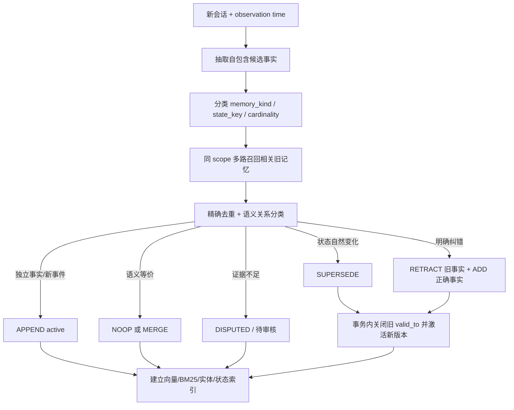

# 基于 Dream Supersede 思路的记忆写入冲突解决与召回设计

> 版本：v1.0
> 日期：2026-08-13
> 定位：面向长期记忆系统的工程设计建议，不是对 Mem0 商业后端未公开实现的复刻

## 1. 结论先行

建议采用“**追加事实版本、显式状态关系、双视图召回**”的总体设计：

1. 新信息先作为候选事实写入，默认不覆盖、也不删除旧记忆；
2. 只在相同用户、相同 `state_key`、且语义上互斥时建立 `SUPERSEDE` 关系；
3. 旧记忆保留为历史版本，关闭其有效时间区间，并指向新记忆；
4. 明确区分“状态自然变化”和“旧事实原本就是错的”；前者 supersede，后者 retract；
5. 在线回答默认使用“当前事实视图”，历史/时间问题使用“时间点视图”；
6. 召回先做多路候选，再做状态消歧和时间重排，最后按事实槽位压缩上下文；
7. 低置信度冲突不自动改状态，保留为 `disputed` 或进入人工审核队列。

一句话概括：

```text
写入时保存事实演化关系，召回时根据问题选择正确的事实版本。
```

这比“新事实直接覆盖旧事实”更适合 LongMemEval、个人助理、客户画像和长期 Agent：既不会让旧事实持续污染当前回答，也不会破坏历史问题所需的证据。

## 2. 为什么不能只做覆盖或只做向量召回

### 2.1 直接覆盖会丢失历史

```text
2024：用户住在里斯本
2026：用户搬到柏林
```

如果把旧文本原地更新成“用户住在柏林”，系统将无法回答“用户搬家以前住在哪里”。更新时间也不能替代事实有效时间：记忆写入数据库的时间，不一定是事件真正发生的时间。

### 2.2 只保留两条但不建立关系会污染当前回答

如果两条记忆都保持 active，搜索“用户现在住在哪里”时，向量相似度可能同时召回里斯本和柏林。LLM 只能临场猜测，召回顺序稍有变化就可能得到不同答案。

### 2.3 仅靠 embedding 不能判断冲突

“住在里斯本”和“住在柏林”向量上高度相似，但“喜欢咖啡”和“也喜欢茶”同样可能高度相似。相似只说明值得比较，不说明应当取代。冲突决策必须理解：

- 是否是同一主体；
- 是否描述同一个事实槽位；
- 槽位是单值还是多值；
- 两个事实能否在同一时间同时成立；
- 新消息是在报告变化，还是在纠正错误。

## 3. 核心概念

### 3.1 Memory kind：先判断记忆类型

不同类型采用不同的更新策略：

| 类型 | 示例 | 默认写入策略 |
| --- | --- | --- |
| `STATE` | 当前居住地、职位、订阅等级 | 单值槽位通常允许 supersede |
| `PREFERENCE` | 饮食偏好、工具偏好 | 可演化；强变化 supersede，弱偏好并存 |
| `RELATIONSHIP` | 婚姻、汇报关系 | 通常带有效时间，可 supersede |
| `PLAN` | 下周出差、准备换工作 | 新计划可能替代、取消或并存 |
| `EVENT` | 去过巴黎、参加过会议 | 已发生事件通常只追加，不 supersede |
| `PROFILE` | 姓名、生日 | 稳定属性；冲突更可能是纠错或 disputed |
| `KNOWLEDGE` | 项目约定、业务规则 | 需要版本、来源和生效时间 |

关键原则：**事件不会因为发生了新事件而过时；状态才有“当前版本”。**

### 3.2 `state_key`：识别“同一个正在演化的事实”

`state_key` 是用户范围内稳定的状态槽标识，例如：

```text
user:u123:residence.city
user:u123:employment.current_company
user:u123:diet.primary_style
project:p9:deployment.production.region
```

不要直接用模型自由生成的字符串作为唯一键。推荐：

1. 先用规则/受控 ontology 规范常见槽位；
2. 未覆盖的长尾槽位由模型生成候选；
3. 再使用 alias 表或语义归一化映射到已有 key；
4. key 必须包含 tenant/owner scope，禁止跨用户冲突消解。

每个 `state_key` 还要声明 cardinality：

- `single`：同一时间通常只有一个值，如主要居住城市；
- `set`：可同时存在多个值，如喜欢的菜系；
- `ordered_set`：有主次，如主要/次要编程语言；
- `timeline`：同一时间允许重叠，但需要时间区间，如并行项目。

### 3.3 生命周期状态

建议至少使用：

| 状态 | 含义 | 当前视图是否可见 |
| --- | --- | ---: |
| `active` | 当前有效或未被否定 | 是 |
| `superseded` | 曾经成立，后来被新状态取代 | 否 |
| `merged` | 重复或被更完整的 canonical 记忆吸收 | 否 |
| `retracted` | 事实原本就是错的，已被明确纠正 | 否 |
| `disputed` | 存在冲突但证据不足，未能自动裁决 | 按策略 |
| `expired` | 计划/临时状态自然到期 | 否 |

`superseded` 与 `retracted` 必须区分：

```text
“我搬到柏林了”
→ 里斯本过去成立：superseded

“你记错了，我从来没住过里斯本”
→ 里斯本从源头不成立：retracted
```

## 4. 推荐数据模型

主表保存不可变事实正文和可变生命周期元数据：

```sql
memory (
  memory_id            uuid primary key,
  tenant_id            text not null,
  owner_type           text not null,
  owner_id             text not null,

  text                  text not null,
  normalized_fact       jsonb,
  memory_kind           text not null,
  state_key             text,
  cardinality           text,

  valid_from            timestamptz,
  valid_to              timestamptz,
  observed_at           timestamptz,
  ingested_at           timestamptz not null,

  lifecycle_state       text not null,
  replaced_by           uuid,
  canonical_id          uuid,

  source_message_ids    jsonb not null,
  source_type           text not null,
  extraction_confidence float,
  resolution_confidence float,
  resolver_version      text,
  metadata              jsonb
)
```

另外维护关系表，避免只能表达单向的一对一关系：

```sql
memory_relation (
  from_memory_id  uuid,
  to_memory_id    uuid,
  relation_type   text,   -- SUPERSEDES / MERGES_INTO / SUPPORTS / CONTRADICTS
  confidence      float,
  reason_code     text,
  resolver_version text,
  created_at      timestamptz,
  primary key (from_memory_id, to_memory_id, relation_type)
)
```

保留 `replaced_by` 是为了快速读取当前版本；关系表则用于表达多个旧版本被一个新事实替代、证据支持和 disputed 等复杂情况。

必要索引：

```text
(tenant_id, owner_type, owner_id, state_key, lifecycle_state)
(tenant_id, owner_id, valid_from, valid_to)
replaced_by
canonical_id
vector index
BM25 / full-text index
entity inverted index
```

对于 `single` 槽位，建议用数据库约束或写入锁保证一个 scope + `state_key` 最终只有一个 active 主版本。不要对 `set` 类型使用该约束。

## 5. 写入阶段的冲突解决

### 5.1 完整流程



### 5.2 第一步：提取必须保留时间和变化语义

抽取输出不应只有一句自然语言，建议是：

```json
{
  "text": "用户于 2026-06-01 从里斯本搬到柏林",
  "subject": "user:u123",
  "predicate": "residence.city",
  "object": "Berlin",
  "memory_kind": "STATE",
  "state_key": "user:u123:residence.city",
  "cardinality": "single",
  "valid_from": "2026-06-01T00:00:00Z",
  "transition": {
    "from": "Lisbon",
    "to": "Berlin"
  },
  "source_message_ids": ["msg-88"]
}
```

相对时间必须以会话的 `observation_time` 为锚点解析，不能以后台处理时间代替。“去年”“下周”“刚刚”如果不落到时间区间，后续再强的冲突模型也无法准确构造时间线。

### 5.3 第二步：候选旧记忆采用多路召回

冲突解决的候选集与回答问题时的召回集不是一回事。写入候选应强调高召回率：

```text
C = union(
  exact state_key active memories,
  semantic top-k,
  BM25 top-k,
  same entity/predicate memories,
  recent same-session memories
)
```

推荐优先级：

1. 精确 `state_key` 命中：最重要；
2. 同实体 + 同 predicate；
3. 向量 Top-K：发现未归一化表达；
4. BM25：保护姓名、型号、地点、数字等精确信息；
5. 最近会话记忆：帮助处理代词和连续叙事。

候选集建议保持小而全，例如去重后 10～30 条；不要把用户全部记忆交给冲突分类模型。

### 5.4 第三步：关系分类而不是简单二分类

解析器应输出结构化动作：

```json
{
  "action": "SUPERSEDE",
  "new_memory": "candidate-1",
  "targets": ["memory-old"],
  "confidence": 0.96,
  "reason_code": "SAME_SINGLE_VALUE_STATE_CHANGED",
  "effective_at": "2026-06-01T00:00:00Z",
  "evidence": ["msg-88"]
}
```

动作集合建议为：

| 动作 | 判定条件 | 数据处理 |
| --- | --- | --- |
| `APPEND` | 独立/互补事实，或新事件 | 新增 active |
| `NOOP` | 完全等价且没有新证据 | 不新增，更新观测统计可选 |
| `MERGE` | 同一事实的新表述更完整 | 新增 canonical 或更新聚合层；旧项 merged |
| `SUPERSEDE` | 同一单值状态发生自然变化 | 新增 active；旧项 superseded |
| `RETRACT` | 用户明确否认旧事实曾成立 | 旧项 retracted；正确事实另行新增 |
| `DISPUTE` | 来源冲突、时间不清、置信度不足 | 都保留，不自动选真相 |

### 5.5 自动 supersede 的硬门槛

只有同时满足以下条件才自动 supersede：

```text
same_scope
AND same_state_key
AND state_is_versionable
AND values_are_mutually_exclusive_at_same_time
AND new_evidence_is_later_or_explicitly_corrective
AND confidence >= threshold
```

建议阈值分层：

- `>= 0.90`：自动执行；
- `0.70～0.90`：标记 disputed，召回时携带冲突提示；
- `< 0.70`：作为独立事实保存，不改变旧生命周期。

具体阈值需要用自己的冲突回归集校准，不能照搬其他系统。

### 5.6 时间区间如何关闭

新状态的 `valid_from = T` 时：

```text
old.valid_to = T
old.lifecycle_state = superseded
old.replaced_by = new.memory_id
new.valid_from = T
new.valid_to = null
new.lifecycle_state = active
```

如果只知道先后、不知道准确时间：

- 保留时间精度，如 `month`、`day`、`unknown`；
- 不伪造精确时间戳；
- 可以用 observation time 作为排序锚点，但标注它不是 event time。

### 5.7 并发与幂等

两个并发请求可能同时读取同一 active 旧状态，再分别写入两个新状态。建议：

1. `idempotency_key = hash(scope + source_message_id + normalized_fact)`；
2. 对 `scope + state_key` 使用短事务锁或 advisory lock；
3. 事务内重新读取 active 版本；
4. 写入新记忆、关系边、旧状态变更和 outbox event；
5. 提交后异步建立搜索索引；
6. 索引失败通过 outbox 重试，不回滚事实存储。

写入后应维护不变量：

```text
single-valued state_key 的同一有效时间点最多一个 active 主版本；
replaced_by 不允许形成环；
superseded 节点必须能沿链到达 active/retracted 终点；
任何生命周期变更都有 source evidence 和 resolver_version。
```

## 6. 召回阶段设计

### 6.1 首先识别查询意图

查询至少分成四类：

| 查询类型 | 示例 | 目标视图 |
| --- | --- | --- |
| `CURRENT` | “我现在住哪里？” | active/current |
| `AS_OF` | “2024 年我住哪里？” | 指定时间点有效版本 |
| `HISTORY` | “我住过哪些城市？” | 完整演化链 |
| `CHANGE` | “我什么时候搬到柏林？” | 转换边与前后版本 |

时间意图可以通过轻量分类器、规则与小模型组合完成。对“现在、目前、当前”应显式标成 CURRENT；不要完全依赖向量排序自行理解。

### 6.2 候选生成采用 hybrid retrieval

回答召回建议并行产生候选：

```text
semantic candidates
∪ BM25 candidates
∪ entity/state_key candidates
∪ temporal overlap candidates
```

然后进行 score fusion。一个可解释的初始公式：

```text
base_score = 0.50 * semantic
           + 0.20 * lexical
           + 0.20 * entity_or_state_match
           + 0.10 * source_quality
```

权重只是起点，应通过召回实验调优。

### 6.3 生命周期和时间过滤应在重排前完成

#### CURRENT 查询

```text
保留 active；
排除 superseded / merged / retracted / expired；
disputed 只在没有可靠 active 事实时返回，并显式标注不确定性。
```

#### AS_OF 查询

保留满足下式的版本：

```text
valid_from <= query_time
AND (valid_to IS NULL OR query_time < valid_to)
```

这里的区间建议采用左闭右开 `[valid_from, valid_to)`，避免新旧版本在切换时刻同时有效。

#### HISTORY / CHANGE 查询

不隐藏 superseded，但：

- 按 `valid_from` 排序；
- 折叠 merged 重复项；
- retracted 事实只能作为“系统曾错误记录”的审计信息，不能陈述为历史真相；
- 返回关系边，帮助回答从什么变成什么、何时变化。

### 6.4 状态感知重排

过滤后再加入状态分数：

```text
final_score = base_score
            + query_intent_match
            + temporal_overlap
            + active_state_bonus
            + exact_state_key_bonus
            - uncertainty_penalty
```

不建议简单使用“越新分越高”：用户现在问童年经历时，最新记忆并不一定相关。recency 只能作为与查询意图相关的一个弱信号。

### 6.5 按事实槽位折叠，避免上下文内部自相矛盾

即使 Top-K 召回了很多记忆，送给回答模型之前还应做一次 slot-aware compaction：

```text
CURRENT：每个 single state_key 最多保留一个 active 主事实；
AS_OF：每个 state_key 保留目标时间点版本；
HISTORY：同一 state_key 保留有序版本链；
EVENT：保留彼此独立且与问题相关的事件。
```

上下文建议使用带状态的结构，而不是无标记文本列表：

```text
[CURRENT | residence.city | valid_from=2026-06-01]
用户目前居住在柏林。

[HISTORICAL | residence.city | valid_to=2026-06-01]
用户此前居住在里斯本。
```

回答提示词应规定：

1. 当前问题优先 CURRENT；
2. 历史条目不能用于回答当前状态；
3. 如果 active 事实处于 disputed，必须表达不确定性；
4. 不得仅根据 `ingested_at` 推断事件先后。

## 7. 三个典型例子

### 7.1 自然状态变化

```text
M1: 用户住在里斯本
M2: 用户于 2026-06-01 搬到柏林
```

结果：

```text
M1.lifecycle_state = superseded
M1.valid_to = 2026-06-01
M1.replaced_by = M2
M2.lifecycle_state = active
M2.valid_from = 2026-06-01
```

“现在住哪里”只返回 M2；“搬家前住哪里”返回 M1。

### 7.2 互补偏好

```text
M1: 用户喜欢咖啡
M2: 用户也喜欢茶
```

如果 `beverage.preference` 是 set cardinality，两条都 active，不 supersede。除非新消息明确说“现在只喝茶，不再喝咖啡”。

### 7.3 明确纠错

```text
M1: 用户出生在上海
新消息：你记错了，我出生在杭州，从来没在上海出生过
```

结果：M1 `retracted`，新增杭州事实 active。M1 不应作为“历史出生地”被 AS_OF 查询命中，因为它从未成立。

## 8. 降级与异常策略

| 异常 | 建议行为 |
| --- | --- |
| 抽取模型超时 | 保存原始消息，进入重试队列，不写半成品事实 |
| 冲突模型超时 | 新事实可先 pending/active_unresolved，后台解析；当前回答降级为带不确定性 |
| 时间解析失败 | 保存原文和 time_precision=unknown，不伪造日期 |
| state_key 无法归一 | 建临时候选 key，暂不 supersede |
| 搜索索引延迟 | 事实库为准，关键 state_key 可走数据库回查 |
| 替代链损坏 | 后台一致性扫描修复，当前读沿可达 active 终点并报警 |

对于地址、药物、权限、支付状态等高风险领域，建议把自动 supersede 阈值调高，或者要求业务系统的结构化证据优先于对话抽取结果。

## 9. 评测方案

不能只看普通 Recall@K。至少增加以下指标：

### 9.1 写入冲突指标

- `Conflict Candidate Recall`：真正冲突的旧记忆是否进入候选集；
- `Supersede Precision / Recall / F1`；
- `False Supersede Rate`：互补事实被错误取代的比例；
- `Retraction Accuracy`：自然变化与事实纠错是否区分正确；
- `State-key Accuracy`；
- `Timeline Closure Accuracy`：`valid_to` 是否正确；
- `Active Uniqueness Violation Rate`。

### 9.2 召回指标

- `Current Fact Recall@K`；
- `Stale Fact Leakage@K`：CURRENT 查询中旧状态泄漏比例；
- `As-of Accuracy`；
- `History Completeness`；
- `Contradictory Context Rate`：最终送给回答模型的上下文是否包含无标记冲突；
- `MRR / nDCG`，分别按 current、temporal、multi-session 问题统计；
- 最终 Answer Accuracy，而不是只评 memory 文本相似度。

### 9.3 必备回归集

1. A → B → C 多步状态链；
2. 喜欢 → 不喜欢 → 再次喜欢；
3. 互补偏好不 supersede；
4. 同一实体的新属性走 merge/append；
5. 明确纠错走 retract；
6. 新消息描述的是过去状态，不能取代当前状态；
7. 同一 state_key 的并发写入；
8. 不同用户出现相同文本，绝不跨 scope 影响；
9. 日期精度只有年/月时的时间点查询；
10. 删除当前版本后，不允许旧版本无提示地自动变成当前真相。

## 10. 推荐落地阶段

### Phase 1：先解决最危险的旧事实泄漏

- 增加 `lifecycle_state`、`state_key`、`valid_from/valid_to`；
- 当前查询默认只读 active；
- 对少数高价值单值槽位做规则化 supersede；
- 建立冲突回归集和 Stale Fact Leakage 指标。

### Phase 2：引入模型关系分类

- 多路候选召回；
- APPEND/MERGE/SUPERSEDE/RETRACT/DISPUTE 分类；
- 置信度门槛和审核队列；
- 写入事务、幂等和 outbox。

### Phase 3：时间和召回闭环

- 查询意图分类；
- current/as-of/history/change 四种视图；
- temporal rerank 与 slot-aware compaction；
- LongMemEval/自建集端到端调参。

### Phase 4：可运营性

- 冲突链审阅 UI；
- 撤销错误 supersede；
- resolver 模型和 prompt 版本回放；
- 数据修复与链一致性巡检；
- 高风险槽位的结构化来源优先级策略。

## 11. 最终建议

如果只选三个最重要的设计决策，我会选择：

1. **事实正文追加写，状态关系可变更**：保留历史证据，同时允许维护当前视图；
2. **用受控 `state_key + cardinality` 判断是否可取代**：不要让相似度或 LLM 单独决定；
3. **召回必须有 current / as-of / history 三类明确视图**：不要把相互矛盾的原始 Top-K 直接交给回答模型。

Dream Supersede 最值得借鉴的不是某个字段名，而是这一原则：**旧事实不是垃圾，它是带有效期的历史；新事实不是修补旧文本，而是开启新的状态版本。**

## 12. 参考资料

- [Mem0 Dream](https://docs.mem0.ai/platform/features/dream)
- [Mem0 Platform v2 → v3 Migration](https://docs.mem0.ai/migration/platform-v2-to-v3)
- [Introducing Temporal Reasoning in Mem0](https://mem0.ai/blog/introducing-temporal-reasoning-in-mem0)
- [Mem0 v3 ADD-only extraction prompt](https://github.com/mem0ai/mem0/blob/main/mem0/configs/prompts.py)
- [Mem0 v3 memory pipeline](https://github.com/mem0ai/mem0/blob/main/mem0/memory/main.py)
