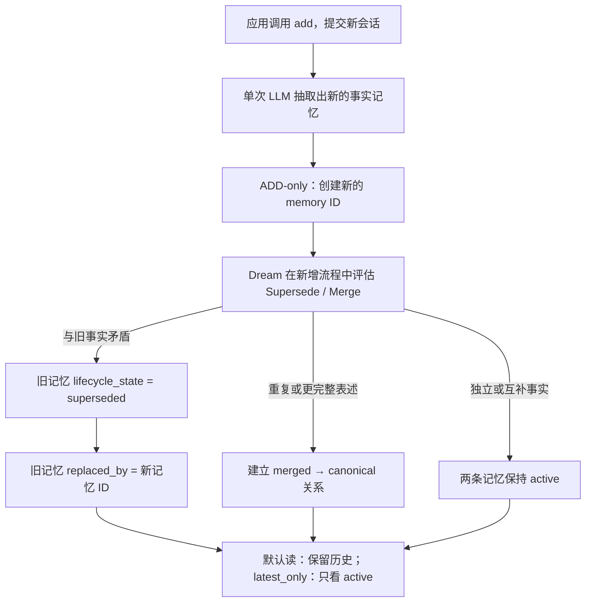

# Mem0 Platform 如何处理新事实与旧记忆冲突：Supersede 机制调研

> 调研日期：2026-08-13
>
> 对象：Mem0 Platform v3（托管商业版）
>
> 术语校正：本文讨论的是 **Supersede / Superseded（取代 / 已被取代）**，不是 “superside”。该能力属于 Platform 的 **Dream** 记忆整理层。

## 1. 结论先行

Mem0 Platform v3 处理“新事实与旧事实矛盾”的核心做法不是覆盖旧记录，也不是物理删除旧记录，而是：

1. 采用 **ADD-only** 写入，把新事实保存成一条新的记忆；
2. 在同一次记忆新增处理流程中运行 Dream 的 **Supersede**；
3. 若新事实被判定取代旧事实，旧记忆被标记为 `superseded`，并通过 `replaced_by` 指向新记忆；
4. 历史仍然保留，普通读取默认仍可返回旧记忆，只是它带有“已被取代”状态；
5. 业务若只需要“当前真相”，必须在 `search` 或 `get_all` 时传 `latest_only=true`，只返回 active 记忆；
6. 如果删除当前记忆但不同时删除替代链，旧记忆可能重新浮现。需要彻底删除整条链时使用 `delete_linked=true`。

因此，更准确的数据模型是“**不可破坏的事实版本 + 生命周期边 + 读时视图**”，而不是传统数据库里的原地 UPDATE：

```text
旧事实 A (superseded) ──replaced_by──> 新事实 B (active)
```

这一点解决了两个相互冲突的目标：一方面，面向当前状态的应用不应被旧事实误导；另一方面，时间问题、审计和历史回溯不能因为更新而丢失证据。

## 2. 官方产品结构：Dream 不只有 Supersede

Dream 是 Mem0 Platform 的后台记忆整理层，包含三个相互独立的动作：

| 动作 | 处理对象 | 数据行为 | 默认读取行为 | 可用性 |
| --- | --- | --- | --- | --- |
| Supersede | 新旧事实相互矛盾，且新事实代表当前状态 | 保留两条记忆；旧记忆标为 superseded 并指向新记忆 | active 和 superseded 都返回 | 所有 Platform 套餐、始终开启 |
| Merge | 完全重复、近重复或新事实是旧事实的更完整版本 | 保留 canonical 记忆；重复项标为 merged | merged 默认隐藏 | 所有 Platform 套餐、始终开启 |
| Synthesis | 多条记忆共同暗示更高层规律 | 新增一条 pattern memory，并链接来源证据 | 与普通记忆一起返回 | Pro 及以上，按项目开启 |

Supersede 和 Merge 都在新增记忆时执行，不需要开关，也不是周期性离线任务。只有 Synthesis 是定时后台任务。官方文档明确称，Supersede/ Merge 与新记忆变得可搜索处于同一处理时间尺度，不需要等待另一个调度周期。

来源：[Dream 官方文档](https://docs.mem0.ai/platform/features/dream)

## 3. 当前 v3 的写入流程

### 3.1 写入算法已从“修改记忆”转为“只新增事实”

Platform v3 的抽取管线是 single-pass、ADD-only：LLM 从新会话中抽取值得保存的事实，新的事实只会被新增，不在抽取阶段对已有事实执行 UPDATE 或 DELETE。官方迁移文档以“用户从纽约搬到旧金山”为例，说明新旧事实都会保留，以支持“以前住在哪里”和“现在住在哪里”两类问题。

这和旧版 Mem0 的行为有本质差异：

| 版本/机制 | 自动写入阶段可能执行的动作 | 冲突后的主要形态 |
| --- | --- | --- |
| 旧算法（Platform v2 / 旧 OSS） | ADD / UPDATE / DELETE / NOOP | 可能覆盖或删除旧事实 |
| Platform v3 基础抽取 | ADD only | 新旧事实并存 |
| Platform v3 + Dream Supersede | ADD 新事实，再建立生命周期关系 | 新事实 active；旧事实 superseded，历史保留 |

所以，不能用旧版 OSS 中“LLM 在 ADD/UPDATE/DELETE/NOOP 中选一个”的公开代码，来解释当前商业版 Supersede 的内部实现。旧版设计只能作为演进背景，不能作为 v3 的实现证据。

来源：[Platform v2 → v3 迁移文档](https://docs.mem0.ai/migration/platform-v2-to-v3)、[Add Memory](https://docs.mem0.ai/core-concepts/memory-operations/add)

### 3.2 Supersede 位于 ADD-only 抽取之后/周围的生命周期整理阶段

官方没有公开服务端代码、提示词、相似度阈值或候选召回数量，但从公开的外部契约可以确认以下流程：



这里最重要的是“是否矛盾”与“是否只是补充”不能只靠字符串不同判断。例如：

- “用户住在里斯本” → “用户搬到了柏林”：当前居住地发生替换，适合 Supersede；
- “用户有一只叫 Rex 的狗” → “Rex 是 3 岁金毛”：后者是更丰富的同一事实，官方将其作为 Merge 示例；
- “用户喜欢咖啡” → “用户也喜欢茶”：两条互补，不应互相取代；
- “用户 2023 年住在里斯本” → “用户 2025 年住在柏林”：表面矛盾但在不同时间区间都可能为真，应保留历史和时间信息。

## 4. 数据模型与可观察字段

Mem0 的公开 OpenAPI 响应 schema 暴露了至少两个与 Supersede 直接相关的字段：

| 字段 | 含义 | 用途 |
| --- | --- | --- |
| `lifecycle_state` | 记忆生命周期状态 | 区分 active、superseded、merged 等状态；公开 schema 目前没有列出完整 enum |
| `replaced_by` | 取代当前记忆的新记忆 ID；没有则为 null | 从旧事实沿替代链找到新事实 |

下例是根据官方字段契约绘制的示意，不是官方响应的逐字复制：

```json
{
  "id": "mem-old",
  "memory": "User lives in Lisbon",
  "lifecycle_state": "superseded",
  "replaced_by": "mem-new"
}
```

```json
{
  "id": "mem-new",
  "memory": "User moved to Berlin",
  "lifecycle_state": "active",
  "replaced_by": null
}
```

来源：[Mem0 OpenAPI](https://docs.mem0.ai/openapi.json)

### 4.1 替代链而非单一版本号

如果事实多次变化，可以形成链：

```text
Lisbon ──replaced_by──> Berlin ──replaced_by──> Tokyo
```

公开 Python SDK 将其称作可传递的 `linked_memory_ids` chain。`delete_linked=true` 会在删除当前节点时，同时删除它所取代的更老节点；默认只删除指定 ID。SDK 明确说明，如果只删除当前事实，旧的 superseded 事实可能再次浮现。

来源：[Python SDK `MemoryClient.delete`](https://github.com/mem0ai/mem0/blob/main/mem0/client/main.py)、[相关已合并 PR #5270](https://github.com/mem0ai/mem0/pull/5270)

## 5. 读路径：历史视图与当前状态视图

Dream 的读取语义如下：

| 读取方式 | active | superseded | merged | 适用场景 |
| --- | ---: | ---: | ---: | --- |
| 默认 `search` / `get_all` | 是 | 是 | 否 | 历史回顾、审计、时间问题 |
| `latest_only=true` | 是 | 否 | 否 | 个性化提示词、当前用户画像、当前配置 |
| `include_merged=true` | 是 | 是 | 是 | 完整审计与去重排查 |

生产应用最容易踩的坑是：以为 Supersede 后旧事实已经自动从普通搜索中消失。官方文档恰好相反——**superseded 默认仍然返回**，只是被标注为历史。如果把普通搜索结果不加筛选地塞进 LLM，上下文中仍可能同时出现新旧事实。

只取当前事实的 Python 调用：

```python
from mem0 import MemoryClient

client = MemoryClient(api_key="...")

current = client.search(
    "Where does the user live now?",
    filters={"user_id": "alice"},
    latest_only=True,
)

snapshot = client.get_all(
    filters={"user_id": "alice"},
    latest_only=True,
)
```

`latest_only` 已进入当前 Python SDK 的 `SearchMemoryOptions` 和 `GetAllMemoryOptions`，CLI 也提供 `search --latest-only` 与 `list --latest-only`。截至调研日，公开 OpenAPI 文件仍未声明这个真实参数；Mem0 自己的已合并 PR 也注明 OpenAPI 落后于线上 API，缺少若干已实测字段。因此，实现时应以当前 SDK、CLI 和 Dream 页面为准，同时固定并验证所用 SDK 版本。

来源：[Python SDK 类型](https://github.com/mem0ai/mem0/blob/main/mem0/client/types.py)、[已合并 PR #6696 的线上实测说明](https://github.com/mem0ai/mem0/pull/6696)

## 6. 写入和一致性的时序

Platform v3 的 `add` 是异步的，通常先返回 `event_id` 和 `PENDING`。应用若需要立刻验证冲突消解，应轮询事件直到 `SUCCEEDED`，再执行读取断言。

```python
first = client.add(
    [{"role": "user", "content": "I live in Lisbon."}],
    user_id="alice",
)

second = client.add(
    [{"role": "user", "content": "I moved to Berlin."}],
    user_id="alice",
)

# 等 second 对应事件成功后再验证：
all_versions = client.search(
    "Where does Alice live?",
    filters={"user_id": "alice"},
)
current_only = client.search(
    "Where does Alice live now?",
    filters={"user_id": "alice"},
    latest_only=True,
)
```

Supersede 本身不是每周/每天运行的 Dream Synthesis 调度任务；它属于 add 流程。另一方面，Temporal Reasoning 的日期富化可能在写入成功后再异步补齐，官方说明新记忆中的日期通常在几秒内影响检索。因此，测试“当前事实过滤”与测试“时间排序”时，应使用不同的等待条件。

来源：[Platform v3 迁移文档](https://docs.mem0.ai/migration/platform-v2-to-v3)、[Temporal Reasoning](https://docs.mem0.ai/platform/features/temporal-reasoning)、[Events API](https://docs.mem0.ai/api-reference/events/get-event)

## 7. Supersede、Temporal Reasoning、Memory Decay 和显式 Update 的区别

这四种机制都可能让“新信息比旧信息更重要”，但它们解决的问题完全不同：

| 机制 | 是否改变生命周期 | 是否保留旧记录 | 决策依据 | 主要作用阶段 |
| --- | --- | --- | --- | --- |
| Dream Supersede | 是：旧事实 → superseded | 是 | 新旧事实是否构成取代关系 | 写入时 + 读时过滤 |
| Temporal Reasoning | 否 | 是 | 查询时间意图与 memory event date/range 是否匹配 | 搜索排序 |
| Memory Decay | 否 | 是 | 最近被检索的时间和频率 | 搜索分数缩放（0.3×–1.5×） |
| 显式 `update(memory_id, ...)` | 原地改同一条记忆 | 旧文本只留在变更历史中 | 应用已明确知道哪条记录需要改 | 确定性人工/业务修正 |

几个关键判断：

- **Supersede 不等于 Memory Decay。** Decay 只降低长时间未访问事实的排名，不判断真假，也不会把事实标成过时。
- **Supersede 不等于 Temporal Reasoning。** Temporal Reasoning 让“去年”和“现在”的查询命中不同时间事实；Supersede 表达某事实已被另一个事实取代。
- **自动 Supersede 不等于显式 Update。** Update 覆盖指定 memory ID 的文本并重建索引，适合纠错；Supersede 创建新的事实版本并保留旧版本，适合状态随时间演化。
- **Memory History API 不等于 Supersede 链。** History API 文档列出的事件是 ADD/UPDATE/DELETE；自动生命周期关系应通过 `lifecycle_state`、`replaced_by`、Dream Dashboard 和最新读取行为核验，不能假定它一定表现为 UPDATE 历史事件。

来源：[Memory Decay](https://docs.mem0.ai/platform/features/memory-decay)、[Update Memory](https://docs.mem0.ai/core-concepts/memory-operations/update)、[Memory History](https://docs.mem0.ai/api-reference/memory/history-memory)

## 8. 冲突检测内部究竟怎么做：已知、推断与未知

为了避免把产品文案扩写成不存在的实现细节，这里按证据等级拆分。

### 8.1 官方公开且可确认

- Supersede 会在新记忆写入时评估；
- 目标是识别“新事实与旧事实矛盾，且新事实替换旧事实”的情况；
- 旧记忆不删除，带状态并链接到新记忆；
- Supersede 和 Merge 始终开启；
- 当前事实可以通过 `latest_only` 单独读取；
- 结果可在 Dream Dashboard 审阅；
- 服务端返回了支持上述关系的数据字段。

### 8.2 合理但未被官方实现文档确认的推断

- 系统需要先在相同身份范围内召回与新事实相关的旧记忆，再做矛盾/重复/互补分类；否则无法在大规模记忆中有效比较；
- 矛盾分类很可能使用语义模型或 LLM，而不仅是 embedding 距离，因为“住在 A”与“住在 B”语义非常接近，却需要理解槽位互斥和时间变化；
- `replaced_by` 与生命周期状态很可能存放于托管服务的事实/元数据源，并参与 `latest_only` 服务端过滤。

这些推断符合产品行为，但 Mem0 没有公开 Dream 服务端代码，因此不应写成确定事实。

### 8.3 当前公开资料没有回答

- Supersede 使用的具体模型、系统提示词和 temperature；
- 召回多少条旧记忆、使用何种候选搜索与阈值；
- 矛盾判定是否有置信度、置信度阈值能否配置；
- 同时有多个旧事实时如何选择被替代集合；
- 并发写入同一事实槽位时是否串行化、是否有事务或乐观锁；
- 错误 Supersede 的 API 级撤销方法；
- `lifecycle_state` 的完整 enum，以及 `include_merged` 在各 SDK 的稳定参数名；
- Supersede 在 `user_id + agent_id/run_id/app_id` 混合 scope 中的精确匹配规则；
- 是否、以及如何对 Dream 上线前的存量记忆进行追溯处理。

如果这些问题关系到生产数据正确性，需要向 Mem0 Enterprise 支持索要架构说明和 SLA，不能依靠 OSS 代码猜测商业后端。

## 9. 生产接入建议

### 9.1 默认使用当前事实视图给 LLM

用户画像、当前偏好、当前地址、当前订阅、当前项目状态等 prompt 上下文，建议统一 `latest_only=True`。只有时间问答、审计和状态演化分析才读取 superseded 历史。

### 9.2 把“随时间变化的状态”和“纠错”分开

- “我搬到柏林了”：通过 `add` 形成新状态，让 Supersede 保留迁移历史；
- “你记错了，我从来没住过里斯本”：这是对错误数据的纠正，优先显式 update/delete，并记录业务审计；
- “我 2024 年住里斯本，2025 年住柏林”：在写入时携带正确 `timestamp`，让时间信息完整。

### 9.3 明确删除语义

- 只删除当前节点：`client.delete(current_id)`；旧节点可能重新成为可见/最新事实；
- 删除当前事实及其更老替代链：`client.delete(current_id, delete_linked=True)`；
- 涉及合规删除时不要仅依赖 `latest_only`，因为它只是读取过滤，不是物理删除。

### 9.4 为 Supersede 单独建立回归集

至少覆盖：

1. 单步反转：喜欢 → 不喜欢；
2. 多步状态链：A 城市 → B 城市 → C 城市；
3. 互补事实不应误替代；
4. 近重复应 Merge，不应 Supersede；
5. 带明确时间的历史事实不能丢；
6. 同一文字在不同 user scope 中必须隔离；
7. 并发添加两个冲突事实时的最终 active 集；
8. 删除当前节点后旧节点是否按预期浮现；
9. `latest_only` 的 search 和 get_all 结果一致；
10. 写入事件完成前后读取结果的时序。

测试断言不应只检查第一条搜索文本，还应检查每条记忆的 `id`、`lifecycle_state`、`replaced_by`、时间字段和默认/最新视图的集合差异。

### 9.5 固定版本并做契约测试

官方文档、OpenAPI、Python SDK 和 TypeScript SDK 的参数曾出现短期漂移。应固定 SDK 版本，在 CI 中用沙箱用户做最小 live contract test，至少确认：

- `latest_only` 被真实发送并生效；
- `replaced_by` / `lifecycle_state` 的字段形状；
- `delete_linked` 的传递删除语义；
- `add` 事件轮询和失败处理；
- 默认读取是否仍包含 superseded 记忆。

## 10. 对自建记忆系统的可复用设计

如果要在本项目或自建系统里复刻其思想，推荐将“事实内容”和“事实生命周期”分离：

```text
Memory
  id
  subject/scope
  predicate-or-topic
  content
  valid/event time
  transaction time
  lifecycle_state: active | superseded | merged | deleted
  replaced_by
  merged_into
  evidence/source
  confidence
```

写入管线可以设计成：

1. 从新会话抽取原子事实；
2. 按 tenant/user/agent/run scope 隔离；
3. 用实体、主题/谓词、向量和时间范围共同召回候选旧事实；
4. 将每个候选分类为 independent / duplicate / enrich / supersede / correction / uncertain；
5. 低置信度只新增或进入人工复核，不自动退休旧事实；
6. 用单事务写入新事实、生命周期边和审计记录；
7. 默认给生成模型 active-only 视图，历史查询再展开链；
8. 定期检测 active 分叉、环、孤立替代边和跨 scope 污染。

相较于直接 UPDATE，这种模型写放大更高、存储量更大，但可审计、可回溯，并且天然适合时间问答。真正困难的不是保存 `replaced_by`，而是准确判断“互斥状态”“时间演化”“补充信息”和“用户纠错”之间的差异。

## 11. 最终判断

Mem0 Platform 当前对新旧事实冲突的产品答案可以概括为：

> **新事实追加保存，旧事实非破坏性退役，用显式关系维护事实版本链，再由读取参数选择历史视图或当前真相视图。**

这比“发现冲突就删除旧向量”更适合长期记忆，因为它保留了时间和证据；但它并不会自动保证业务端永远只看到当前事实。生产正确性的关键在于：正确使用 `latest_only`、等待异步写入完成、处理替代链删除，并针对误判和并发建立自己的验证与补偿机制。

## 12. 主要参考资料

1. [Dream：Supersede、Merge、Synthesis 的官方语义](https://docs.mem0.ai/platform/features/dream)
2. [Platform v2 → v3：ADD-only 算法与读时处理](https://docs.mem0.ai/migration/platform-v2-to-v3)
3. [How Mem0 Works：抽取、存储与检索模型](https://docs.mem0.ai/core-concepts/how-it-works)
4. [Add Memory：当前 additive pipeline](https://docs.mem0.ai/core-concepts/memory-operations/add)
5. [Temporal Reasoning：时间检索与 reference_date](https://docs.mem0.ai/platform/features/temporal-reasoning)
6. [Memory Decay：访问驱动的搜索降权](https://docs.mem0.ai/platform/features/memory-decay)
7. [Update Memory：显式原地更新](https://docs.mem0.ai/core-concepts/memory-operations/update)
8. [Memory History API](https://docs.mem0.ai/api-reference/memory/history-memory)
9. [OpenAPI：`replaced_by` 与 `lifecycle_state` 响应字段](https://docs.mem0.ai/openapi.json)
10. [Python SDK：`latest_only` 类型与 `delete_linked` 链删除](https://github.com/mem0ai/mem0/tree/main/mem0/client)
11. [PR #6696：SDK/CLI 参数补齐及 live API 实测](https://github.com/mem0ai/mem0/pull/6696)
12. [PR #5270：替代链的传递删除语义](https://github.com/mem0ai/mem0/pull/5270)
