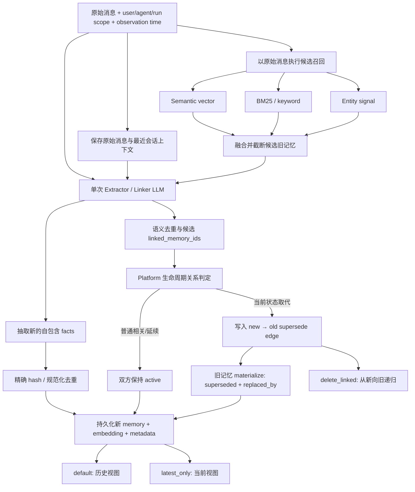

# Mem0 商业版 Supersede：最可能的实现全流程、数据模型与实验取证

> 调研与实验日期：2026-08-13
>
> 对象：Mem0 Platform v3 托管商业版、Mem0 OSS `739534c0a3232e4b5ae6b4349ae4e50fc00df614`
>
> 文档性质：基于公开文档、开源代码与黑盒实验形成的架构推断，不代表 Mem0 官方披露的服务端实现

## 1. 结论先行

综合 Mem0 公开契约、OSS v3 ADD-only 管线和多组 Platform 黑盒实验，当前最可能的实现是：

1. 新消息进入 ADD-only 写入管线，不原地覆盖旧记忆；
2. 系统先使用原始消息，在同一身份 scope 内召回一小批相关旧记忆。OSS 当前固定 `top_k=10`；商业版的精确数量未公开，但实验行为与候选截断一致；
3. 一次 LLM 调用同时读取原始消息、最近消息和候选旧记忆，完成新 fact 抽取、语义去重以及候选 `linked_memory_ids` 选择；
4. 托管平台的隐藏生命周期层进一步区分普通相关关系与真正的 supersede 关系；
5. 新记忆作为 active 节点写入，并保存一条可从新记忆遍历到旧记忆的、按 memory ID 持久化的 supersede 边；
6. 旧记忆保留正文和 ID，但物化为 `lifecycle_state=superseded`，并反向投影 `replaced_by=<new_memory_id>`；
7. 默认列表保留历史；`latest_only=true` 过滤 superseded 节点；`delete_linked=true` 从当前节点沿新→旧的链传递删除；
8. 精确相同文本还存在一个独立的全局 hash/规范化去重层，它不一定依赖候选 Top-K；
9. Memory History 只记录内容层的 ADD/UPDATE 等事件，不记录自动 supersede 关系，说明关系/生命周期至少在逻辑上属于独立存储或隐藏系统字段；
10. 关系一旦建立，即使把新记忆文本改成完全无关内容，关系仍然存在并可级联删除，证明它是按 memory ID 持久化的，不是读取或删除时重新比较文本。

一句话总结：

```text
原始消息召回候选 → LLM 同时抽取 fact 与选 link → 平台生命周期层形成 typed supersede edge
→ 新侧保存可遍历的前向关系 → 旧侧物化 replaced_by/lifecycle_state → 读路径提供历史视图与当前视图
```

## 2. 证据等级

为避免把推测写成事实，本文使用三种证据等级：

| 等级 | 含义 |
| --- | --- |
| 已验证 | 在 Mem0 Platform v3 线上 API 中通过隔离用户、事件完成等待和清理得到的稳定行为 |
| 强推断 | 同时得到 OSS 代码和黑盒行为支持，但商业服务端源码未公开 |
| 未确认 | 黑盒接口无法区分，必须依赖服务端源码、数据库 schema 或官方说明 |

## 3. 最可能的端到端流程



### 3.1 阶段一：原始消息先召回候选旧记忆

OSS 当前实现直接用 `parsed_messages` 生成查询 embedding，并在相同 `user_id` / `agent_id` / `run_id` scope 内检索 `top_k=10`。旧记忆随后被映射为短整数 ID，以降低 LLM 幻觉 ID 的概率。

关键代码位置：

- [`mem0/memory/main.py#L879-L894`](https://github.com/mem0ai/mem0/blob/739534c0a3232e4b5ae6b4349ae4e50fc00df614/mem0/memory/main.py#L879-L894)
- [`mem0/memory/main.py#L896-L918`](https://github.com/mem0ai/mem0/blob/739534c0a3232e4b5ae6b4349ae4e50fc00df614/mem0/memory/main.py#L896-L918)

黑盒严格对照也支持这个顺序：同一组旧记忆中，原始陶瓷消息查询目标旧 fact 排名第 13，而实际抽取出的新 fact 查询旧 fact 排名第 1；最终新旧 fact 仍然同时 active。若商业版稳定采用“先抽 fact，再用 fact Top-K 召回关联对象”，该旧 fact 应进入候选并更可能被 supersede。需要保留的边界是：写入内部检索可能与公开 search 使用不同模型、阈值或融合配置，因此这是强推断，不是源码级证明。

### 3.2 阶段二：同一次 LLM 调用完成 fact 抽取与候选关联

OSS 将以下输入放入一次 LLM 调用：

```text
Existing Memories
New Messages
Last k Messages
Observation Date
custom instructions
```

Prompt 要求模型在新记忆与候选旧记忆属于同实体/话题、偏好更新、事件延续或矛盾时输出 `linked_memory_ids`。输出中的 ID 必须来自候选集合。

关键代码与 Prompt：

- [`mem0/configs/prompts.py#L692-L701`](https://github.com/mem0ai/mem0/blob/739534c0a3232e4b5ae6b4349ae4e50fc00df614/mem0/configs/prompts.py#L692-L701)
- [`mem0/configs/prompts.py#L918-L936`](https://github.com/mem0ai/mem0/blob/739534c0a3232e4b5ae6b4349ae4e50fc00df614/mem0/configs/prompts.py#L918-L936)

### 3.3 阶段三：商业版把宽泛 link 转换成生命周期关系

OSS Prompt 中的 `linked_memory_ids` 含义很宽，包括 related、continuation、updated preference 和 contradiction。商业版不能把所有 link 都当作 supersede，否则“有一只狗 Max”与“Max 接种疫苗”也会互相取代。

平台实验显示：

- 套餐 Basic→Pro：旧记忆变为 superseded，`delete_linked` 的 `cascade_count=1`；
- Max 所有权→Max 接种疫苗：两条都 active，`delete_linked` 的 `cascade_count=0`。

因此平台至少在语义上维护了普通相关关系与 supersede 关系的区别。它可能是显式 `relation_type`，也可能是两个独立 ID 集合；公开接口不足以区分。

### 3.4 阶段四：按 ID 持久化关系并物化生命周期

一旦建立 Basic→Pro 关系，实验将 Pro 记忆原地更新为完全无关的“用户喜欢古典钢琴”。20 秒后：

```text
旧 Basic：replaced_by 仍指向该 memory ID，lifecycle_state 仍为 superseded
新节点：正文已变成钢琴音乐，lifecycle_state 仍为 active
```

再对“钢琴音乐”节点执行 `delete_linked=true`，API 仍返回 `cascade_count=1`，并将它与旧 Basic 一起删除。关系显然不是根据当前文本或 embedding 临时重算，而是以 memory ID 为端点持久化。

### 3.5 阶段五：不同读接口投影不同视图

已观察到同一条旧记忆在不同接口中出现不同投影：

```text
单条 GET：replaced_by=M2, lifecycle_state=superseded
V3 普通列表：replaced_by 可能为 null，且通常不返回 lifecycle_state
latest_only：过滤该旧记忆
History：只有内容 ADD/UPDATE，不记录 supersede 字段变化
```

删除当前节点后还观察到过悬空投影：普通列表中的旧记忆 `replaced_by=null`，但单条 GET 仍指向已删除的新 ID，`latest_only` 仍过滤旧节点。即使等待 45 秒也未收敛。这说明列表、单条 GET、当前视图和 History 很可能读取不同物化字段、索引或服务投影。

## 4. 最可能的数据模型

### 4.1 可以由实验确认的逻辑模型

```text
Memory M2 (new, active)
  └── SUPERSEDES / linked edge ──> Memory M1 (old, superseded)

Memory M1 reverse projection:
  replaced_by = M2.id
  lifecycle_state = superseded
```

确认度高的性质：

- 端点是稳定 memory ID；
- 权威遍历方向至少支持新→旧；
- 旧→新的 `replaced_by` 是反向投影或物化字段；
- supersede 边和普通 related 边的级联语义不同；
- 边不随节点文本更新自动重算；
- 边可驱动 `latest_only` 和 `delete_linked`；
- 自动生命周期变化不进入公开 Memory History。

### 4.2 最可能的物理模型：混合式

最合理的生产实现是“主记忆记录 + 前向关系存储 + 旧侧物化字段”：“前向关系存储”可能是新记忆 JSON/JSONB 字段，也可能是独立关系表。

```sql
memory (
  id                  uuid primary key,
  owner_scope         jsonb not null,
  text                text not null,
  embedding           vector,
  metadata            jsonb,
  created_at          timestamptz,
  updated_at          timestamptz,

  lifecycle_state     text,       -- active / superseded / merged ...
  replaced_by         uuid,       -- 旧侧反向物化
  synthesized         boolean
)
```

候选实现 A：新节点隐藏字段。

```json
{
  "id": "M2",
  "superseded_memory_ids": ["M1"]
}
```

候选实现 B：独立关系表。

```sql
memory_relation (
  source_memory_id   uuid,        -- 新记忆
  target_memory_id   uuid,        -- 旧记忆
  relation_type      text,        -- SUPERSEDES / RELATED / CONTINUES / MERGES_INTO
  confidence         float,
  resolver_version   text,
  created_at         timestamptz,
  primary key (source_memory_id, target_memory_id, relation_type)
)
```

### 4.3 概率判断

| 物理实现 | 当前判断 | 理由 |
| --- | ---: | --- |
| 新侧隐藏 supersede ID 数组 + 旧侧物化字段 | 约 45% | 官方/SDK 使用 `linked_memory_ids chain` 表述，天然支持新→旧递归 |
| 独立关系/生命周期表 + 旧侧物化字段 | 约 45% | 便于多边、关系类型、反向查找、并发和递归删除；History 与生命周期分离也支持独立层 |
| 只在旧节点保存单个 `replaced_by` | 约 8% | 可以反向查找，但难以自然解释官方的新→旧 linked chain 与传递级联 |
| 每次读取/删除时重新做语义分析 | 低于 2% | 新节点文本改成无关内容后，原边仍能精确级联 |

这里的 45%/45% 不是统计置信度，只是工程判断。黑盒 API 无法百分百区分隐藏数组与关系表，因为二者可以产生完全相同的外部行为。

## 5. 黑盒实验与证据汇总

所有实验都使用唯一隔离 `user_id`，等待 ADD 事件 `SUCCEEDED` 后读取，并在结束时执行 Delete All、确认剩余 count 为 0。API Key 不写入文件或仓库。

### 5.1 E1：Basic→Pro 的 Supersede 与反向投影

输入：

```text
M1: My current subscription plan is Basic.
M2: I upgraded from Basic to Pro. My current plan is Pro.
```

结果：

```text
GET M1:
  replaced_by = M2.id
  lifecycle_state = superseded

GET M2:
  replaced_by = null
  lifecycle_state = active

latest_only:
  只返回 M2
```

证据意义：平台确实保存生命周期关系；`replaced_by` 不是没有使用，只是在部分列表投影中可能为 null。

### 5.2 E2：`delete_linked` 验证新→旧可遍历边

对 E1 的 M2 执行：

```http
DELETE /v1/memories/{M2}/?delete_linked=true
```

结果：

```json
{
  "message": "Memory deleted successfully!",
  "cascade_count": 1
}
```

随后 M1、M2 均为 404。官方 SDK/PR 也明确说明，该参数会传递删除当前记忆所 supersede 的更老记忆，即 `linked_memory_ids` chain，并与 `latest_only` 互为删除侧和读取侧机制。

来源：[Mem0 PR #5270](https://github.com/mem0ai/mem0/pull/5270)、[Mem0 release](https://github.com/mem0ai/mem0/releases)

### 5.3 E3：原始消息召回与 fact 召回顺序的严格对照

旧事实：

```text
The user's cobalt archive code is ORBIT-7741.
```

加入 12 条与陶瓷釉料高度相关的旧记忆。新原始消息只讨论陶瓷，但通过 custom instructions 确认实际抽取结果为：

```text
The user's cobalt archive code is NOVA-8822.
```

同一组记忆、同一轮实验中的公开检索排名：

| 查询 | ORBIT 旧事实排名 |
| --- | ---: |
| 原始陶瓷消息 | 13 |
| 抽取后的 NOVA fact | 1 |

最终状态：

```text
ORBIT: active, replaced_by=null
NOVA:  active, replaced_by=null
latest_only 同时返回两条
```

证据意义：强烈支持“原始消息先召回并截断候选，LLM 只能从候选中链接”；不支持“稳定地先抽 fact，再用 fact 做一次相同范围 Top-K 关联检索”。

限制：公开 search 与写入内部 search 可能使用不同模型、阈值或融合策略，因此只能定为强推断。

### 5.4 E4：抑制 link 输出后，后置 Resolver 未独立读取原始纠错语义

两组都先保存：

```text
User is allergic to peanuts.
```

第二条原始消息分别为：

```text
A: Correction: I am not allergic to peanuts. My earlier statement was wrong.
B: My status has not changed: I am still allergic to peanuts.
```

两组都被强制抽取成相同中性文本，并禁止输出 `linked_memory_ids`：

```text
User discussed peanut allergy information.
```

结果：两组 `latest_only` 都返回旧过敏记忆和新中性记忆，A 并未 supersede 旧事实。

证据意义：不支持“一个独立后置 Resolver 脱离抽取结果，再重读 raw message 判断矛盾”的强假设。更可能是 raw message 在 Extractor/Linker 阶段被使用，生命周期层消费已产生的候选 link/关系信号。

限制：custom instructions 可能改变整条提示词行为，不能排除商业版在其他路径中还存在额外 Resolver。

### 5.5 E5：精确相同 fact 在 Top-K 外仍被去重

同样用 12 条陶瓷记忆把目标旧 fact 挤到公开搜索第 13，但这次强制抽取与旧 fact 完全相同的文本。ADD 事件 `results=[]`，最终目标文本仍只有一条。

证据意义：商业版很可能还存在独立于候选语义 link 的精确 hash/规范化去重层。合理拆分是：

```text
完全相同事实 → 全局精确去重
同一槽位不同值 → 依赖召回候选与 LLM link / lifecycle resolution
```

### 5.6 E6：修改新节点文本后，关系仍按 ID 存续

先建立 Basic→Pro，再通过显式 update 把 Pro 节点改成：

```text
User enjoys listening to classical piano music.
```

20 秒后，旧 Basic 仍为：

```text
replaced_by = 已改成钢琴音乐的同一个 memory ID
lifecycle_state = superseded
```

随后对钢琴节点执行 `delete_linked=true`，仍返回 `cascade_count=1`，并删除新旧两个节点。

证据意义：这是“关系按 ID 持久化”的最强黑盒证据。关系不是读取/删除时基于当前文本、embedding 或 LLM 临时重算。

### 5.7 E7：普通相关关系不会进入 supersede 级联

输入：

```text
M1: User has a dog named Max.
M2: Max received a rabies vaccination.
```

结果：两条都 active、`replaced_by=null`。删除 M2 并设置 `delete_linked=true` 返回：

```json
{
  "message": "Memory deleted successfully!",
  "cascade_count": 0
}
```

证据意义：平台不会将所有同实体/同主题 link 都作为 supersede 删除链。底层至少存在普通相关关系与 supersede 关系的语义区分。

### 5.8 E8：History 与生命周期关系分离

Basic→Pro 形成 supersede 后：

- 旧 Basic History 仍只有 ADD；
- 新 Pro History 有 ADD，改成钢琴后再多一个 UPDATE；
- 两边 History 都没有 `replaced_by`、`lifecycle_state`、`linked_memory_ids` 或 SUPERSEDE event；
- 单条 GET、`latest_only` 和 `delete_linked` 却都能看到或使用该关系。

证据意义：内容审计与生命周期关系至少是两个逻辑通道。关系可能在独立表/服务，也可能是被 History 屏蔽的系统字段。

### 5.9 E9：删除后的投影不一致与悬空状态

默认删除当前 Pro 节点、不使用 `delete_linked`，等待 45 秒后：

```text
普通列表：仍返回旧 Basic，replaced_by=null
单条 GET：旧 Basic 仍 replaced_by=已删除的 Pro，lifecycle_state=superseded
latest_only：不返回旧 Basic
```

证据意义：`replaced_by` 和 `latest_only` 不是统一的读时反向查询结果；更像不同物化字段/索引或最终一致性服务。也说明当前线上行为并不总是符合 SDK 描述的“删除表头后旧记忆重新浮现”。生产系统不能把默认删除当作可靠的 supersede 撤销操作。

### 5.10 E10：三代链并非每次稳定形成

输入 Basic→Pro→Enterprise 后，一次实验得到：

```text
Basic → replaced_by Pro
Pro active
Enterprise active
latest_only 同时返回 Pro 与 Enterprise
```

证据意义：自动 Supersede 依赖候选召回和模型关系判断，不像具有确定 `state_key` 的事务型版本链。它可能出现漏链或分叉，不能假设任意状态序列都会稳定形成 M1←M2←M3。

## 6. 已验证、强推断和仍未知

### 6.1 已验证

- 新旧冲突可形成 `old.replaced_by=new` 和 `old.lifecycle_state=superseded`；
- `latest_only` 可过滤已 superseded 节点；
- `delete_linked=true` 可从新节点级联到旧节点；
- 关系按 memory ID 持久化，不随新节点文本改变而自动重算；
- 普通相关事件与 supersede 级联不同；
- 自动 supersede 不进入公开 Memory History；
- V3 列表、单条 GET、History 和 `latest_only` 可能出现不同投影；
- 当前线上存在删除后悬空生命周期或长期不收敛的行为；
- 自动链路存在非确定性，三代状态不保证稳定串链；
- 精确相同文本存在独立去重行为。

### 6.2 强推断

- 写入关联候选优先由原始消息召回，而不是稳定地由抽取后的 fact 再召回；
- Extractor/Linker 在一次 LLM 调用内同时抽取 fact 和选择候选旧记忆；
- 商业生命周期层消费 link/隐藏关系信号，再决定是否物化 supersede；
- 新→旧关系是权威或至少可遍历的一侧，`replaced_by` 是旧→新的反向投影；
- 当前视图很可能由独立生命周期索引或物化状态驱动。

### 6.3 仍未知

- 商业版内部候选数量是否严格为 10；
- 内部具体 embedding、reranker、BM25/entity 融合权重和阈值；
- 关系判定使用何种 LLM、Prompt、temperature 和置信度阈值；
- 是否存在显式 `relation_type`，还是不同的隐藏 ID 集合；
- 前向边物理上位于新记忆 JSON/JSONB 字段还是独立关系表；
- 并发写入同一事实槽位是否有锁、唯一约束或冲突重试；
- 如何通过公开 API 正确撤销错误的自动 supersede；
- Merge、Synthesis 与 Supersede 是否共享同一关系存储。

## 7. 对生产接入的直接启示

### 7.1 当前状态问答必须使用 `latest_only`

默认读取仍可能返回历史版本。用户画像、当前地址、当前订阅和当前偏好应默认使用 `latest_only=true`；时间问答或审计才读取完整历史。

### 7.2 不要把自动 Supersede 当作确定性状态机

实验已经出现漏链、分叉和删除后悬空状态。高价值单值状态最好由应用额外维护结构化 `state_key`、当前指针和事务约束，Mem0 的自动 link 作为语义辅助与历史存储。

### 7.3 不要通过修改文本来修复错误关系

关系不会随正文更新重算。错误 Supersede 需要明确的关系撤销/重建机制；如果 Platform 没有公开 API，应删除并按正确顺序重建，或向 Mem0 支持确认 Dashboard 的修复语义。

### 7.4 删除当前节点时显式选择语义

- 只删除当前节点：可能留下悬空 superseded 状态，且旧记忆不一定按 SDK 描述恢复；
- `delete_linked=true`：会破坏整条旧版本链，适合彻底清除，不适合一般撤销；
- 生产接入应先在隔离环境验证当前 SDK/API 版本的行为。

### 7.5 保留自己的 provenance 与关系审计

公开 History 不记录自动 lifecycle 变化。若业务要求可解释、可撤销，应在自己的系统中记录：

```text
source message IDs
old/new memory IDs
observed_at
relation decision
confidence
resolver version
operator correction
```

## 8. 推荐的复刻模型

如果自建类似机制，不建议完全复刻“只依赖原始消息 Top-K + LLM link”。更稳妥的方案是：

```text
原始消息多路召回
UNION
抽取 fact 后按 state_key/entity 再召回
→ 候选去重
→ typed relation classifier
→ 事务写入 memory_relation
→ 物化 current head / replaced_by
```

推荐表结构：

```sql
memory (
  id                   uuid primary key,
  tenant_id            text not null,
  owner_id             text not null,
  text                 text not null,
  normalized_fact      jsonb,
  state_key            text,
  valid_from           timestamptz,
  valid_to             timestamptz,
  lifecycle_state      text not null,
  replaced_by          uuid,
  source_message_ids   jsonb,
  resolver_version     text,
  created_at           timestamptz,
  updated_at           timestamptz
);

memory_relation (
  source_memory_id     uuid not null,
  target_memory_id     uuid not null,
  relation_type        text not null,
  confidence           float,
  reason_code          text,
  resolver_version     text,
  created_at           timestamptz not null,
  primary key (source_memory_id, target_memory_id, relation_type)
);
```

这样既保留历史，又能可靠表达一对多、多对一、related、contradicts、supersedes、merges 等关系，并支持事务化撤销。

## 9. 实验限制与安全说明

- 实验使用 custom instructions 构造控制变量，属于诊断输入，不代表自然流量中的平均行为；
- 公开 search 排名只能近似内部写入候选排名；
- Platform 是持续演进的托管服务，结果只代表 2026-08-13 当日版本；
- 一对多 fan-out 补充实验遇到服务端断连，因此未用于判断数组与关系表；
- 物理存储结构必须由 Mem0 服务端源码、数据库 schema、内部导出或官方工程说明最终确认；
- 所有隔离测试用户，包括成功、失败和断连组，都已执行清理并确认剩余 count 为 0；
- API Key 未写入本文、实验结果文件或 Git 仓库。鉴于密钥曾在对话中直接发送，仍建议轮换。

## 10. 相关资料

- [Mem0 Dream](https://docs.mem0.ai/platform/features/dream)
- [Mem0 Add Memory](https://docs.mem0.ai/core-concepts/memory-operations/add)
- [Mem0 OpenAPI](https://docs.mem0.ai/openapi.json)
- [Mem0 OSS `main.py`](https://github.com/mem0ai/mem0/blob/739534c0a3232e4b5ae6b4349ae4e50fc00df614/mem0/memory/main.py)
- [Mem0 OSS additive extraction prompt](https://github.com/mem0ai/mem0/blob/739534c0a3232e4b5ae6b4349ae4e50fc00df614/mem0/configs/prompts.py)
- [PR #5270：`delete_linked` 与传递 linked chain](https://github.com/mem0ai/mem0/pull/5270)
- [PR #6696：Platform 参数与线上 effect testing](https://github.com/mem0ai/mem0/pull/6696)
- [前置调研：Mem0 商业版 Supersede 冲突解决机制](./Mem0商业版Supersede冲突解决机制调研_2026-08.md)
- [前置设计：Dream Supersede 记忆冲突与召回设计](./Dream-Supersede记忆冲突解决与召回设计_2026-08.md)
