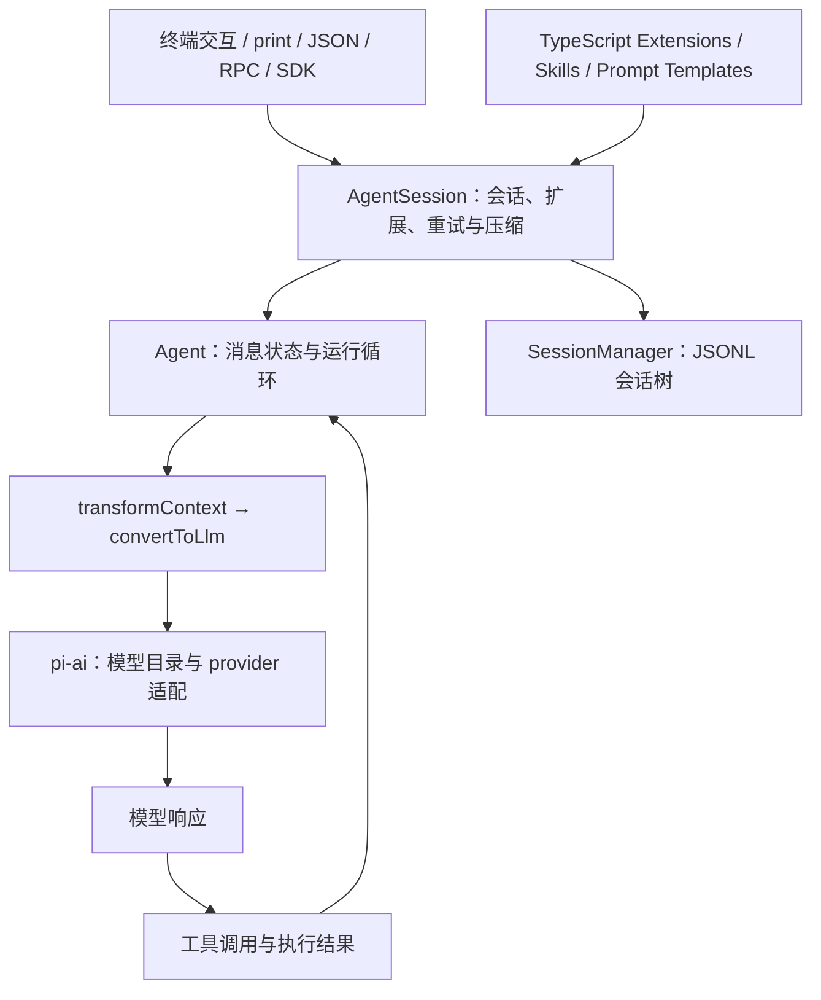
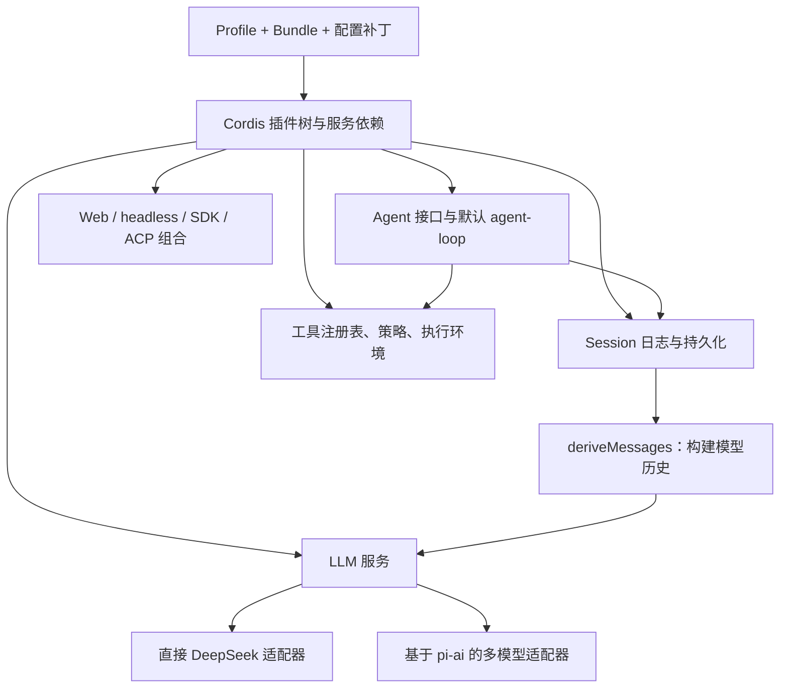
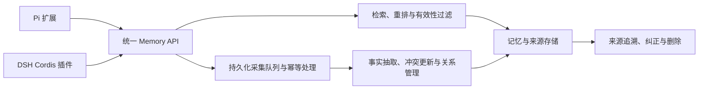

# Pi Agent 与 DeepSeek Harness：架构、生态及记忆接入技术洞察

> 调研日期：2026-09-08（Asia/Shanghai）。
>
> 调研对象：Pi Agent Harness，重点是 `pi-coding-agent` 与 `pi-agent-core`；DeepSeek Harness，命令名 `dsh`。Pi 的旧地址 `badlogic/pi-mono` 当前指向 `earendil-works/pi`，本文使用当前上游。
>
> 证据方式：官方仓库固定提交、架构文档、实现源码、配置和许可证静态审阅，以及 GitHub 发布记录；未安装运行 Agent、未调用付费模型、未做端到端性能或记忆效果实验。默认分支源码不等于发布版制品，本文不保证全部能力都已进入对应发行包。
>
> 决策场景：选择可二次开发的 Agent 宿主，并结合本仓库已有的记忆研究，判断如何复用同一个长期记忆服务。仓库里的设计文档作为场景背景，不视为全部已上线的系统能力。

## 1. 决策摘要

**Pi 更适合从终端编码助手、嵌入式 SDK 和少量扩展开始；DSH 更适合需要组合模型、工具、会话、执行环境和多种交互入口的产品原型。对记忆业务，建议共享服务与数据契约，分别维护薄宿主适配器，不把记忆算法锁进某一个 Agent 循环。** 这是基于下面证据的工程判断，不是性能排名。

最值得关注的六个发现：

1. **它们既有竞争，也有直接复用。** DSH 的 `dsh-llm-pi-ai` 依赖 `@earendil-works/pi-ai: ^0.85.1`，把 Pi 的模型调用能力适配进自己的 `ctx.llm`；它复用的是模型层，不能据此说 DSH 使用 Pi 的 Agent 循环。[D4][D5]
2. **真正的差异是默认产品路径与扩展边界。** Pi 当前 CLI 经 `createAgentSession()` 创建 `Agent`，外围管理会话和扩展；DSH 用 Cordis 插件组合模型适配器、工具、会话、Agent 接口及默认循环，循环本身也可被替换。[P3][D2]
3. **不能把今天的 Pi 简化为“只有一个极简 loop”。** 当前仓库还包含独立的 Chord 组合运行时，提供 facets、服务和复制状态；但当前 CLI 的 SDK 实现仍能看到 `new Agent(...)`。不能把新包的全部能力当成现有 CLI 已完成迁移的证据。[P3][P8]
4. **同名 turn 不是同一层级。** Pi Agent Core 的 `turn_end` 对应一次模型响应及工具执行；DSH 的 `step` 才接近这个粒度，DSH 一个 `turn` 可包含多步。记忆采集、成本归因和结束通知必须按语义映射。[P4][P5][D2]
5. **会话保存、压缩和长期记忆是三种不同能力。** 两者都有会话与上下文管理；这并不自动构成跨会话的事实更新、冲突解决、权限隔离和有效性治理。[P6][P7][D2][D8]
6. **DSH 的可组合性伴随明显的版本适配成本。** 官方明确标注 developer preview；本次看到 [9 月 3 日的 rc.1](https://github.com/deepseek-ai/deepseek-harness/releases/tag/dsh-v0.1.2-rc.1)、[9 月 4 日的 alpha.1](https://github.com/deepseek-ai/deepseek-harness/releases/tag/dsh-v0.1.3-alpha.1) 和 9 月 7 日的 alpha.2 连续发布，均标记为预发行版本。做原型有价值，做生产底座必须先验证升级、恢复及所需部署组合，而不是把“插件化”当作成熟度证明。[D1][D11][D12]

对当前仓库关注的记忆方向，建议顺序是：**沿已有 DSH 方案完成单宿主闭环，再接 Pi 检验服务契约的可移植性；两边共用评测任务。** 如果实际目标仅是给个人终端编码流程增加记忆，则可以先做 Pi，减少首版需要理解的宿主组合概念。

## 2. 版本基线与项目边界

| 对象 | 本次固定源码提交 | 源码 / 发布情况 | 阅读边界 |
| --- | --- | --- | --- |
| Pi | `b2602be77cb7b0de45dd616407fd210daa48aa75` | CLI 与 Agent Core 包均为 `0.85.1`；GitHub 最新非预发行 release 为 `v0.85.1`，2026-09-05 发布 | 重点分析现有 CLI/SDK 路径，单独说明 Chord；不把发布后提交视为 release 内容 |
| DSH | `c389f96bf3a9b6807cb71ed6bdad5849be0df6d8` | CLI 源码 `0.1.3-alpha.2`；同名预发行 release 于 2026-09-07 发布 | 分析默认驱动、base 组合和明确标注的可选能力 |
| OpenCode | `ecbc6ccac85b3e8087b6445e584318419b9e2b34` | 默认分支 `dev` 的说明与许可证快照 | 仅作产品默认能力对照，没有审查其内部运行时 |
| Claude Code | `ab9b2cf7bb9e4f98ff264c07a22e46d83c29c558` | 官方公开仓库说明与许可证快照 | 仅作商业产品与接入形态对照，不推断闭源内核 |

版本证据见 [Pi 包定义][P9]、[Pi release][P10]、[DSH 包定义][D10]、[DSH releases][D11]。上述两个主体的最近提交均在北京时间 9 月 8 日，但近期提交和发布只能证明维护活动，不能证明生产可靠性。

Pi 当前包要求 Node.js `>=22.19.0`；DSH 根包要求 `^22.19.0 || >=24.0.0`。不要照搬旧教程中更低的 Node 版本。[P9][D13]

这里的 **harness** 指模型完成任务所需的外部运行设施：输入与上下文组织、模型请求、工具执行、控制流、会话恢复和应用集成。它不是特指某一种插件框架；“一切皆插件”是 DSH 的设计选择，不能当成所有 harness 的定义。[P1][D1][D2]

## 3. Pi：以可直接使用的编码助手为起点

### 3.1 分层与一次任务的执行路径

Pi 将模型接入、Agent 运行及编码产品分成可单独使用的包：[P1][P2][P3][P4]

这个图描述本次 `packages/coding-agent/src/core/sdk.ts` 确认的路径，并不覆盖仓库里所有实验性或新增 API。`transformContext` 被连接到扩展的 context 事件；消息随后转换为模型理解的格式。[P3]

**可复用之处**：如果只缺模型适配，可以用 `pi-ai`；如果需要状态与工具循环，可以用 `pi-agent-core`；如果需要会话、编码工具、扩展和现成 CLI，则从 `pi-coding-agent` 的 SDK 开始。选择最小够用的一层，比先 fork 整个 CLI 更容易控制维护面。[P1][P3][P4]

### 3.2 扩展机制：给现有工作流增加能力

Pi 支持 TypeScript 扩展、Skills、提示模板、主题，以及通过 npm/Git 分发的 Pi Packages。扩展可注册工具、处理事件并调整上下文。[P2][P5]

对于长期记忆，两个入口尤其不同：

- `before_agent_start` 可以返回持久化的 custom message，并将它送入模型；适合把一次召回的内容和来源记录到会话。
- `context` 在每次模型调用之前拿到消息副本并做非破坏性变换；适合过滤和重排，但不能假设这种临时变换已经完整记录在会话文件里。[P5]

**工程判断**：自动召回不要简单挂在每次 `context` 上重复查询。优先在新用户任务开始时检索一次，用任务 / 查询键去重；必要时才在任务中途刷新。否则一次复杂任务的多个模型调用会反复增加延迟、查询成本和重复上下文。

### 3.3 会话树和压缩

Pi CLI 会话采用 JSONL，条目通过 `id` / `parentId` 构成树，可在同一会话文件里保留分支。上下文压缩保留摘要与近期消息；分支摘要帮助切换路径时保留必要背景。[P6][P7]

**对记忆的影响**：采集器应读取当前分支与确切来源条目，不能把 JSONL 的物理追加顺序当作唯一对话历史。压缩摘要可以帮助继续工作，但不宜默认成为“用户事实”的原始证据；事实应尽量链接到原始用户陈述、确认的操作结果或经审核的结论。

### 3.4 极简默认值的成本在哪里

当前 README 明确不内置 MCP、子 Agent、plan mode、待办列表和权限弹窗等默认产品功能，并给出扩展、外部工具或容器化路径。这不代表这些能力无法实现，而是由使用者选择实现方式。[P2]

Pi 默认继承启动进程权限。官方容器文档还特别区分“整个 Pi 进程在隔离环境中”与“Pi 在宿主、仅把部分工具路由进隔离环境”：后一种方式中的其他扩展代码仍可能在宿主运行。[P1][P11]

因此，轻量的是默认产品决策与接入路径，不能直接推导出整个仓库代码量小、总成本更低或默认隔离更强。

### 3.5 Chord 是需要跟踪的新方向

Chord 是 Pi 仓库中的独立应用组合运行时，提供 facet 分布、依赖图校验、服务绑定、逆依赖顺序清理、复制状态及传输无关的远程服务边界。[P8]

**推断**：Pi 也在探索跨进程、跨界面的组合能力，长期比较应该追踪其公共 API 与现有扩展系统如何衔接。当前材料不足以认定 Chord 与 Cordis 等价，更不能仅凭名称或功能相似推断代码来源。首版 Pi 记忆适配器应优先依赖现有公开扩展 API，降低跟随新架构变动的成本。

## 4. DSH：以可组合运行设施为起点

### 4.1 Cordis、Profile、Bundle 和能力接口

DSH 用 Cordis 管理服务依赖、事件与插件生命周期。模型适配器、工具注册表、会话日志及默认循环都是组合中的插件。调用方通过 `ctx.agents` 等接口访问能力，不必直接依赖默认循环实现。[D2][D3]

`web`、`headless`、`sdk`、`acp` 等组合共享 base 层；`sdk-minimal` 是显式独立组合的例外。配置层按顺序叠加，覆盖某个 row 的 `config` 是整体替换。官方还描述了独立桌面应用的专用启动和版本绑定方式；本报告不评价其安装和使用成熟度。[D2]

**重要边界**：自定义 profile 默认支持动态补丁重载，内置 `web` 为 live；`headless`、`sdk`、`sdk-minimal`、`acp` 在启动时应用配置。不能宣传所有模式都能在任务中途无条件热换。插件卸载撤销受管理的监听、注册和资源，不会自动回滚已发出的外部写入。[D2][D3]

### 4.2 日志是模型上下文的依据

默认循环把接纳的输入、模型结果和工具结果记录进会话，再由 `deriveMessages()` 构建后续模型历史。请求重建 invariant 的源码会比较请求消息与日志派生结果，并核对 request header。[D2][D6]

对记忆插件而言，应通过受支持的输入 / 消息路径引入召回内容，或定义合规的持久化事件，不能只在最终模型请求中偷偷拼接一段未记录的记忆。`agent/pre-step` 是 waterfall；包装下游 enter decision 时要保留其其他字段，例如 `startsRequestSeries`。[D2][D7]

**价值与限制并存**：这种设计有利于回答“那一刻模型看到了什么”，但不等于请求经过模型供应商之后的所有行为都可重放，也不等于持久化绝不丢失。官方架构说明当前将完整的 compact assistant stream 在 settlement 时提交，硬进程退出发生在 settlement 前时可能没有持久化的 attempt stream。[D2]

### 4.3 默认功能组合更丰富，但要检查是否启用

base 配置包含沙箱、审批、plan / agent 模式和子 Agent 等插件。子 Agent 也有明确的服务与 provider 接口，能力标志不匹配会拒绝调用，不能假设各种 provider 都支持相同选项。[D14][D15]

MCP 是可选工具桥，支持 stdio 与 Streamable HTTP；官方文档明确没有默认启用的服务器，而且只桥接 tools，尚不支持 MCP resources 与 prompts。[D16]

这类声明应该分成三层检查：**源码有这个包 → 当前 profile 挂载了它 → 当前配置成功启用了它。** 单看包目录或架构图不足以证明用户开箱即有该能力。

### 4.4 DSH 与 Pi 的直接关系

`dsh-llm-pi-ai` 的 README、依赖声明和 base 配置共同证明：[D4][D5][D14]

- 它复用 Pi 的多 provider 模型调用层，可与直接 DeepSeek 适配器共存。
- base 中该插件可以零路由挂载，待配置 provider profiles 后启用路由。
- DSH 仍由自己的 Agent 驱动、会话和工具管线负责任务执行。

**推断**：对比“支持多少模型”时，应该先排除共享适配层带来的重复优势，重点检查宿主如何处理上下文、重试、工具执行及审计。共享库可能减少重复开发，也可能形成共同的兼容性故障点；两套产品跑通同一 provider 不构成两份完全独立的兼容验证。

## 5. 对照矩阵：能力、代价与适用条件

以下只比较本次证据能够支持的维度；没有统一实测分数，也不按 stars 排名。

| 维度 | Pi Agent | DSH | 选型影响 |
| --- | --- | --- | --- |
| 主要入口 | 终端交互、print / JSON、RPC、嵌入式 SDK [P2] | Web、headless、SDK、ACP 等 profile；另有桌面启动架构 [D2] | 个人 CLI 增强与产品组合的起点不同 |
| 扩展路径 | 现有 CLI 的 TypeScript 事件与工具扩展、Skills、Pi Packages [P5] | Cordis 服务 / 事件 / scope 与 profile / bundle [D2][D3] | 前者适合局部增强；后者适合替换多个能力实现，这是工程判断 |
| 模型层 | `pi-ai` 可独立使用 [P1] | 直接 DeepSeek 或 `dsh-llm-pi-ai` 等适配器 [D4] | 切模型能力不是严格二选一 |
| 会话依据 | CLI JSONL 树、当前路径与分支 [P6] | 追加事件日志、消息投影、请求重建检查 [D2][D6] | 采集器不能共用原始文件解析器 |
| 压缩 | 阈值触发、摘要与近期保留、分支摘要 [P7] | 可组合的 compaction；可先裁剪工具结果再决定是否摘要 [D8][D9] | 应比较任务保真度及压缩成本，而非只比窗口长度 |
| 工具并发 | Agent Core 默认 parallel；含 sequential 工具的 batch 整批串行 [P4][P12] | 显式标记并发安全的调用可并行；独占调用形成屏障，默认上限 10 [D17] | 插件读写共享状态必须遵守各自调度契约；不能直接套用到全部 CLI 工具 |
| 子 Agent / plan | 默认产品不内置，可扩展 [P2] | base 组合中有相关能力，具体 provider 能力有差异 [D14][D15] | 需要整套多 Agent 行为时，DSH 提供更多现成组合材料 |
| MCP | 当前 CLI 不内置，需扩展 [P2] | 可选 MCP tools 桥，非完整 resources / prompts 支持 [D16] | 现有 MCP 工具资产在 DSH 中有官方接入路径 |
| 隔离边界 | 默认继承进程权限；容器 / VM 或工具路由 [P1][P11] | 有策略与沙箱插件，但官方未安全审计且不应视为生产安全 [D12][D14] | 两者都要按实际部署边界验收 |
| 开源与费用 | MIT；模型、计算、存储及扩展维护另计 [P13] | MIT；模型、计算、存储及组合维护另计 [D18] | 开源许可证不等于零运行成本 |
| 当前维护风险 | 有近期非预发行 release；新 Chord 路径值得观察 [P8][P10] | 高频预发行且明确允许破坏性变化 [D1][D11] | 冻结适配基线，升级前跑契约与恢复验证 |

### 5.1 放进已有项目与产品版图

补充 OpenCode 和 Claude Code 是为了避免只在两个可开发底座之间选择，忽略“直接使用现成产品”这条路线；下面并未给它们做同深度的源码审计。

| 对象 | 本次确认的产品特点 | 与 Pi / DSH 的关系 |
| --- | --- | --- |
| OpenCode | MIT 开源；README 明确提供 build、plan、general 子 Agent，并有 beta 桌面应用 [O1][O2] | 如果主要需求是有现成模式和界面的开源编码助手，应列为使用体验对照；不能只因 Pi 更可定制或 DSH 插件更多就排除它 |
| Claude Code | 官方说明覆盖终端、IDE 和 GitHub 使用方式；公开仓库提供插件材料。许可证为保留权利并指向商业条款 [C1][C2] | 更适合作为商业编码产品的体验与任务效果对照；公开 GitHub 仓库不等于获得其内核的 MIT 式再分发授权 |

本次没有核实各商业计划的具体价格，也没有订阅或付费测试，因此不列美元价格和“谁更便宜”的排名。可落地的成本口径应是：**每个成功任务的模型输入 / 输出与缓存费用、压缩 / 记忆费用、执行资源、集成维护和人工补救成本**，而不是只看某模型的 token 单价。

## 6. 对记忆系统最有价值的技术洞察

### 6.1 统一业务事件，不统一宿主事件名称

| 业务语义 | Pi 侧可用入口 / 注意点 | DSH 侧可用入口 / 注意点 |
| --- | --- | --- |
| 用户新任务开始、自动召回 | `before_agent_start`；可返回持久化 custom message [P5] | `agent/pre-step`；一次 turn 会多次进入，按新输入 / 业务任务键判断 [D2][D7] |
| 每次模型调用前调整 | `context`，非破坏性消息变换 [P5] | 默认循环从已记录历史构建请求，遵守请求重建约束 [D6][D7] |
| 一次模型响应和工具批次完成 | Agent Core `turn_end` [P4] | 持久化 `step/end` [D2] |
| 一次运行暂告结束 | `agent_end` 仍可能后续重试或压缩；现有 CLI 提供 `agent_settled` [P5][P14] | `turn/end` 包含结束语义；不代表业务目标必然完成，也可能取消或阻止 [D2][D7] |
| 恢复与补采 | 当前会话分支及来源条目游标 [P6] | 持久化会话事件及消费游标 [D2] |

**建议**：业务层自行定义 `task_started`、`evidence_committed`、`task_settled`，并记录 `completed / canceled / blocked / failed` 等结果。不能在收到任意 end 事件后就保存“任务已成功”的记忆。

### 6.2 把召回结果变成可追溯的输入

两边都可以让记忆进入上下文，但审计方式不完全相同。Pi 可选持久化 custom message；DSH 强调模型输入可由日志重建。[P5][D6]

推荐每次注入记录：查询标识、记忆 ID 与版本、来源证据、有效时间、实际注入文本及截断情况。后续分析失败案例时，应能区分：没有检索到、检索到了但未注入、被截断或压缩、注入了过时信息，以及模型看到了仍使用错误。

这比单独记录“向量检索 Top-K”更接近任务层面的可解释性。它是建议的数据契约，不是声称两个宿主已经原生提供所有字段。

### 6.3 采集必须能补偿恢复，不能只依赖结束回调

会话持久化提供了重放材料，但回调调用外部记忆服务与宿主写日志之间通常不是一个原子事务。进程可能在两者之间退出；热重载也不撤销已经发出的请求。[P6][D2][D3]

建议采用“持久化来源 + 幂等消费游标 + 可恢复队列”：

1. 在线事件触发轻量通知，不在关键回调里执行长时间 LLM 抽取。
2. 后台从已提交会话证据读取增量；启动恢复时从游标补扫，避免只靠内存队列。
3. 用宿主、会话、分支 / 来源事件、抽取策略版本组成幂等键，处理重复投递。
4. 按项目和身份划分命名空间；对子 Agent、fork 与源会话的重复证据定义共享来源或去重规则。
5. 对成功结果、失败经验、用户偏好采用不同写入策略，保留来源角色与确认程度。

“exactly once”不能由一个 `agent_end` 回调保证。首版应把至少一次投递下的幂等性、可补偿性和可观察性做清楚。

### 6.4 分离原始证据、压缩上下文和长期事实

Pi 压缩会生成摘要并保留近期片段；DSH 可先裁剪过长工具结果，再执行摘要。两者都是管理有限上下文的机制，不自动解决跨会话事实更新。[P7][D8][D9]

建议维护三个逻辑层：

- **证据层**：用户原话、确定的工具结果、来源与时间；可以回溯。
- **会话工作层**：宿主当前上下文、分支摘要、压缩和当前任务状态。
- **长期记忆层**：抽取后的事实 / 偏好 / 经验及其更新、失效、权限与关联关系。

召回给模型的文本应标明来源类型，不把 Agent 自己的猜测当成用户确认事实。采集时排除自己注入的记忆，避免重复提取形成自我强化。

## 7. 推荐实现：同一服务，两个适配器

这是建议方案，不是已实现功能图。MVP 不要求重写现有记忆存储，也不要求两边使用同一个插件框架。

建议统一的业务契约包括：

| 契约 | 必要信息 | 责任边界 |
| --- | --- | --- |
| `recall` | 身份 / 项目范围、查询、时间意图、注入预算、任务键 | 服务检索与过滤；宿主决定何时调用、如何持久化注入 |
| `ingest` | 稳定证据 ID、来源角色、原文、时间、任务结果、幂等键 | 服务抽取与更新；宿主保证来源映射和可恢复投递 |
| `feedback` | 记忆 ID / 版本、纠正或删除意图、操作者范围 | 服务处理生命周期；宿主提供入口与授权上下文 |
| `trace` | 查询与注入记录、使用的记忆版本及证据指针 | 支撑失败归因，不假设模型一定实际使用了所有召回项 |

这些名称是业务设计，不是 Pi 或 DSH 的现成 API。

**Pi 适配器**优先做 `before_agent_start` 自动召回、持久化 custom message、已提交证据采集，以及显式查找 / 纠正记忆工具；利用 `agent_settled` 判断运行状态，但不把它当成唯一的持久化投递保障。[P5][P14]

**DSH 适配器**使用依赖注入声明宿主服务，按 `agent/pre-step` 的 decision 契约接入，并从持久化 session 证据增量采集；注册和监听具备 disposer，后台工作正确处理取消与重载。具体代码仍需按固定 SDK 类型编译验证，本报告不提供未经编译的伪 API 模板。[D3][D6][D7]

本仓库已有 [DSH 场景化记忆实施报告](./DeepSeek-Harness场景化记忆接入洞察与实施方案_2026-09.md)，其中 Mem0 / MemOS / Mem9 的接入结论有独立源码基线。本次不把那些生态插件结论升级为“截至今天已重新验证”，也不覆盖已有报告；新的 Pi 对照和宿主契约建议可作为补充。

## 8. 最小验证计划与决策门槛

先验证接入语义，再验证任务收益。所有数字均是建议的起始规模或验收目标，不是测量结果。

### 8.1 不依赖付费模型的集成验证

| 场景 | 方法 | 建议验收标准 |
| --- | --- | --- |
| 一条任务多次模型 / 工具循环 | 用假模型和确定性工具驱动完整生命周期 | 按业务任务键只进行预期次数的召回；不把每个 step 都当新任务 |
| 压缩 / 重试 / 排队续跑 | 人为触发压缩和可重试错误 | 不因 `agent_end` 过早宣告整体结束；来源不重复入库 |
| 退出后重启 | 在来源写入后、投递前，以及服务写入后、游标更新前退出 | 重启能补采；幂等处理无额外事实副本 |
| Pi 分支 / DSH 子会话 | 同源证据在不同路径出现 | 来源可追踪，未选分支不误当当前对话；不重复计为独立用户事实 |
| 服务超时 | 让记忆服务延迟、报错或不可达 | 正常任务可按约定降级；检索超时、补采状态可观测 |
| 身份与项目隔离 | 同名事实放入不同测试命名空间 | 测试集内零跨范围返回；这只是测试结果目标，不是安全证明 |
| 删除和纠正 | 纠正已召回事实，再发起新会话 | 下次检索遵守新版本；日志仍能说明此前实际注入的旧版本 |

### 8.2 使用真实模型的任务评测

在另行开展实验时，固定模型精确 ID、provider、推理设置、工具权限、工作区、预算和插件版本。即使两边使用同一 `pi-ai`，仍应记录实际请求设置，不能只看界面模型名。

选取约 20–30 个跨会话编码任务，覆盖项目约定、架构决策变更、环境修复经验和明确不应该跨项目共享的偏好。每个宿主分别跑“无长期记忆 / 启用同一记忆服务”两个条件，检查宿主内的收益，再比较宿主之间的结果，避免将模型或任务难度差异归因于 harness。

至少记录任务成功率、陈旧记忆误用率、来源可追溯率、检索 / 注入 token、压缩次数、端到端耗时和每成功任务成本。小样本给出任务级结果与波动范围，不以单次成功案例宣称提升百分比。

是否继续投入的门槛应是：记忆能在重复出现的任务类别中带来可解释的收益；没有项目串扰和明显陈旧信息回归；额外延迟与成本在业务可接受范围内。只有插件成功加载，不足以通过这道门槛。

## 9. 结论、局限与会改变判断的新证据

对于当前的记忆方向，最有价值的资产是**跨宿主可复用的记忆语义、来源记录和效果评测**。Pi 和 DSH 的不同扩展路径正好可以用来检验服务是否过度依赖单一生命周期。

- **先选 Pi**：主要服务终端开发者，需要快速叠加少量定制能力；已有独立的执行隔离与后台服务设施。
- **先选 DSH**：需要组合多种能力和界面入口，愿意承担 preview 版本适配，并能验证持久化、插件生命周期及部署边界。
- **优先试现成产品**：主要目标是团队立即获得编码产出，而非开发新的 Agent / 记忆产品；把 OpenCode、Claude Code 作为效果与使用成本基线。

本报告的限制是静态审阅，没有运行 SDK、插件、沙箱、恢复或 benchmark；未验证云端部署、多租户安全、商业计划价格与第三方插件兼容性。DSH 部分包级文档与总架构文档可能因快速演进存在表述不同步，实施时应以固定提交的类型、实现和实际测试共同判定；本报告对流持久化引用当前总架构说明，不宣称每个 transient chunk 都已落盘。

若 Pi 的新组合运行时正式迁移进主 CLI、DSH 收敛出稳定接口与可靠的升级记录，或同条件实验显示某宿主在目标任务中有显著收益，应重新评估以上推荐。

## 10. 参考来源

除 release 页面外，以下主要仓库文件均固定到本次读取的 commit；访问日期统一为 2026-09-08。发布页面可能继续更新元数据，正文已记录本次读取的日期与预发行标志。

### Pi

- [P1：项目总览与权限边界][P1]
- [P2：Coding Agent 产品说明、入口、扩展与默认取舍][P2]
- [P3：当前 CLI SDK 的 AgentSession / Agent 装配实现][P3]
- [P4：Agent Core 事件与工具执行契约][P4]
- [P5：Extensions 生命周期、context 与持久化消息][P5]
- [P6：CLI 会话树格式][P6]
- [P7：上下文压缩与分支摘要][P7]
- [P8：Chord 独立组合运行时][P8]
- [P9：CLI 包版本与 Node 要求][P9]
- [P10：v0.85.1 发布记录][P10]
- [P11：容器化与工具路由的边界][P11]
- [P12：Agent Core 工具调度源码][P12]
- [P13：MIT 许可证][P13]
- [P14：AgentSession 的结束与 settled 事件实现][P14]

### DeepSeek Harness

- [D1：官方定位与 developer preview 状态][D1]
- [D2：总体架构、组合、日志、生命周期][D2]
- [D3：Cordis 插件、服务、事件与清理][D3]
- [D4：pi-ai 模型适配器说明][D4]
- [D5：pi-ai 适配器依赖声明][D5]
- [D6：请求与日志重建 invariant 源码][D6]
- [D7：默认 Agent 的 preStep 与 turn 实现][D7]
- [D8：基础压缩策略][D8]
- [D9：工具结果裁剪策略][D9]
- [D10：CLI 包版本][D10]
- [D11：0.1.3-alpha.2 发布记录][D11]
- [D12：官方安全与成熟度说明][D12]
- [D13：根包运行环境][D13]
- [D14：base 插件组合配置][D14]
- [D15：子 Agent 服务与 provider 契约][D15]
- [D16：MCP tools 桥及限制][D16]
- [D17：默认驱动与工具调度契约][D17]
- [D18：MIT 许可证][D18]

### 产品对照

- [O1：OpenCode 官方 README][O1]；[O2：许可证][O2]
- [C1：Claude Code 官方 README][C1]；[C2：许可证说明][C2]

[P1]: https://github.com/earendil-works/pi/blob/b2602be77cb7b0de45dd616407fd210daa48aa75/README.md
[P2]: https://github.com/earendil-works/pi/blob/b2602be77cb7b0de45dd616407fd210daa48aa75/packages/coding-agent/README.md
[P3]: https://github.com/earendil-works/pi/blob/b2602be77cb7b0de45dd616407fd210daa48aa75/packages/coding-agent/src/core/sdk.ts
[P4]: https://github.com/earendil-works/pi/blob/b2602be77cb7b0de45dd616407fd210daa48aa75/packages/agent/README.md
[P5]: https://github.com/earendil-works/pi/blob/b2602be77cb7b0de45dd616407fd210daa48aa75/packages/coding-agent/docs/extensions.md
[P6]: https://github.com/earendil-works/pi/blob/b2602be77cb7b0de45dd616407fd210daa48aa75/packages/coding-agent/docs/session-format.md
[P7]: https://github.com/earendil-works/pi/blob/b2602be77cb7b0de45dd616407fd210daa48aa75/packages/coding-agent/docs/compaction.md
[P8]: https://github.com/earendil-works/pi/blob/b2602be77cb7b0de45dd616407fd210daa48aa75/packages/chord/README.md
[P9]: https://github.com/earendil-works/pi/blob/b2602be77cb7b0de45dd616407fd210daa48aa75/packages/coding-agent/package.json
[P10]: https://github.com/earendil-works/pi/releases/tag/v0.85.1
[P11]: https://github.com/earendil-works/pi/blob/b2602be77cb7b0de45dd616407fd210daa48aa75/packages/coding-agent/docs/containerization.md
[P12]: https://github.com/earendil-works/pi/blob/b2602be77cb7b0de45dd616407fd210daa48aa75/packages/agent/src/agent-loop.ts
[P13]: https://github.com/earendil-works/pi/blob/b2602be77cb7b0de45dd616407fd210daa48aa75/LICENSE
[P14]: https://github.com/earendil-works/pi/blob/b2602be77cb7b0de45dd616407fd210daa48aa75/packages/coding-agent/src/core/agent-session.ts
[D1]: https://github.com/deepseek-ai/deepseek-harness/blob/c389f96bf3a9b6807cb71ed6bdad5849be0df6d8/README.md
[D2]: https://github.com/deepseek-ai/deepseek-harness/blob/c389f96bf3a9b6807cb71ed6bdad5849be0df6d8/docs/architecture.md
[D3]: https://github.com/deepseek-ai/deepseek-harness/blob/c389f96bf3a9b6807cb71ed6bdad5849be0df6d8/docs/cordis-primer.md
[D4]: https://github.com/deepseek-ai/deepseek-harness/blob/c389f96bf3a9b6807cb71ed6bdad5849be0df6d8/packages/llm/llm-pi-ai/README.md
[D5]: https://github.com/deepseek-ai/deepseek-harness/blob/c389f96bf3a9b6807cb71ed6bdad5849be0df6d8/packages/llm/llm-pi-ai/package.json
[D6]: https://github.com/deepseek-ai/deepseek-harness/blob/c389f96bf3a9b6807cb71ed6bdad5849be0df6d8/packages/core/agent-loop/src/invariant.ts
[D7]: https://github.com/deepseek-ai/deepseek-harness/blob/c389f96bf3a9b6807cb71ed6bdad5849be0df6d8/packages/core/agent-loop/src/agent.ts
[D8]: https://github.com/deepseek-ai/deepseek-harness/blob/c389f96bf3a9b6807cb71ed6bdad5849be0df6d8/packages/compaction/compaction-basic/README.md
[D9]: https://github.com/deepseek-ai/deepseek-harness/blob/c389f96bf3a9b6807cb71ed6bdad5849be0df6d8/packages/compaction/compaction-tool-result-pruner/README.md
[D10]: https://github.com/deepseek-ai/deepseek-harness/blob/c389f96bf3a9b6807cb71ed6bdad5849be0df6d8/apps/cli/package.json
[D11]: https://github.com/deepseek-ai/deepseek-harness/releases/tag/dsh-v0.1.3-alpha.2
[D12]: https://github.com/deepseek-ai/deepseek-harness/blob/c389f96bf3a9b6807cb71ed6bdad5849be0df6d8/SAFETY.md
[D13]: https://github.com/deepseek-ai/deepseek-harness/blob/c389f96bf3a9b6807cb71ed6bdad5849be0df6d8/package.json
[D14]: https://github.com/deepseek-ai/deepseek-harness/blob/c389f96bf3a9b6807cb71ed6bdad5849be0df6d8/packages/bundle/base/cordis.patch.yml
[D15]: https://github.com/deepseek-ai/deepseek-harness/blob/c389f96bf3a9b6807cb71ed6bdad5849be0df6d8/docs/subsystems/subagent.md
[D16]: https://github.com/deepseek-ai/deepseek-harness/blob/c389f96bf3a9b6807cb71ed6bdad5849be0df6d8/packages/mcp/mcp-client/README.md
[D17]: https://github.com/deepseek-ai/deepseek-harness/blob/c389f96bf3a9b6807cb71ed6bdad5849be0df6d8/packages/core/agent-loop/README.md
[D18]: https://github.com/deepseek-ai/deepseek-harness/blob/c389f96bf3a9b6807cb71ed6bdad5849be0df6d8/LICENSE
[O1]: https://github.com/anomalyco/opencode/blob/ecbc6ccac85b3e8087b6445e584318419b9e2b34/README.md
[O2]: https://github.com/anomalyco/opencode/blob/ecbc6ccac85b3e8087b6445e584318419b9e2b34/LICENSE
[C1]: https://github.com/anthropics/claude-code/blob/ab9b2cf7bb9e4f98ff264c07a22e46d83c29c558/README.md
[C2]: https://github.com/anthropics/claude-code/blob/ab9b2cf7bb9e4f98ff264c07a22e46d83c29c558/LICENSE.md
