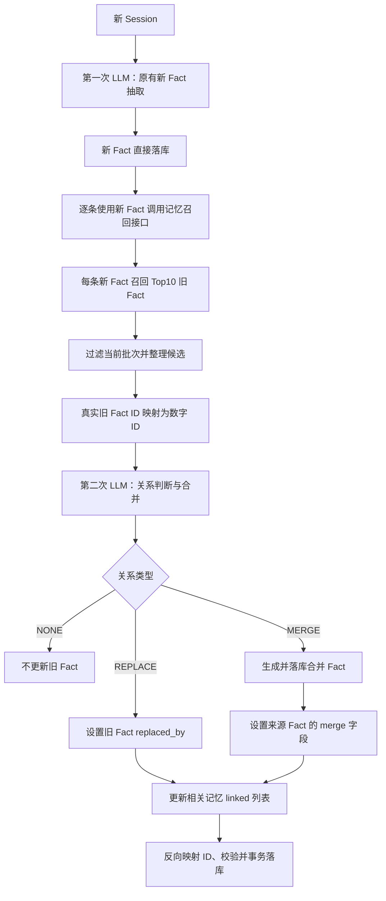

# 两阶段 LLM 新旧记忆关联更新方案

> 版本：v3
>
> 核心变化：第一次 LLM 只负责新 Fact 抽取并直接落库；第二次 LLM 在合并阶段负责新旧 Fact 的关系判断和更新。

## 1. 解决的问题与 v3 思路

v3 将“新事实抽取”和“新旧记忆整理”拆成两个独立阶段：

1. **抽取阶段**：完全复用原有记忆抽取流程，只从新 Session 抽取新 Fact，并直接写入数据库；
2. **合并阶段**：使用已经落库的新 Fact 召回相关旧 Fact，再调用一次 LLM 判断新旧关系并更新关联字段。

这样拆分的主要原因是：

- 第一次调用只做抽取，不让旧记忆干扰新 Fact 的生成；
- 原有抽取 Prompt、输出格式和落库流程不需要改变；
- 新 Fact 已有真实 ID，第二次 LLM 可以直接生成可落库的关联结果；
- 关系判断失败时不会丢失新 Session 中已经抽取出的事实；
- 抽取质量和关系判断质量可以分别评测。

v3 只判断三种关系：

| 关系 | 含义 | 处理结果 |
|---|---|---|
| `NONE` | 新旧 Fact 没有需要处理的关系 | 新 Fact 保持原样，不更新旧 Fact |
| `REPLACE` | 旧 Fact 被新 Fact 取代 | 设置 `old.replaced_by = new.id` |
| `MERGE` | 新旧 Fact 可以合并成更完整的事实 | 生成新的合并 Fact，并用 `merge` 字段标识来源 Fact 指向它 |

凡是被判定为 `REPLACE` 或 `MERGE` 的记忆，都通过 `linked` 列表保存关系参与者 ID。

## 2. 具体流程

### 2.1 总体流程



### 2.2 第一阶段：新 Fact 抽取并落库

第一次 LLM 调用保持现有抽取流程不变：

```text
原有记忆抽取 Prompt
+ 新 Session
-> 新 Fact JSON
-> 新 Fact 直接落库
```

这一阶段不召回旧记忆，也不判断重复、替代或合并关系。每条新 Fact 落库后获得真实 `memory_id`。

建议给同一 Session 抽取出的新 Fact 写入相同的 `ingestion_batch_id`，供第二阶段召回时排除当前批次，避免新 Fact 互相被误认为旧 Fact。

### 2.3 第二阶段前：按新 Fact 召回 Top10

对第一阶段产生的每条新 Fact 分别调用记忆召回接口：

```text
new_fact.text
-> 记忆召回接口
-> Top10 old_facts
```

召回时需要满足：

- 限定在同一用户或同一记忆空间；
- 排除当前 `new_fact_id`；
- 排除当前 `ingestion_batch_id` 中的其他新 Fact；
- 默认优先返回没有被 `replaced_by` 或 `merge` 指向其他记忆的旧 Fact；
- 如果过滤后不足 Top10，可以继续从后续召回结果补足。

如果第一阶段抽取出多条新 Fact，则每条新 Fact 都有自己的 Top10 候选组。第二次 LLM 调用可以一次接收全部候选组：

```text
N1 -> O1...O10
N2 -> O3...O12
N3 -> O8...O17
```

相同旧 Fact 在多个候选组中只传一次正文，但保留它分别属于哪些新 Fact 候选集的信息。

### 2.4 第二阶段：LLM 关系判断

第二次 LLM 的输入由三部分组成：

```text
关系判断 Prompt
+ 已落库的新 Fact
+ 每条新 Fact 对应的 Top10 旧 Fact
```

关系判断 Prompt 只需要包含：

1. 三种关系的定义和判断边界；
2. 新 Fact 与旧 Fact 的候选分组；
3. `MERGE` 时生成合并 Fact 的要求；
4. JSON 输出格式。

完整 Prompt 见：[第二阶段新旧记忆关系判断 Prompt（v3）](./第二阶段新旧记忆关系判断Prompt_v3_2026-08.md)。

LLM 对每条新 Fact 输出一个决策：

- `NONE`：没有相关旧 Fact，或只有主题相关但不构成替代、合并；
- `REPLACE`：一个或多个旧 Fact 表达的是同一事实槽位，新 Fact 是更新后的状态；
- `MERGE`：一个或多个旧 Fact 与新 Fact 兼容，合并后能形成更完整且不冲突的事实。

同一个新 Fact 可以关联多个旧 Fact，因此第二阶段使用 `old_fact_ids` 列表。LLM 只能引用该新 Fact 的 Top10 候选 ID。

### 2.5 三种关系的落库规则

#### NONE

```text
不修改旧 Fact
不设置 replaced_by
不设置 merge
不增加 linked
第一阶段写入的新 Fact 保持有效
```

#### REPLACE

假设新 Fact `N1` 取代旧 Fact `O1`、`O2`：

```text
O1.replaced_by = N1
O2.replaced_by = N1

O1.linked += [N1]
O2.linked += [N1]
N1.linked += [O1, O2]
```

旧 Fact 正文不修改，新 Fact 也不重新生成。`replaced_by` 是单值字段，`linked` 是去重后的 ID 列表。

#### MERGE

假设 `N1` 与旧 Fact `O1`、`O2` 可以合并，LLM 生成合并后的 Fact 文本，后端创建新的 canonical Fact `M1`：

```text
M1.fact = LLM 生成的 merged_fact

O1.merge = M1
O2.merge = M1
N1.merge = M1

O1.linked += [N1, M1]
O2.linked += [N1, M1]
N1.linked += [O1, O2, M1]
M1.linked = [N1, O1, O2]
```

`O1`、`O2` 和 `N1` 的正文均不覆盖。`M1` 是新的合并结果，并保存来源记忆 ID。为避免递归合并，`M1` 不在当前批次中再次进入第二阶段。

所有列表更新都采用集合并集语义，重复执行不会产生重复 ID。

## 3. 第二阶段 LLM 输入、输出与校验

### 3.1 数字 ID 映射

调用第二次 LLM 前，后端将真实旧 Fact ID 映射为本次请求内的数字 ID：

```text
real_id_to_number:
  mem_old_7f8a -> 1
  mem_old_91bc -> 2

number_to_real_id:
  1 -> mem_old_7f8a
  2 -> mem_old_91bc
```

新 Fact 已经落库，可以使用稳定的短标签 `N1`、`N2`。后端同时保存短标签到真实新 Fact ID 的映射。

LLM 输出后执行反向映射。任何不在 Map 中的数字 ID 或新 Fact 标签都必须拒绝，不能直接落库。

### 3.2 第二次 LLM 输入示例

```json
{
  "new_facts": [
    {
      "new_fact_id": "N1",
      "fact": "用户现在居住在杭州"
    }
  ],
  "candidate_old_facts": {
    "N1": [
      {
        "old_fact_id": 1,
        "fact": "用户居住在上海"
      },
      {
        "old_fact_id": 2,
        "fact": "用户喜欢杭州的生活节奏"
      }
    ]
  }
}
```

### 3.3 第二次 LLM 输出

#### 无关联

```json
{
  "decisions": [
    {
      "new_fact_id": "N1",
      "relation": "NONE",
      "old_fact_ids": []
    }
  ]
}
```

#### 旧记忆被新记忆取代

```json
{
  "decisions": [
    {
      "new_fact_id": "N1",
      "relation": "REPLACE",
      "old_fact_ids": [1]
    }
  ]
}
```

#### 新旧记忆可以合并

```json
{
  "decisions": [
    {
      "new_fact_id": "N1",
      "relation": "MERGE",
      "old_fact_ids": [1, 2],
      "merged_fact": "用户现居杭州，并喜欢杭州的生活节奏"
    }
  ]
}
```

### 3.4 后端校验与一致性

第二次 LLM 输出落库前必须校验：

1. `new_fact_id` 来自当前批次；
2. `old_fact_ids` 全部来自对应新 Fact 的 Top10 候选；
3. `NONE` 的 `old_fact_ids` 必须为空；
4. `REPLACE` 必须至少包含一个旧 Fact；
5. `MERGE` 必须至少包含一个旧 Fact，并提供非空 `merged_fact`；
6. 同一旧 Fact 在一个批次内不能同时被多个新 Fact 设置不同的 `replaced_by` 或 `merge`；
7. 更新前重新读取旧 Fact，不能覆盖已经存在的 `replaced_by` 或 `merge`；
8. `linked` 使用集合去重，不能包含自身 ID；
9. 合并 Fact、关系字段和 `linked` 列表在同一事务中写入。

第一阶段已经写入新 Fact，因此第二阶段失败时应保留新 Fact，并记录待重试状态。第二阶段处理必须支持幂等重试，避免重复创建合并 Fact 或重复写入链接。
