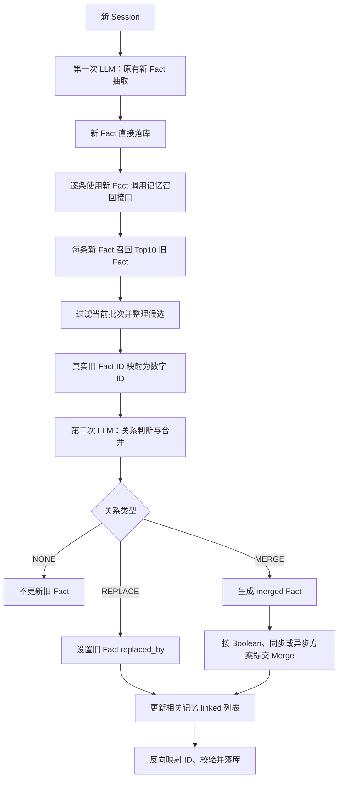
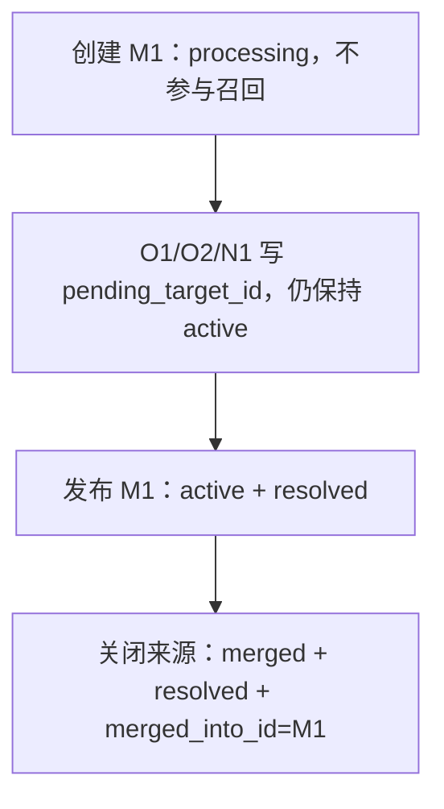

# 两阶段 LLM 新旧记忆关联更新方案（OpenSearch-only）

> 版本：v4
>
> 基线：v3
>
> 核心变化：完整保留 v3 的两阶段抽取、召回、关系判断和 `NONE / REPLACE` 处理，只扩展 `MERGE` 部分；针对仅使用 OpenSearch 向量索引的约束，给出 Boolean 最简版、同步对象版和异步对象版三种实现及对比。

## 1. 解决的问题与 v4 边界

v4 继续使用 v3 的两阶段设计：

1. **抽取阶段**：完全复用原有记忆抽取流程，只从新 Session 抽取新 Fact，并直接写入 OpenSearch；
2. **关系阶段**：使用已经落库的新 Fact 召回相关旧 Fact，再调用一次 LLM 判断新旧关系并更新关联字段。

v4 不修改以下 v3 设计：

- 第一次 LLM 的抽取 Prompt、输出格式和落库方式；
- 每条新 Fact 分别召回 Top10 旧 Fact；
- `NONE / REPLACE / MERGE` 三种关系的判断边界；
- `linked` 与 `replaced_by` 的语义；
- 第二次 LLM 的数字 ID 映射、输入输出和后端校验；
- 使用 `ingestion_batch_id` 排除当前批次，避免递归处理。

v4 只解决以下 `MERGE` 问题：

1. 如果只增加一个 Boolean 字段，最简单可以怎样实现；
2. 如果关系判断与 Add 同步完成，字段和写入流程怎样设计；
3. 如果关系判断异步完成，如何在 OpenSearch 没有跨文档事务的情况下恢复部分失败；
4. 后续 Merge 应召回 merged Fact 还是原始 Fact；
5. 三种实现各自的字段数量、优缺点和适用范围。

### 1.1 三种关系保持不变

| 关系 | 含义 | 处理结果 |
|---|---|---|
| `NONE` | 新旧 Fact 没有需要处理的关系 | 新 Fact 保持原样，不更新旧 Fact |
| `REPLACE` | 旧 Fact 被新 Fact 取代 | 设置 `old.replaced_by = new.id` |
| `MERGE` | 新旧 Fact 可以合并成更完整的事实 | 生成新的 merged Fact，并按所选实现记录来源和当前有效状态 |

凡是被判定为 `REPLACE` 或 `MERGE` 的记忆，都通过 `linked` 列表保存关系参与者 ID。

### 1.2 v3 关系字段保持不变的部分

```json
{
  "linked": [],
  "replaced_by": null
}
```

| 字段 | 类型 | 含义 |
|---|---|---|
| `linked` | `string[]` | 与当前 Fact 存在强关联的记忆 ID，只表达关联，不表达新旧方向 |
| `replaced_by` | `string \| null` | 当前 Fact 被哪条新 Fact 取代，指向当前有效事实 |

`MERGE` 字段不再在本节固定为一种结构，而是在第 4 章提供三档实现。Boolean 版用于最低成本验证；同步和异步对象版用于需要来源追踪的实现。

## 2. 具体流程

### 2.1 总体流程



### 2.2 第一阶段：新 Fact 抽取并落库

第一次 LLM 调用保持现有抽取流程不变：

```text
原有记忆抽取 Prompt
+ 新 Session
-> 新 Fact JSON
-> 新 Fact 直接落库
```

这一阶段不召回旧记忆，也不判断重复、替代或合并关系。每条新 Fact 落库后获得真实 `memory_id`。

同一 Session 抽取出的新 Fact 写入相同的 `ingestion_batch_id`，供第二阶段召回时排除当前批次，避免新 Fact 互相被误认为旧 Fact。`ingestion_batch_id` 已经属于 v3 设计，不计入 v4 新增 Merge 字段数量。

### 2.3 第二阶段前：按新 Fact 召回 Top10

对第一阶段产生的每条新 Fact 分别调用记忆召回接口：

```text
new_fact.text
-> OpenSearch 向量召回
-> Top10 old_facts
```

召回时需要满足：

- 限定在同一用户或同一记忆空间；
- 排除当前 `new_fact_id`；
- 排除当前 `ingestion_batch_id` 中的其他新 Fact；
- 默认只返回当前有效 Fact；
- 如果过滤后不足 Top10，继续从后续召回结果补足。

如果第一阶段抽取出多条新 Fact，则每条新 Fact 都有自己的 Top10 候选组：

```text
N1 -> O1...O10
N2 -> O3...O12
N3 -> O8...O17
```

相同旧 Fact 在多个候选组中只传一次正文，但保留它分别属于哪些新 Fact 候选集的信息。

### 2.4 第二阶段：LLM 关系判断

第二次 LLM 的输入由三部分组成：

```text
关系判断 Prompt
+ 已落库的新 Fact
+ 每条新 Fact 对应的 Top10 旧 Fact
```

关系判断 Prompt 只需要包含：

1. 三种关系的定义和判断边界；
2. 新 Fact 与旧 Fact 的候选分组；
3. `MERGE` 时生成 merged Fact 的要求；
4. JSON 输出格式。

LLM 对每条新 Fact 输出一个决策：

- `NONE`：没有相关旧 Fact，或只有主题相关但不构成替代、合并；
- `REPLACE`：一个或多个旧 Fact 表达的是同一事实槽位，新 Fact 是更新后的状态；
- `MERGE`：一个或多个旧 Fact 与新 Fact 兼容，合并后能形成更完整且不冲突的事实。

同一个新 Fact 可以关联多个旧 Fact，因此第二阶段使用 `old_fact_ids` 列表。LLM 只能引用该新 Fact 的 Top10 候选 ID。

### 2.5 `NONE` 与 `REPLACE` 落库规则保持不变

#### NONE

```text
不修改旧 Fact
不设置 replaced_by
不增加 linked
第一阶段写入的新 Fact 保持有效
```

#### REPLACE

假设新 Fact `N1` 取代旧 Fact `O1`、`O2`：

```text
O1.replaced_by = N1
O2.replaced_by = N1

O1.linked += [N1]
O2.linked += [N1]
N1.linked += [O1, O2]
```

旧 Fact 正文不修改，新 Fact 也不重新生成。`replaced_by` 是单值字段，`linked` 是去重后的 ID 列表。

### 2.6 `MERGE` 的共同语义

假设 `N1` 与旧 Fact `O1`、`O2` 可以合并，LLM 生成 merged Fact `M1`：

```text
inputs  = [N1, O1, O2]
output  = M1
```

三种实现都遵守以下约束：

1. `O1`、`O2`、`N1` 正文不覆盖；
2. `M1` 使用 merged Fact 文本重新生成 embedding；
3. 正常向量召回最终只返回当前有效 Fact `M1`，不再独立返回已被吸收的 `O1/O2/N1`；
4. `M1` 不在当前 `ingestion_batch_id` 中再次进入第二阶段；
5. 后续批次可以把仍然有效的 `M1` 作为候选，与其他 Fact 继续合并成 `M2`；
6. 如果需要审计、重新生成或时间校验，对象版可以展开原始来源，但原始来源不作为独立 Merge 候选；
7. `linked` 列表继续使用集合并集语义。

## 3. 第二阶段 LLM 输入、输出与校验

### 3.1 数字 ID 映射

调用第二次 LLM 前，后端将真实旧 Fact ID 映射为本次请求内的数字 ID：

```text
real_id_to_number:
  mem_old_7f8a -> 1
  mem_old_91bc -> 2

number_to_real_id:
  1 -> mem_old_7f8a
  2 -> mem_old_91bc
```

新 Fact 已经落库，可以使用稳定的短标签 `N1`、`N2`。后端同时保存短标签到真实新 Fact ID 的映射。

LLM 输出后执行反向映射。任何不在 Map 中的数字 ID 或新 Fact 标签都必须拒绝，不能直接落库。

### 3.2 第二次 LLM 输入示例

```json
{
  "new_facts": [
    {
      "new_fact_id": "N1",
      "fact": "用户现在居住在杭州"
    }
  ],
  "candidate_old_facts": {
    "N1": [
      {
        "old_fact_id": 1,
        "fact": "用户居住在上海"
      },
      {
        "old_fact_id": 2,
        "fact": "用户喜欢杭州的生活节奏"
      }
    ]
  }
}
```

### 3.3 第二次 LLM 输出

#### 无关联

```json
{
  "decisions": [
    {
      "new_fact_id": "N1",
      "relation": "NONE",
      "old_fact_ids": []
    }
  ]
}
```

#### 旧记忆被新记忆取代

```json
{
  "decisions": [
    {
      "new_fact_id": "N1",
      "relation": "REPLACE",
      "old_fact_ids": [1]
    }
  ]
}
```

#### 新旧记忆可以合并

```json
{
  "decisions": [
    {
      "new_fact_id": "N1",
      "relation": "MERGE",
      "old_fact_ids": [1, 2],
      "merged_fact": "用户现居杭州，并喜欢杭州的生活节奏"
    }
  ]
}
```

### 3.4 v3 通用校验保持不变

第二次 LLM 输出落库前必须校验：

1. `new_fact_id` 来自当前批次；
2. `old_fact_ids` 全部来自对应新 Fact 的 Top10 候选；
3. `NONE` 的 `old_fact_ids` 必须为空；
4. `REPLACE` 必须至少包含一个旧 Fact；
5. `MERGE` 必须至少包含一个旧 Fact，并提供非空 `merged_fact`；
6. 同一旧 Fact 在一个批次内不能同时被多个新 Fact 设置不同的 `replaced_by` 或 Merge 后继；
7. 更新前重新读取旧 Fact，不能覆盖已经存在的 `replaced_by` 或 Merge 后继；
8. `linked` 使用集合去重，不能包含自身 ID；
9. Merge 来源列表使用集合去重，不能包含 merged Fact 自身 ID；
10. 同一 Fact 不能同时设置 `replaced_by` 和 Merge 后继，避免出现两个有效后继；
11. 沿 `replaced_by` 或 Merge 后继查找当前有效 Fact 时必须检测环路；
12. 第二阶段失败时保留第一阶段抽取出的新 Fact，并允许幂等重试。

第 12 条在三种实现中的保证程度不同：Boolean 版只依赖调用方重试，同步对象版依赖确定性 ID 与乐观锁，异步对象版具有显式中间状态和恢复流程。

## 4. v4 的三种 Merge 实现

### 4.1 总览

以下字段数量只统计相对现有 Fact 文档新增的 Merge metadata，不统计已有的 `id / fact / embedding / user_id / linked / replaced_by / created_at / updated_at / ingestion_batch_id`。

| 方案 | 新增字段数 | 执行方式 | 来源可追溯 | 部分失败恢复 | 正常召回过滤 | 推荐度 |
|---|---:|---|---|---|---|---|
| A. Boolean 最简版 | 1 | 同步 | 弱，只能借助 `linked` 猜测 | 弱 | `merged = false` | 仅实验 |
| B. 同步对象版 | 4 | 同步等待 | 强 | 中，调用方重试 | `lifecycle_state = active` | 小规模可用 |
| C. 异步对象版 | 8 | 后台任务，可等待 | 强 | 强，支持恢复 | `lifecycle_state = active` | OpenSearch-only 推荐 |

### 4.2 方案 A：Boolean 最简版

#### 4.2.1 字段

只增加一个 Boolean：

```json
{
  "merged": false
}
```

这里必须固定语义：

```text
merged = false：当前 Fact 仍可以参与正常召回
merged = true：当前 Fact 已经被其他 merged Fact 吸收，不再参与正常召回
```

`merged` 不能表示“当前 Fact 是否由 Merge 生成”。因此 `M1` 虽然是 merged Fact，但在它仍然有效时仍是 `merged = false`。

#### 4.2.2 落库示例

```json
{
  "O1": {
    "merged": true,
    "linked": ["N1", "M1"]
  },
  "O2": {
    "merged": true,
    "linked": ["N1", "M1"]
  },
  "N1": {
    "merged": true,
    "linked": ["O1", "O2", "M1"]
  },
  "M1": {
    "fact": "LLM 生成的 merged_fact",
    "merged": false,
    "linked": ["N1", "O1", "O2"]
  }
}
```

#### 4.2.3 执行流程

```text
1. 第二次 LLM 生成 merged_fact
2. 写入 M1，merged = false
3. 将 O1/O2/N1 更新为 merged = true
4. 更新所有参与者 linked
5. refresh=wait_for 后返回
```

OpenSearch Bulk 不是跨文档事务，因此即使同步执行也可能部分成功。Boolean 版不保存提交状态，失败时只能依靠调用方根据 `linked` 和确定性的 `M1` ID 重试。

#### 4.2.4 优缺点

优点：

- 只增加一个字段；
- OpenSearch 过滤简单；
- 最适合快速验证 Merge 是否提升 LongMemEval 指标；
- 不需要后台 worker 和状态机。

缺点：

- 无法直接区分原始 Fact、merged Fact 和 Merge 方向；
- 无法可靠知道 M1 由哪些 Fact 生成；
- `linked` 同时包含普通关联、替代关联和 Merge 关联，语义不唯一；
- 无法可靠重新生成、撤销或解释 Merge；
- 部分失败后难以自动恢复；
- 不适合作为长期数据模型。

### 4.3 方案 B：同步对象版

#### 4.3.1 字段

同步版新增 4 个字段：

```json
{
  "origin_kind": "merged",
  "lifecycle_state": "active",
  "derived_from_ids": ["O1", "O2", "N1"],
  "merged_into_id": null
}
```

字段职责：

| 字段 | 类型 | 含义 |
|---|---|---|
| `origin_kind` | `keyword` | `extracted / merged`，说明当前 Fact 如何产生 |
| `lifecycle_state` | `keyword` | `active / merged / superseded / deleted`，正常召回只取 `active` |
| `derived_from_ids` | `keyword[]` | 当前 Fact 的直接来源，不递归保存所有叶子来源 |
| `merged_into_id` | `keyword \| null` | 当前 Fact 被合并进的直接目标 |

不增加 `canonical_id`。`merged_into_id` 保存直接边，避免 `O1 -> M1 -> M2` 时递归更新所有祖先。

#### 4.3.2 落库示例

```json
{
  "O1": {
    "origin_kind": "extracted",
    "lifecycle_state": "merged",
    "derived_from_ids": [],
    "merged_into_id": "M1"
  },
  "O2": {
    "origin_kind": "extracted",
    "lifecycle_state": "merged",
    "derived_from_ids": [],
    "merged_into_id": "M1"
  },
  "N1": {
    "origin_kind": "extracted",
    "lifecycle_state": "merged",
    "derived_from_ids": [],
    "merged_into_id": "M1"
  },
  "M1": {
    "fact": "LLM 生成的 merged_fact",
    "origin_kind": "merged",
    "lifecycle_state": "active",
    "derived_from_ids": ["N1", "O1", "O2"],
    "merged_into_id": null
  }
}
```

如果 `M1` 后续又被合并进 `M2`，保留 `M1.derived_from_ids`，同时设置：

```json
{
  "lifecycle_state": "merged",
  "merged_into_id": "M2"
}
```

#### 4.3.3 同步执行流程

```text
1. 读取 O1/O2/N1 的 _seq_no 与 _primary_term
2. 第二次 LLM 生成 merged_fact
3. 根据 `user_id`、排序后的来源 ID 和 `resolver_version` 生成确定性 Merge 操作 ID 与 M1 ID
4. 使用 op_type=create 写入 M1
5. 使用 Bulk 和 if_seq_no/if_primary_term 更新 O1/O2/N1
6. 检查 Bulk 中每一个 item 是否成功
7. 更新 linked
8. refresh=wait_for
9. 全部成功后 Add/关系接口才返回成功
```

如果 M1 已存在且内容、来源一致，视为幂等成功；如果任一 source 返回 409，重新读取其当前状态。已经指向 M1 可视为成功，指向其他后继则放弃本次提交并重新判断。

#### 4.3.4 优缺点

优点：

- 字段少且语义清楚；
- 原始来源和直接后继都可追溯；
- 调用返回后即可按最终状态搜索；
- 不需要后台任务扫描器；
- 适合低吞吐实验、管理接口和小规模 Benchmark。

缺点：

- Add 延迟包含向量召回、第二次 LLM、embedding 和多文档更新；
- LLM 或 OpenSearch 更新失败会直接影响请求；
- Bulk 仍然可能部分成功，同步不等于事务；
- 请求超时后，调用方无法只从字段判断提交进行到哪一步；
- 高并发时 409 重试和重复 LLM 调用较多。

### 4.4 方案 C：异步对象版

#### 4.4.1 字段

异步版在同步版 4 个字段基础上再增加 4 个状态字段，共 8 个：

```json
{
  "origin_kind": "merged",
  "lifecycle_state": "active",
  "derived_from_ids": ["O1", "O2", "N1"],
  "merged_into_id": null,

  "resolution_state": "resolved",
  "created_by_merge_op_id": "merge-op-001",
  "consumed_by_merge_op_id": null,
  "pending_target_id": null
}
```

新增状态字段职责：

| 字段 | 类型 | 含义 |
|---|---|---|
| `resolution_state` | `keyword` | `pending / processing / resolved / failed` |
| `created_by_merge_op_id` | `keyword \| null` | 生成当前 Fact 的 Merge 操作 |
| `consumed_by_merge_op_id` | `keyword \| null` | 消费当前 Fact 的 Merge 操作 |
| `pending_target_id` | `keyword \| null` | Saga 提交过程中即将指向的目标 |

可选增加 `resolver_version`，用于审计、灰度和离线重算；它不属于正确执行所必需的 8 个核心字段。

#### 4.4.2 新 Fact 入库和 worker 领取

第一阶段的新 Fact 立即可搜索，但关系尚未完成：

```json
{
  "origin_kind": "extracted",
  "lifecycle_state": "active",
  "resolution_state": "pending",
  "derived_from_ids": [],
  "merged_into_id": null,
  "created_by_merge_op_id": null,
  "consumed_by_merge_op_id": null,
  "pending_target_id": null
}
```

worker 搜索 `resolution_state = pending` 的文档，并使用 `_seq_no + _primary_term` 将其原子更新为 `processing`。只有更新成功的 worker 获得处理权。

如果需要处理 worker 崩溃，可额外复用现有 metadata 写入 `worker_id / lease_until`；它们属于任务调度扩展，不计入核心 Merge 字段。

#### 4.4.3 四阶段 Saga

OpenSearch 不提供跨多个 Fact 文档的事务，异步版使用以下顺序：



具体过程：

1. **Prepare target**
   - 用确定性 ID 和 `op_type=create` 创建 M1；
   - `lifecycle_state = preparing`；
   - `resolution_state = processing`；
   - `created_by_merge_op_id = merge-op-001`；
   - 此时正常召回过滤 `lifecycle_state = active`，所以 M1 不可见。
2. **Prepare sources**
   - 使用 `_seq_no + _primary_term` 给 O1/O2/N1 写入 `pending_target_id = M1`；
   - 设置 `consumed_by_merge_op_id = merge-op-001`；
   - 来源仍保持 `lifecycle_state = active`，worker 崩溃时不会出现事实空窗。
3. **Publish target**
   - 将 M1 更新为 `lifecycle_state = active`、`resolution_state = resolved`；
   - 从这一步到来源关闭前可能短暂出现新旧重复，但不会出现全部不可见。
4. **Finalize sources**
   - 将 O1/O2/N1 更新为 `lifecycle_state = merged`；
   - 设置 `merged_into_id = M1`；
   - 清空 `pending_target_id`；
   - 设置 `resolution_state = resolved`。

每一个 Bulk 响应都必须逐项检查。失败项使用相同 `merge-op-001` 重试，不能因为 Bulk HTTP 状态成功就认为所有文档都已成功。

异步版将 `preparing` 作为 `lifecycle_state` 的临时提交状态；稳定状态仍然是 `active / merged / superseded / deleted`。

#### 4.4.4 恢复规则

后台修复器定期扫描长时间停留在 `processing` 的文档：

| 当前状态 | 恢复动作 |
|---|---|
| M1 存在且 source.pending_target_id = M1 | 继续发布 M1 并关闭 sources |
| M1 已 active，部分 source 仍 active | 继续 finalize sources |
| source 已 merged_into_id = M1 | 该 source 视为幂等成功 |
| source 已指向其他目标 | 标记当前操作失败，重新基于最新 active Fact 判断 |
| M1 创建失败且 sources 未 prepare | 删除或标记失败的操作状态，新 Fact 回到 pending |

由于来源在 M1 发布前始终保持 active，恢复期间最多出现短暂重复，不会因为中间步骤失败而丢失可召回事实。

#### 4.4.5 优缺点

优点：

- Add 请求不需要等待第二次 LLM 和多文档更新；
- 支持任务重试、限流、批处理和更强的 Merge 模型；
- 显式记录生成操作、消费操作和中间目标；
- 可以自动恢复 OpenSearch Bulk 部分成功；
- 适合在线服务和大规模 LongMemEval 抽取；
- 与 Mem0 Platform 的异步事件和后台 Dream 思路一致。

缺点：

- 比同步版多 4 个字段和一个 worker；
- 提交过程中可能短暂同时召回 M1 与部分来源；
- 需要扫描 `pending / processing`、超时恢复和监控积压；
- 调用方如果要求强一致，需要轮询或等待 barrier；
- 调试需要同时观察 Fact 状态、操作 ID 和 worker 日志。

### 4.5 后续 Merge 的召回规则

三种实现都遵循“召回当前有效 Fact，而不是召回所有原始 Fact”。

#### Boolean 版

```text
merged = false
AND ingestion_batch_id != current_batch
AND replaced_by IS NULL
```

#### 同步和异步对象版

```text
lifecycle_state = active
AND merged_into_id IS NULL
AND replaced_by IS NULL
AND ingestion_batch_id != current_batch
```

对于异步 worker，可以进一步要求候选旧 Fact：

```text
resolution_state = resolved
```

新写入且仍为 `pending` 的 Fact 可以在用户搜索中可见，但不应同时被多个 Merge worker 当作稳定旧候选。

需要区分：

| Fact 类型 | 是否参与后续 Merge 候选 |
|---|---|
| 尚未合并的原始 Fact | 是 |
| 当前有效的 merged Fact，例如 M1 | 是 |
| 已经被 M1 吸收的 O1/O2/N1 | 否 |
| M1 的来源 Fact | 仅在校验、审计或重算时展开 |
| 当前批次生成的 M1 | 当前批次否，后续批次是 |

不能把 `M1、O1、O2、N1` 同时作为独立候选交给 LLM，否则会重复计算同一证据并导致反复 Merge。

### 4.6 OpenSearch Mapping 建议

Boolean 版只需：

```json
{
  "merged": { "type": "boolean" }
}
```

对象版使用扁平字段，不需要 `nested`：

```json
{
  "origin_kind": { "type": "keyword" },
  "lifecycle_state": { "type": "keyword" },
  "derived_from_ids": { "type": "keyword" },
  "merged_into_id": { "type": "keyword" },

  "resolution_state": { "type": "keyword" },
  "created_by_merge_op_id": { "type": "keyword" },
  "consumed_by_merge_op_id": { "type": "keyword" },
  "pending_target_id": { "type": "keyword" }
}
```

`derived_from_ids` 是 keyword 多值字段。这里只保存直接来源，不把整个祖先树复制进文档，防止多层 Merge 后文档持续膨胀。

向量召回应把当前有效状态过滤放入 k-NN 查询内部，而不是仅使用 `post_filter`：

```json
{
  "query": {
    "knn": {
      "embedding": {
        "vector": [0.12, 0.34],
        "k": 10,
        "filter": {
          "bool": {
            "filter": [
              { "term": { "user_id": "user-001" } },
              { "term": { "lifecycle_state": "active" } }
            ],
            "must_not": [
              { "term": { "ingestion_batch_id": "current-batch" } }
            ]
          }
        }
      }
    }
  }
}
```

建议以 `user_id` 作为 routing，使同一用户的 Fact 位于同一 shard，降低限定用户召回和更新的开销。routing 不能提供跨文档事务，只是减少查询范围。

### 4.7 同步与异步选择

| 维度 | Boolean 最简版 | 同步对象版 | 异步对象版 |
|---|---|---|---|
| Add 延迟 | 高 | 最高 | 最低 |
| 字段复杂度 | 最低 | 中 | 高 |
| 关系可解释性 | 弱 | 强 | 强 |
| Read-after-write | 返回后基本一致 | 返回后基本一致 | 默认最终一致 |
| OpenSearch 部分失败 | 调用方人工重试 | 确定性 ID + 调用方重试 | Saga 自动恢复 |
| 重复窗口 | 请求执行期间 | 请求执行期间 | 后台提交期间 |
| 原始来源保留 | 正文保留但方向不清 | 保留 | 保留 |
| 在线吞吐 | 低 | 低 | 高 |
| Benchmark 确定性 | 高 | 高 | barrier 后高 |
| 最适用场景 | 快速消融实验 | 小规模、强一致调用 | 在线和大规模抽取 |

推荐策略：

```text
快速验证 Merge 是否有效：Boolean 版
低吞吐原型或人工管理接口：同步对象版
长期 OpenSearch-only 实现：异步对象版
LongMemEval：异步写入，但回答问题前执行同步 barrier
```

LongMemEval barrier 条件：

```text
当前评测 user 范围内：
resolution_state = pending 或 processing 的文档数量为 0
并等待 OpenSearch refresh 完成
```

## 5. 一致性与幂等要求

### 5.1 三种实现共同要求

1. 合并目标 ID 必须确定性生成或通过幂等键唯一约束；
2. 来源 ID 排序后再计算签名，避免 `[O1, O2]` 与 `[O2, O1]` 产生两个目标；
3. 更新来源时使用 OpenSearch `_seq_no + _primary_term`；
4. 每个 Bulk item 单独检查成功或失败；
5. merged Fact embedding 只根据 `merged_fact` 重新生成；
6. 来源 Fact embedding 不修改，仅更新 metadata；
7. 不物理删除来源 Fact，正常召回通过状态过滤；
8. 必须检测 `replaced_by` 与 `merged_into_id` 形成的环路；
9. 同一 Fact 不能同时具有有效的 `replaced_by` 和 `merged_into_id`；
10. `linked`、来源 ID 都采用集合语义。

### 5.2 推荐幂等键

```text
merge_operation_id = sha256(
  user_id
  + sorted(source_fact_ids)
  + resolver_version
)

merged_content_hash = sha256(normalized_merged_fact)
```

Boolean 和同步版可以使用 `merge_operation_id` 直接生成 M1 ID；异步版同时将其用作 `merge-op-001` 的唯一操作 ID。`merged_content_hash` 用于检查同一操作重试时 LLM 是否生成了不同正文，不参与操作去重。

## 6. 与其他项目的设计对照

### 6.1 Mem0 Platform 与 Dream

Mem0 Platform V3 Add 返回 `PENDING + event_id`，调用方通过事件接口等待完成，说明其公开写入接口采用异步任务模型。官方 Dream 文档将 Merge、Supersede 和 Synthesis 描述为后台维护，其中 Merge 和 Supersede 默认开启。

参考：

- https://docs.mem0.ai/api-reference/memory/add-memories
- https://docs.mem0.ai/llms.txt
- https://docs.mem0.ai/openapi.json

Mem0 Platform 没有公开 Dream 的 Merge 候选池、跨文档提交顺序或 canonical schema，因此 v4 只参考其“后台任务 + 最终一致”模式，不声称复现其内部字段。

Mem0 官方仓库中的 pi-agent-plugin Dream 是另一套更简单的周期整理：获取全部 memories，发现近重复后删除 originals 并添加 merged memory。它下一轮自然只看到 merged memory，但失去原始来源链路。v4 不采用物理删除，以支持 LongMemEval badcase 分析和重新生成。

### 6.2 Graphiti

Graphiti 在 edge 中保存事实、episode 来源以及有效/失效时间，解析后使用当前有效关系参与检索，同时保留 episode provenance。v4 对象版采用类似原则：正常召回只看 active Fact，原始 Fact 留在 OpenSearch 中作为证据。

参考：

- https://github.com/getzep/graphiti/blob/main/graphiti_core/edges.py
- https://github.com/getzep/graphiti/blob/main/graphiti_core/graphiti.py

### 6.3 LangMem

LangMem 的 memory manager 支持 create、update、delete/upsert，并保留版本历史。它更接近“读取当前版本、历史用于审计”的模型。v4 在 OpenSearch 中不能依赖独立版本库，因此通过不可变正文、状态字段和来源 ID 保留最小可追溯性。

参考：

- https://langchain-ai.github.io/langmem/reference/memory/
- https://langchain-ai.github.io/langmem/reference/tools/

### 6.4 OpenSearch

v4 的 OpenSearch-only 写入和召回约束基于以下官方能力：

- Bulk 可以减少多文档写入的网络开销，但每个 item 独立返回成功或失败，调用方必须处理部分成功；
- `_seq_no + _primary_term` 用于乐观并发控制；
- `refresh=wait_for` 只保证更新在返回前对搜索可见，不提供跨文档事务；
- k-NN efficient filtering 应把状态过滤放在 k-NN 查询内部；
- keyword 多值字段可直接保存 `derived_from_ids`，不需要为标量 ID 数组使用 nested mapping。

参考：

- https://docs.opensearch.org/latest/api-reference/document-apis/bulk/
- https://docs.opensearch.org/latest/api-reference/document-apis/index-document/
- https://docs.opensearch.org/latest/vector-search/filter-search-knn/index/
- https://docs.opensearch.org/latest/mappings/

## 7. 从 v3 升级到 v4

v4 不要求修改 v3 的 `linked`、`replaced_by`、Prompt 或 LLM 输出。只需要选择一种 Merge 落库适配器。

### 7.1 Boolean 适配器

```text
旧的 merge.source_ids / merge.target_id 不再写入
新增 merged，默认 false
有 Merge 后继的来源设置为 true
```

该路径仅用于消融实验，不建议作为已有 v3 数据的长期迁移目标。

### 7.2 同步对象适配器

```text
merge.source_ids -> derived_from_ids
merge.target_id  -> merged_into_id
derived_from_ids 非空 -> origin_kind = merged
merged_into_id 非空  -> lifecycle_state = merged
其他                 -> lifecycle_state = active
```

### 7.3 异步对象适配器

先完成同步对象字段映射，再补充：

```text
resolution_state = resolved
created_by_merge_op_id = null 或根据历史生成
consumed_by_merge_op_id = null 或根据历史生成
pending_target_id = null
```

已有稳定数据迁移时全部标记为 `resolved`；只有迁移完成后的新 Fact 才从 `pending` 开始。

## 8. 最终建议

1. 保留 Boolean 版作为字段最少的实验基线，用于确认 Merge 本身是否带来指标提升；
2. 同步对象版作为中间实现，验证来源追踪、后续继续 Merge 和 OpenSearch 状态过滤；
3. 正式 OpenSearch-only 方案使用异步对象版的 8 个核心字段；
4. 正常 Merge 候选只召回当前 active 的原始 Fact 或 merged Fact，不召回已经被吸收的来源；
5. 原始 Fact 永不物理删除，需要时按 `derived_from_ids` 展开；
6. 在线请求默认异步，强一致接口可以等待指定操作完成；
7. LongMemEval 写入可以并发异步，但开始问答前必须执行 barrier，确保不存在 `pending / processing`。

最终选择可以概括为：

```text
Boolean = 最少字段，最低实现成本，最低可追溯性
同步对象 = 清晰关系，调用返回后基本一致，但延迟高且仍无跨文档事务
异步对象 = 字段最多，但最适合 OpenSearch-only 的部分失败恢复和大规模处理
```
