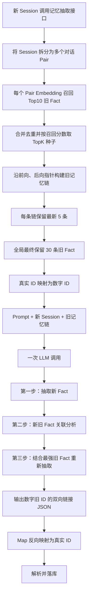

# 单次 LLM 调用的新旧记忆区分与关联方案

> 版本：v2（精简版）
>
> 核心约束：一次 LLM 调用、每个 Pair 向量召回 Top10、按分数筛选可配置 TopK 种子、沿前后向指针构建记忆链、每条链保留最新 5 条、输入 LLM 前将真实 ID 映射为数字。

## 1. 解决的问题：区分新旧记忆

新 Session 写入长期记忆时，需要先抽取新事实，再判断这些新事实和已有旧记忆之间的关系。

需要解决的核心问题包括：

- 新事实是否和旧事实重复、相关、可合并、替代或冲突；
- 当存在多条相似旧记忆时，哪一条与新事实关联最强；
- 如何利用强关联旧事实补全新 Session 中的指代和上下文，再得到更准确的新事实；
- 如何建立新旧事实的双向关联，同时不覆盖旧事实正文。

本方案将每条新事实最多关联一条旧事实：

```text
旧事实 --forward_linked_new_fact_id--> 新事实
旧事实 <--backward_linked_old_fact_id-- 新事实
```

两个链接字段都是可空的单值字段，不使用数组。找不到足够强的关联时，新事实的后向链接为空，旧事实也不增加前向链接。

## 2. 具体方案

### 2.1 Mem0 Dream 的基本做法

Mem0 Dream 的核心思路不是直接覆盖旧记忆，而是在新增事实时管理新旧事实的关系：

- `Supersede`：新事实代表更新后的状态，保留旧事实，并将旧事实标记为已被新事实取代；
- `Merge`：对重复或高度重合的事实进行合并；
- `Synthesis`：从多条记忆中生成更高层的总结性记忆。

Dream 保留历史事实，再通过生命周期状态和链接区分当前事实与历史事实。其服务端具体召回数量、Prompt 和关系判断实现没有公开，因此这里只借鉴“新增事实、保留历史、建立关系”的思路，不复刻其内部实现。

参考：[Mem0 Dream](https://docs.mem0.ai/platform/features/dream)、[Mem0 新版记忆算法迁移说明](https://docs.mem0.ai/migration/platform-v2-to-v3)。

### 2.2 我们的主要流程



### 2.3 旧记忆召回与链路构建算法

#### 第一步：Pair 向量召回

1. 新 Session 进入记忆抽取接口；
2. 按对话轮次拆分为多个 Pair；
3. 对每个 Pair 直接进行 Embedding；
4. 使用 Pair 的向量调用旧记忆召回接口，每个 Pair 取相似度最高的 Top10 旧 Fact。

这里的 Top10 是每个 Pair 的初始召回数量，不直接输入 LLM。

#### 第二步：生成 TopK 链路种子

合并所有 Pair 的 Top10 结果，并按 `memory_id` 去重。同一旧 Fact 被多个 Pair 命中时，保留最高召回分数：

```text
seed_score(memory) = max(score(memory, pair_1), ..., score(memory, pair_n))
```

对去重后的旧 Fact 按 `seed_score` 降序排列，保留前 TopK 条作为链路构建种子。TopK 是可调配置：

```yaml
pair_recall_top_n: 10
chain_seed_top_k: 10
chain_latest_limit: 5
llm_old_fact_limit: 30
```

TopK 控制要展开多少条候选链。TopK 越大，覆盖率越高，但链路查询和 Prompt 成本也越高。

#### 第三步：通过双向指针构建记忆链

从每个 TopK 种子出发：

1. 沿 `backward_linked_old_fact_id` 向旧方向遍历；
2. 沿 `forward_linked_new_fact_id` 向新方向遍历；
3. 将两个方向的结果按“旧 → 新”合并为一条完整链；
4. 多个种子落在同一条链时合并为一条链，避免重复输入；
5. 链的召回分数取该链所有命中种子的最高分；
6. 每条链只保留最新的 5 条旧 Fact。

```text
chain_score(chain) = max(seed_score(seed) for seed in chain)
chain_context(chain) = latest_5_facts(chain)
```

“最新”优先由前向指针的链路位置确定；如果链路不完整，再使用事实时间或创建时间辅助排序。

遍历时需要维护 `visited_memory_ids` 和最大跳数，遇到空指针、缺失节点或循环立即停止，避免脏数据造成死循环。

#### 第四步：控制最终输入规模

将去重后的记忆链按 `chain_score` 降序排列，再加入 LLM 上下文，最终保留 30 条旧 Fact：

```text
最终输入 = 多条旧记忆链
每条链最多 5 条旧 Fact
候选充足时，所有链合计固定为 30 条旧 Fact
```

如果前面完整链合计不足 30，而加入下一条链会超过 30，则从最后一条链中只取剩余额度，并优先保留这条链中最新的 Fact。如果所有候选链合计不足 30，则全部保留。这里的 30 表示旧 Fact 节点总数，不是 30 条链。

算法伪代码：

```text
hits = {}
for pair in session_pairs:
    for fact, score in vector_search(embed(pair), limit=10):
        hits[fact.id] = max(hits.get(fact.id, 0), score)

seeds = sort_by_score(hits)[:chain_seed_top_k]

chains = {}
for seed in seeds:
    chain = walk_backward(seed) + seed + walk_forward(seed)
    chain = deduplicate_and_order(chain)
    chain_key = chain_tail_id(chain)
    chains[chain_key] = merge_same_chain(chains[chain_key], chain)
    chains[chain_key].score = max(chains[chain_key].score, hits[seed.id])

ranked_chains = sort_by_chain_score(chains)
llm_chains = pack_ranked_chains(
    latest_n_each_chain=5,
    total_fact_limit=30,
    truncate_last_chain_keep_latest=true
)
```

### 2.4 单次 LLM 处理与写入

LLM 在一次调用中按照 Prompt 引导依次完成：

1. **第一次抽取**：仅根据记忆抽取 Prompt 和新 Session 抽取新 Fact；
2. **关联分析**：将每条新 Fact 与输入的旧记忆链比较，判断关系，并只选择关联最强的一条旧 Fact；如果都不满足关联条件，则不建立链接；
3. **重新抽取**：使用新 Session、记忆抽取 Prompt 以及选出的强关联旧 Fact，再次检查和抽取，补全明确指代、上下文与时间信息，得到最终新 Fact。

这里的“第一次抽取、关联分析、重新抽取”都是同一次 LLM 请求内部的处理步骤，不会再次调用 LLM。

LLM 输出的是一条逻辑关系，后端将其写成两个方向：

```text
旧 Fact.forward_linked_new_fact_id = 新 Fact ID
新 Fact.backward_linked_old_fact_id = 旧 Fact ID
```

旧 Fact 的正文不更新，只增加前向链接；新 Fact 正常写入，并保存后向链接。两个链接字段都只保存一个 ID。

## 3. LLM 输入、Prompt 和输出

### 3.1 LLM 输入

一次 LLM 调用包含三类输入：

```text
Prompt
+ 新 Session 原始对话
+ 经过链路构建、截断和数字 ID 映射后的旧记忆链
```

旧记忆链示例：

```json
{
  "chain_id": 1,
  "chain_score": 0.91,
  "facts": [
    {
      "old_fact_id": 12,
      "fact": "用户曾居住在北京",
      "backward_id": null,
      "forward_id": 13
    },
    {
      "old_fact_id": 13,
      "fact": "用户目前居住在上海",
      "backward_id": 12,
      "forward_id": null
    }
  ]
}
```

链内 Fact 按“旧 → 新”排序。召回分数只用于旧记忆链排序，不直接等于最终关联结论。

### 3.2 真实 ID 与数字 ID 映射

在旧记忆链输入 LLM 前，后端收集所有旧 Fact 的真实 ID，并建立仅对本次请求有效的双向 Map：

```text
real_id_to_number:
  mem_7f8a... -> 12
  mem_91bc... -> 13

number_to_real_id:
  12 -> mem_7f8a...
  13 -> mem_91bc...
```

映射按“链排序 → 链内旧到新顺序”依次编号，保证输入稳定、便于复现。传给 LLM 前，需要同时替换：

- `old_fact_id`；
- `backward_id`；
- `forward_id`。

LLM 只看到数字 ID，并在输出中引用数字旧 Fact ID。收到 JSON 后，后端使用 `number_to_real_id` 反向映射为真实 ID，再执行链接写入。

```text
真实 ID -> 数字 Map -> LLM 输入/输出 -> 反向 Map -> 真实 ID
```

Map 只保存在本次请求上下文中，不写入数据库。LLM 输出不存在于 Map 中的数字 ID 时，校验必须失败，不能猜测或直接落库。

### 3.3 Prompt 的组成

完整 Prompt 包含四部分：

1. **引导思维链**：规定模型按照“第一次抽取 → 关联判断 → 结合旧事实重新抽取 → 输出”的顺序处理；
2. **记忆抽取规则**：定义什么内容应该被抽取为长期记忆；
3. **关联判断规则**：指导模型识别重复、相关、可合并、替代和冲突，并要求每条新 Fact 最多选择一条最强关联旧 Fact；
4. **输出格式**：约束模型只输出合法 JSON，不输出分析过程。

本文只定义 Prompt 的结构，不展开每部分的具体措辞和示例。

### 3.4 JSON 输出

推荐输出结构：

```json
{
  "new_facts": [
    {
      "new_fact_id": "N1",
      "fact": "用户计划于 2026 年 9 月从上海搬到杭州",
      "backward_linked_old_fact_id": 13
    }
  ],
  "old_fact_links": [
    {
      "old_fact_id": 13,
      "fact": "用户目前居住在上海",
      "forward_linked_new_fact_id": "N1"
    }
  ]
}
```

其中：

- `new_fact_id` 可以是 LLM 本次输出的临时 ID，落库时由后端映射为真实 ID；
- LLM 输出中的 `old_fact_id` 和 `backward_linked_old_fact_id` 都是数字 ID；
- 后端通过请求级 Map 将数字 ID 反向映射为真实旧 Fact ID；
- `backward_linked_old_fact_id` 表示新 Fact 关联的唯一旧 Fact；
- `forward_linked_new_fact_id` 表示旧 Fact 关联的唯一新 Fact；
- 没有强关联旧 Fact 时，`backward_linked_old_fact_id` 为 `null`，同时不输出对应的 `old_fact_links`；
- 后端根据同一条逻辑关系原子写入前向和后向字段，避免两个方向不一致；
- 旧 Fact 正文保持不变，只更新前向链接字段。
