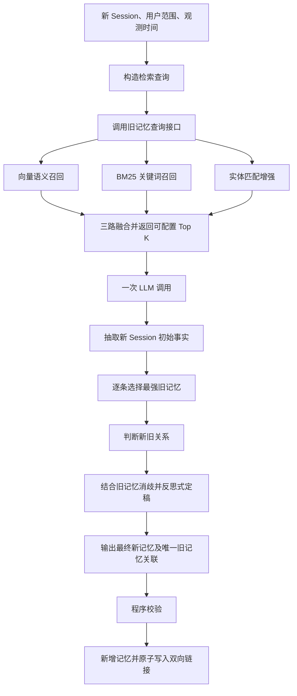

# 单次 LLM、记忆正文不可变、双向单链接的记忆写入方案

> 状态：方案设计稿 v2
> 日期：2026-08-14
> 适用范围：以 Session 为写入单位的长期记忆抽取、关联和追加写入
> 核心约束：只调用一次 LLM；旧记忆正文和事实字段不改，但允许更新链接元数据；每条记忆最多一个前向链接和一个后向链接；旧记忆通过查询接口进行三路加权召回；召回 `top_k` 可配置。

## 1. 要解决的问题

将一个新 Session 写入长期记忆时，系统不能只做孤立的事实抽取，还要理解新信息与既有记忆之间的关系。

典型问题包括：

- 同一事实被重复写入，造成记忆膨胀；
- 用户状态发生变化，但新旧事实没有建立联系；
- 新 Session 使用“之前那个”“还是原来的”等指代，仅凭当前句子无法生成完整记忆；
- 新信息只是旧信息的补充，却被保存成互不相关的碎片；
- 新旧事实发生冲突，但系统没有记录冲突关系；
- 直接改写或删除旧记忆容易破坏历史证据，也会放大 LLM 的误判风险；
- 固定召回数量无法同时适应简单 Session 和多主题长 Session。

本方案希望在保留历史事实正文的前提下，用一次 LLM 调用完成：

1. 从新 Session 抽取原子事实；
2. 将每条新事实与候选旧记忆比较；
3. 最多选择一条最强关联旧记忆；
4. 判断重复、补充、可合并、状态替代、纠正或冲突等关系；
5. 借助强关联旧记忆消歧和增强最终抽取结果；
6. 输出可以直接校验和落库的结构化结果。

## 2. 方案结论

整体采用“检索在前、一次推理、新事实追加、链接元数据双向更新”的结构：



关键原则如下：

- **事实内容不可变**：不修改旧记忆正文、来源、事实时间和事实状态；只允许更新链接元数据。
- **双向单链接**：旧记忆的 `forward_memory_id` 指向新记忆；新记忆的 `backward_memory_id` 指回旧记忆；两个字段都是可空标量，不是数组。
- **允许无链接**：候选中没有足够强的关系时，新记忆的 `backward_memory_id = null`，也不更新任何旧记忆的前向链接。
- **最强不等于相关**：只有同时满足“候选中最强”和“超过关联阈值”才能建立链接。
- **一次 LLM 调用**：初抽取、关系判断、反思式再抽取是同一次请求内的逻辑阶段，而不是多次模型请求。
- **检索和推理解耦**：旧记忆查询接口负责高召回候选集，LLM 负责语义对齐和关系判定。
- **双向一致性**：`old.forward_memory_id = new.id` 与 `new.backward_memory_id = old.id` 必须在同一事务内同时成功或同时失败。

## 3. 系统边界与不变量

### 3.1 本方案负责什么

- 新 Session 的事实记忆抽取；
- 旧记忆候选召回；
- 新事实与一条最强旧记忆的对齐；
- 新旧关系分类；
- 时间、指代和上下文消歧；
- 新记忆及关系信息的追加写入。

### 3.2 本方案不做什么

- 不覆盖旧记忆正文；
- 不删除旧记忆；
- 不把旧记忆标成失效；
- 不修改旧记忆的来源证据、事实时间或事实语义；
- 除 `forward_memory_id` 外，不向旧记忆写入 `replaced_by`、生命周期状态等派生判断；
- 不允许 LLM 关联未出现在候选池中的旧记忆 ID；
- 不要求新记忆必须关联旧记忆。

### 3.3 数据不变量

```text
每条记忆最多有一个 forward_memory_id 和一个 backward_memory_id
新记忆的 backward_memory_id 必须为空或来自本次候选池
若 old.forward_memory_id = new.id，则 new.backward_memory_id 必须 = old.id
旧记忆只有 forward_memory_id 可以在链接事务中发生变化
最终记忆必须能追溯到新 Session，或明确标识为结合旧记忆形成的综合事实
关系置信度低于阈值时不得建立链接
```

本文对字段方向作如下固定定义：

```text
时间/演进方向：旧记忆 --forward_memory_id--> 新记忆
反向追溯方向：旧记忆 <--backward_memory_id-- 新记忆
```

因此，“上海 -> 杭州 -> 北京”的状态链表示为：

```text
上海.forward = 杭州
杭州.backward = 上海
杭州.forward = 北京
北京.backward = 杭州
```

如果团队现有代码对“前向/后向”的命名方向相反，可以交换字段名，但数据库、Prompt 和读取逻辑必须采用同一个定义。

## 4. LLM 调用前：旧记忆三路加权召回

### 4.1 查询接口输入

在调用 LLM 前，由写入服务构造旧记忆检索请求：

```json
{
  "query": "由新 Session 构造的检索文本",
  "scope": {
    "user_id": "user-123"
  },
  "top_k": 20,
  "filters": {},
  "include_score_details": true
}
```

其中：

- `query` 来自原始新 Session，不依赖 LLM 的事实抽取结果；
- `scope` 必须约束在同一用户或同一记忆空间；
- `top_k` 由配置项控制，例如 `related_memory_top_k`；
- `filters` 可按应用增加记忆类型、项目、会话空间或时间范围；
- `include_score_details` 建议在调试和评测期打开，生产期可以只保留融合分数。

之所以必须使用原始 Session 构造查询，是因为本方案只有一次 LLM 调用：不能先用 LLM 抽取事实、再检索旧记忆、然后第二次让 LLM 判断关系。

### 4.2 三路召回信号

查询接口使用三类信号：

1. **向量语义分数**：发现表达不同但语义接近的记忆；
2. **BM25 关键词分数**：保留姓名、地点、产品、数字等精确词项；
3. **实体增强分数**：根据人物、组织、地点、物品等实体及其关联记忆提高候选得分。

抽象融合公式为：

```text
score(m) = normalize(
    w_semantic × semantic(m)
  + w_bm25    × bm25(m)
  + w_entity  × entity_boost(m)
)
```

按当前 Mem0 查询实现，可以理解为语义分、归一化 BM25 分和实体增强分相加，再按本次实际启用信号的理论最大值归一化。实体增强的默认权重为 `0.5`；如果三路都启用，理论最大值为 `2.5`。

需要注意：当前查询实现会先应用语义阈值，再进行混合打分。因此，低于语义阈值的候选不能仅靠 BM25 或实体信号“救回”。如果后续发现专有名词或精确数字的旧记忆漏召回，需要重新评估这个门控顺序。

### 4.3 可变 Top K

建议配置：

```yaml
memory_ingestion:
  related_memory_top_k: 20
  relation_accept_threshold: 0.75
  max_session_query_chars: 12000
```

`related_memory_top_k` 不应写死在 Prompt 中，而应作为服务配置传入查询接口。其影响是：

| Top K | 优点 | 风险 |
|---|---|---|
| 较小 | Token 少、延迟低、干扰少 | 强关联旧记忆可能未进入候选池 |
| 较大 | 候选覆盖率高 | Token 增长、近似记忆增多、LLM 误关联风险上升 |

初期可以把 `20` 作为实验默认值，而不是最终结论。应至少测试 `5/10/20/30/50`，根据关联召回率、关系准确率、Token 和延迟选择默认值。

### 4.4 长 Session 的查询构造

如果 Session 很短，可直接将规范化后的完整 Session 作为一次查询。

如果 Session 很长或包含多个主题，建议在 LLM 调用前进行确定性切分，并对每个分块调用同一查询接口：

```text
原始 Session
  -> 按消息边界/话题长度切分
  -> 每个分块三路召回
  -> 按 memory_id 去重
  -> 同一旧记忆取各分块中的最高融合分
  -> 全局排序并截断为 related_memory_top_k
```

这一步不使用 LLM，因此仍满足“一次 LLM 调用”。

如果各查询的融合分数不可直接比较，可采用倒数排名融合 RRF，而不要直接比较原始分数。最终进入 LLM 的仍然只有全局 Top K 条旧记忆。

## 5. 输入给 LLM 的内容

一次 LLM 请求包含四部分。

### 5.1 任务规则

系统 Prompt 应明确：

- 只抽取有长期价值、可复用的事实；
- 每条事实必须原子化；
- 新事实必须以新 Session 为主要证据；
- 旧记忆只用于关联、补全明确指代、理解状态变化和发现冲突；
- 不得因为旧候选出现某个事实，就把它误当成新 Session 新表达的事实；
- 每条新记忆最多选择一个旧候选；
- 候选都不够相关时必须输出空链接；
- 不能生成任何旧记忆更新操作；
- 只输出符合 Schema 的 JSON，不输出思维链。

### 5.2 新 Session 原文

消息应携带稳定的消息 ID、角色和原始内容：

```json
{
  "session_id": "session-456",
  "observation_time": "2026-08-14T10:30:00+08:00",
  "messages": [
    {
      "message_id": "msg-1",
      "role": "user",
      "content": "我下个月会从上海搬到杭州。"
    }
  ]
}
```

不要只传摘要。原始消息是事实证据、时间推理和指代消解的基础。

### 5.3 候选旧记忆

只传查询接口返回的 Top K：

```json
[
  {
    "candidate_id": "O1",
    "memory_id": "mem-abc",
    "text": "用户目前居住在上海。",
    "backward_memory_id": null,
    "forward_memory_id": null,
    "created_at": "2025-11-02T09:00:00+08:00",
    "observed_at": "2025-11-02T09:00:00+08:00",
    "score": 0.89,
    "score_details": {
      "semantic": 0.91,
      "bm25": 0.78,
      "entity_boost": 0.5
    }
  }
]
```

建议用 `O1`、`O2` 等短 ID 降低 Token 和抄错 ID 的概率，后端保存短 ID 到真实 `memory_id` 的映射。LLM 只能输出 `candidate_id`，程序再映射为真实 ID。

候选中应包含现有的前向和后向链接。对于严格一对一链，已有非空 `forward_memory_id` 的旧记忆不是可直接追加的链尾。查询服务可以展开到链尾后再送入候选池，或把完整的短链上下文一并提供给 LLM；不能无声覆盖已有前向链接。

检索分数只表示候选相关性，不等于最终关系置信度。LLM 不应机械选择分数最高的候选，而应比较语义主体、事实槽位、时间和证据。

### 5.4 输出 Schema 和少量边界示例

Prompt 中应给出严格 JSON Schema，以及至少覆盖以下边界的少量示例：

- 无旧记忆关联；
- 完全重复；
- 新状态替代旧状态；
- 明确纠正；
- 表面相似但主体或事实槽位不同，不应关联。

## 6. LLM 在一次调用中的处理逻辑

下面是模型应遵循的内部任务顺序。它用于约束决策流程，但不要求模型输出完整思维链。

### 阶段 A：仅依据新 Session 初步抽取

先忽略候选旧记忆，从新 Session 中抽取草稿事实：

- 去除寒暄、临时指令和无长期价值内容；
- 将复合句拆成原子事实；
- 绑定 `source_message_ids`；
- 判断事实类型，例如偏好、状态、计划、经历、关系或稳定属性；
- 提取明确时间，不能确定时保留空值，不得编造。

先独立抽取可以减少“旧候选污染新事实”的风险。

### 阶段 B：逐条比较全部 Top K 候选

对每条草稿事实，比较候选旧记忆，重点检查：

1. 主体是否相同；
2. 事实槽位是否相同；
3. 对象或取值是否相同；
4. 时间范围是否重叠；
5. 新 Session 是否明确表达延续、变化、纠正或否定；
6. 旧记忆是否能解释新 Session 中的指代或省略。

模型应选择语义关系最强的一条候选，而不是默认选择检索分最高的一条。

### 阶段 C：进行门控并确定唯一关系

先判断是否达到关联要求：

```text
候选中最强 + 关系证据充分 + 置信度超过阈值
    -> 新记忆输出一个 backward_memory_id
    -> 后端将对应旧记忆的 forward_memory_id 写为新记忆 ID
否则
    -> backward_memory_id = null，relation_type = NONE
    -> 不更新任何旧记忆链接
```

建议的关系类型如下，方向均为“新记忆相对旧记忆”：

| relation_type | 含义 | 默认写入行为 |
|---|---|---|
| `NONE` | 没有足够强的旧记忆关系 | 新增新记忆，不链接 |
| `DUPLICATE` | 新旧表达同一事实，没有实质新增 | 默认不新增，记录 NOOP |
| `EXTENDS` | 新事实补充旧事实的细节，两者兼容 | 新增并链接旧记忆 |
| `MERGEABLE` | 新旧信息可组合成一条更完整的综合事实 | 新增综合记忆并链接旧记忆 |
| `SUPERSEDES` | 同一状态槽位出现较新的取值 | 新增当前状态记忆并链接旧记忆 |
| `CORRECTS` | 新 Session 明确指出旧说法错误并给出修正 | 新增纠正记忆并链接旧记忆 |
| `CONTRADICTS` | 新旧冲突，但没有足够证据判断谁替代谁 | 新增新事实并保留冲突链接 |

`RELATED` 不建议作为第一版的主要类型，因为它过于宽泛，容易形成没有处理价值的链接。如果产品确实需要“同主题但不同事实槽位”的导航关系，可以增加 `RELATED`，但不能让它代替上述精确关系。

`SUPERSEDES` 和 `CORRECTS` 必须区分：前者通常是事实随时间发生变化，旧事实在过去可能正确；后者表示用户明确纠正了原先的错误表达。

### 阶段 D：利用唯一旧记忆进行反思式定稿

选出唯一强关联旧记忆后，模型重新检查草稿事实：

- 补全明确可解析的主体和指代；
- 将“现在”“下个月”等相对时间结合 `observation_time` 规范化；
- 区分历史事实、当前状态和未来计划；
- 对 `MERGEABLE` 生成一条完整但不越过证据边界的综合表述；
- 对 `SUPERSEDES` 明确新状态及其生效时间；
- 对 `CORRECTS` 明确“新说法纠正旧说法”；
- 再次检查是否应拆成多条原子记忆；
- 删除无证据、重复或仅由旧候选诱导出的内容。

这就是本方案中的“再次抽取”：它发生在同一次 LLM 请求内部，使用的是已经选出的唯一旧记忆上下文。

### 阶段 E：生成最终结构化结果

模型只输出结果，不输出分析过程、比较列表或隐藏思维链。

## 7. LLM 输出设计

### 7.1 推荐 JSON

```json
{
  "schema_version": "memory_ingestion_v2",
  "new_memories": [
    {
      "temp_id": "N1",
      "text": "用户计划于 2026 年 9 月从上海搬到杭州。",
      "memory_kind": "PLAN",
      "source_message_ids": ["msg-1"],
      "observed_at": "2026-08-14T10:30:00+08:00",
      "valid_from": "2026-09",
      "backward_memory_id": "O1",
      "forward_memory_id": null,
      "relation_type": "SUPERSEDES",
      "relation_confidence": 0.96,
      "reason_code": "SAME_SUBJECT_AND_STATE_SLOT_NEWER_VALUE",
      "generation_mode": "SESSION_WITH_OLD_CONTEXT"
    }
  ],
  "noops": []
}
```

完全重复时的示例：

```json
{
  "schema_version": "memory_ingestion_v2",
  "new_memories": [],
  "noops": [
    {
      "source_message_ids": ["msg-3"],
      "backward_memory_id": "O4",
      "relation_type": "DUPLICATE",
      "relation_confidence": 0.98,
      "reason_code": "SAME_FACT_NO_NEW_INFORMATION"
    }
  ]
}
```

### 7.2 字段说明

| 字段 | 必填 | 说明 |
|---|---:|---|
| `temp_id` | 是 | 本次输出中的临时新记忆 ID |
| `text` | 是 | 原子化、可独立理解的最终记忆文本 |
| `memory_kind` | 是 | 偏好、状态、计划、经历等类型 |
| `source_message_ids` | 是 | 新 Session 中的证据消息 ID |
| `observed_at` | 是 | 系统观察到该表达的时间 |
| `valid_from` | 否 | 事实明确开始生效的时间 |
| `backward_memory_id` | 是 | 当前新记忆指向的唯一旧候选短 ID，或 `null` |
| `forward_memory_id` | 是 | 当前新记忆的后继；首次创建时通常为 `null` |
| `relation_type` | 是 | 新记忆相对旧记忆的关系 |
| `relation_confidence` | 是 | 模型对关系判断的置信度，不是检索分数 |
| `reason_code` | 是 | 可统计的简短原因码，不是自由展开的思维链 |
| `generation_mode` | 是 | 仅依赖 Session，或结合旧记忆定稿 |

输出中刻意没有：

```text
old_memory_updates
replaced_by
linked_new_id
lifecycle_state
```

LLM 只需要输出新记忆的 `backward_memory_id`，不需要再生成一份内容重复、且可能不一致的 `old_memory_updates`。服务端可以确定性地把同一条逻辑边物化为：

```text
old.forward_memory_id = new.id
new.backward_memory_id = old.id
```

这里允许更新旧记忆的 `forward_memory_id`，但不允许更新旧记忆正文或其他事实字段。

## 8. LLM 调用后的确定性处理

服务端不能直接信任模型输出，需要依次执行：

1. JSON Schema 校验；
2. 验证所有 `source_message_ids` 都来自当前 Session；
3. 验证 `backward_memory_id` 为空或来自本次 Top K 候选；
4. 验证每条新记忆最多一个后向链接；
5. 验证 `NONE` 必须对应空链接，其余关系必须对应非空链接；
6. 如果 `relation_confidence` 低于阈值，强制改成 `NONE + null`；
7. 将候选短 ID 映射为真实 memory ID；
8. 对新记忆文本做 Session 证据检查和基本去重；
9. 检查目标旧记忆的 `forward_memory_id` 是否仍为空，防止并发覆盖；
10. 给新记忆分配正式 ID并生成 Embedding；
11. 在同一事务中插入新记忆，并写入 `old.forward_memory_id = new.id`；
12. 回读验证 `old.forward = new` 且 `new.backward = old`；
13. 将 NOOP 和决策摘要写入审计日志。

建议采用比较并交换语义处理并发：

```sql
UPDATE memories
SET forward_memory_id = :new_id
WHERE memory_id = :old_id
  AND forward_memory_id IS NULL;
```

受影响行数不是 `1` 时，说明该旧记忆在 LLM 推理期间已被其他写入连接。此时应回滚本次链接事务，重新读取链尾并重试；不能覆盖原链接。

建议的新记忆存储结构：

```json
{
  "memory_id": "mem-new-789",
  "text": "用户计划于 2026 年 9 月从上海搬到杭州。",
  "user_id": "user-123",
  "source_session_id": "session-456",
  "source_message_ids": ["msg-1"],
  "observed_at": "2026-08-14T10:30:00+08:00",
  "valid_from": "2026-09",
  "backward_memory_id": "mem-abc",
  "forward_memory_id": null,
  "relation_type": "SUPERSEDES",
  "relation_confidence": 0.96,
  "created_at": "2026-08-14T10:30:04+08:00"
}
```

每条记忆记录都具有这两个链接字段：

```text
backward_memory_id  nullable scalar
forward_memory_id   nullable scalar
```

第一版可以直接放在记忆主表中，并为两个字段分别建立索引。数据库还应使用唯一约束保证同一记忆不能成为多个节点的前向或后向目标，从存储层维护严格的一对一链。

## 9. 为什么这样解决

### 9.1 旧记忆事实内容不可变，保留完整历史和证据

覆盖或删除旧记忆正文会丢失“用户曾经这样说过”的历史信息。新事实始终追加，只更新旧记忆的前向指针，可以：

- 审计每次状态变化；
- 回放 LLM 的错误关联；
- 在模型误判时撤销新记录，而不需要恢复旧正文；
- 支持时间推理，例如区分“过去住上海”和“现在住杭州”。

双向链接还让读取侧既能从旧事实沿 `forward_memory_id` 找到后续事实，也能从新事实沿 `backward_memory_id` 回溯历史。

### 9.2 单链接降低模型决策复杂度

数组链接很容易变成“看到相关就全选”。每条新记忆只选一个最强旧记忆，可以：

- 降低输出复杂度；
- 提高关系语义的明确性；
- 便于人工评测链接是否正确；
- 迫使系统把复合记忆拆成原子事实；
- 限制错误关联的传播范围。

代价是复杂事实图被压缩成一条主关系。因此，单链接适合作为第一版写入约束，不等于完整知识图谱。

### 9.3 三路召回兼顾语义、精确词项和实体

单用向量检索可能漏掉罕见实体和精确数字；单用 BM25 又难以识别同义表达。实体增强能进一步聚合围绕同一人、地点或对象的记忆。三路融合比任何单路更适合作为 LLM 前的候选生成器。

### 9.4 Top K 可配置，便于按数据和模型调优

候选数量本质上是召回覆盖率、Prompt 成本和误关联率之间的折中，不存在对所有 Session 都最优的固定值。把它外置为配置，可以通过离线评测确定默认值，并按 Session 长度或主题数动态调整。

### 9.5 一次 LLM 调用控制成本和延迟

模型在一个上下文内依次完成初抽取、关系判断和反思式定稿，避免两次调用带来的额外延迟和中间状态管理。同时，先独立抽取再读取旧记忆关系，能在一定程度上降低候选旧记忆对新事实的污染。

## 10. 关键代价：链接不会自动改变事实有效性

虽然旧记忆增加了前向链接，但其事实正文和向量仍会独立参与后续检索。例如：

```text
旧：用户目前居住在上海
新：用户已搬到杭州
关系：新 SUPERSEDES 旧
```

如果回答问题时只按向量相似度取 Top K，旧记忆仍可能排在前面。`forward_memory_id` 本身不会自动让旧记忆失效。

因此，读取侧至少需要选择一种策略：

1. **关系链展开**：召回旧记忆后，沿 `forward_memory_id` 找到后续记忆，将相关新旧事实一起交给回答模型；
2. **检索后抑制**：如果旧记忆存在更新的替代关系，则降低旧记忆作为“当前事实”的排序权重；
3. **时间重排**：对同一主体和事实槽位优先使用较新的状态，同时保留旧事实用于历史问题；
4. **查询意图区分**：询问“现在”时偏向新状态，询问“以前”时保留完整链路。

这是本方案最重要的系统边界：**旧记忆事实内容不变降低了写入风险，双向链接提供了演进路径，但“当前有效事实”仍需在读取阶段计算。** 如果读取侧完全忽略关系字段，状态冲突问题只会被记录下来，不会真正被解决。

## 11. 主要风险与防护

### 11.1 原始 Session 召回可能遗漏细粒度主题

因为检索发生在 LLM 抽取之前，系统拿不到高质量的事实级查询。多主题长 Session 中，主主题可能淹没次要事实。

防护：按消息或长度确定性切分、多查询融合，并评测每条最终事实对应旧记忆是否进入候选池。

### 11.2 候选中分数最高的不一定是正确关系

检索分数衡量相似度，不能直接证明事实槽位相同、时间相同或存在替代关系。

防护：LLM 必须比较全部候选；链接需要独立关系置信度；设置空链接门控。

### 11.3 Top K 过大导致误关联

更多候选会增加近似事实和主体混淆。

防护：原子化新记忆、限制一个链接、提供主体/槽位/时间判定规则、对低置信关系置空。

### 11.4 `MERGEABLE` 可能引入旧记忆污染

综合记忆既包含当前 Session，也包含旧记忆的信息。如果旧记忆本身错误，错误会被复制到新记录。

防护：标记 `generation_mode`，保留旧链接和新 Session 证据；只合并与当前表达明确兼容的内容；对关键事实可禁用自动综合。

### 11.5 不覆盖旧记忆正文会增加存储量和读取复杂度

所有历史版本长期保留，需要额外的关系查询、时间推理和去重。

防护：利用双向链接遍历历史链，并按需构建可重算的“当前状态视图”或缓存；该视图不是旧记忆正文，不破坏事实内容不可变约束。

## 12. 推荐 Prompt 骨架

```text
你是长期记忆写入决策器。

输入包括：
1. 一个带消息 ID 的新 Session；
2. observation_time；
3. 查询接口返回的候选旧记忆 Top K。

请在一次响应中完成：
A. 仅根据新 Session 抽取有长期价值的原子事实草稿；
B. 对每条草稿比较全部候选旧记忆；
C. 最多选择一个关系最强且证据充分的旧记忆；
D. 从 NONE、DUPLICATE、EXTENDS、MERGEABLE、SUPERSEDES、CORRECTS、CONTRADICTS 中选择关系；
E. 利用选中的旧记忆解决明确指代、时间和状态变化，再生成最终事实；
F. 输出符合给定 Schema 的 JSON。

硬约束：
- 旧记忆的事实内容只读，不输出正文、删除、失效或生命周期更新操作；
- 每条新记忆的 backward_memory_id 只能为一个候选 ID 或 null；
- 新记忆首次创建时 forward_memory_id 必须为 null；
- 后端根据 backward_memory_id 确定性更新旧记忆的 forward_memory_id；
- 没有足够证据时必须选择 NONE 和 null；
- 检索分数不是关系结论；
- 不得把仅存在于旧候选、而新 Session 没有表达或引用的内容当作新事实；
- 所有新记忆必须提供 source_message_ids；
- 不输出分析过程，只输出 JSON。
```

实际生产 Prompt 还需要加入完整 JSON Schema、关系边界定义和少量正反例。

## 13. 评测方案

### 13.1 分层指标

不要只看最终问答准确率，应拆成：

- **候选召回率**：正确旧记忆是否进入查询接口 Top K；
- **事实抽取 Precision / Recall**：是否遗漏或编造新 Session 事实；
- **链接准确率**：`backward_memory_id` 是否选对；
- **双向一致率**：`old.forward = new` 与 `new.backward = old` 是否始终成对存在；
- **空链接准确率**：无关事实是否被错误强连；
- **关系分类 Macro-F1**：尤其关注 `SUPERSEDES/CORRECTS/CONTRADICTS`；
- **重复抑制率**：重复事实是否正确 NOOP；
- **时间规范化准确率**；
- **旧记忆污染率**：新记忆是否加入了 Session 没有依据的旧内容；
- **读取侧旧事实污染率**：回答当前状态问题时是否仍错误采用旧状态；
- **端到端问答指标**：例如 LongMemEval；
- **成本指标**：Token、P50/P95 延迟和每 Session 成本。

### 13.2 Top K 消融实验

固定模型、Prompt 和数据集，分别测试：

```text
top_k ∈ {5, 10, 20, 30, 50}
```

重点观察两条曲线：

1. 正确旧记忆进入候选池的 Recall@K；
2. 进入 LLM 后最终链接的 Precision@K。

前者通常随 K 增大而提高，后者可能因噪声增加而下降。默认值应选在两者与成本的折中点，而不是仅追求候选召回率。

## 14. 推荐第一版默认决策

在待确认项确定前，可以按以下默认值实现原型：

```yaml
related_memory_top_k: 20
relation_accept_threshold: 0.75
duplicate_policy: NOOP
old_memory_mutation: LINK_METADATA_ONLY
max_backward_links_per_memory: 1
max_forward_links_per_memory: 1
allow_branching: false
require_old_chain_tail: true
long_session_query_mode: CHUNK_AND_MAX_FUSION
```

关系集合使用：

```text
NONE
DUPLICATE
EXTENDS
MERGEABLE
SUPERSEDES
CORRECTS
CONTRADICTS
```

读取侧原型至少实现：当召回一条旧记忆时，沿 `forward_memory_id` 找到最新的 `SUPERSEDES` 或 `CORRECTS` 记忆，并将关系链一起提供给回答模型。

## 15. 待确认问题

以下细节不能仅靠当前描述唯一确定，需要产品或工程决策：

1. **长 Session 查询方式**：完整 Session 只查一次，还是按消息/主题确定性切分后多次查询再融合？本文暂按“短 Session 整体查询，长 Session 分块融合”设计。
2. **Top K 的默认值和范围**：本文暂以 `20` 为实验默认值，建议测试 `5～50`。
3. **重复事实策略**：`DUPLICATE` 是直接 NOOP，还是也追加一条“重复观察”记录？本文默认 NOOP，并把重复证据写审计日志。
4. **`MERGEABLE` 的落库语义**：是否允许新记忆正文同时包含旧记忆信息？本文允许，但要求保留来源和 `generation_mode`。
5. **关系接受阈值**：是使用 LLM 自报置信度、规则校准分，还是单独训练/评测得到的阈值？本文暂用可配置阈值表示。
6. **是否严格禁止分叉**：两个字段都是标量时，同一旧记忆不能同时前向指向多条新记忆。本文默认禁止分叉，并要求追加到当前链尾；如果业务需要分叉，标量字段无法完整表达，需要关系表或数组。
7. **读取侧策略**：采用关系链展开、旧状态降权，还是构建“当前状态视图”？这一项必须确定，否则 `SUPERSEDES` 只是记录关系，不能保证回答时使用新状态。
8. **查询接口阈值顺序**：是否继续在混合打分前应用语义阈值？这会影响 BM25 和实体召回能否补救语义弱匹配。
9. **动态 Top K**：第一版只做可配置固定值，还是按 Session 长度、分块数量或候选分数断崖自动调整？
10. **时间字段规范**：`observed_at`、`valid_from`、计划时间和事件时间分别采用什么精度及缺失策略？
11. **前向/后向字段命名方向**：本文定义前向为“旧到新”、后向为“新到旧”；需要确认是否与现有工程命名一致。

其中最影响第一版实现的三个问题是：

1. 重复事实选择 NOOP 还是仍追加记录；
2. 长 Session 的查询与多路结果融合方式；
3. 严格链式结构遇到已有前向链接时，是追到链尾重试，还是允许关系分叉。

## 16. 最终方案摘要

```text
新 Session
  -> 直接或分块调用旧记忆查询接口
  -> 向量语义 + BM25 + 实体增强三路加权召回
  -> 按可配置 related_memory_top_k 生成候选池
  -> 一次 LLM 调用：初抽取 -> 最强旧记忆选择 -> 关系分类 -> 反思式定稿
  -> 输出新记忆 + 可空的单个 backward_memory_id + relation_type
  -> 程序校验
  -> 新增记忆并原子写入 old.forward = new、new.backward = old
  -> 旧记忆正文不变，只有前向链接元数据允许更新
  -> 读取时利用双向关系链计算当前有效事实
```

该设计优先保证历史事实内容不可变、关系可审计和调用成本可控。双向字段能直接遍历新旧演进链，但要完整解决“旧事实仍被召回”的问题，仍需配套读取侧的关系展开或状态重排机制。
