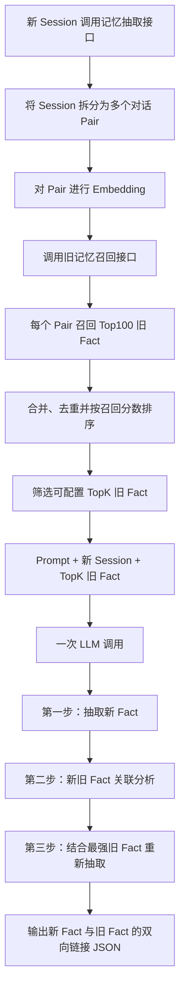

# 单次 LLM 调用的新旧记忆区分与关联方案

> 版本：v2（精简版）
>
> 核心约束：一次 LLM 调用、旧记忆 Top100 召回、可配置 TopK 输入、每条新记忆只关联一条最强旧记忆、前后向字段均为单值。

## 1. 解决的问题：区分新旧记忆

新 Session 写入长期记忆时，需要先抽取新事实，再判断这些新事实和已有旧记忆之间的关系。

需要解决的核心问题包括：

- 新 Session 中哪些内容值得形成新记忆；
- 新事实是否和旧事实重复、相关、可合并、替代或冲突；
- 当存在多条相似旧记忆时，哪一条与新事实关联最强；
- 如何利用强关联旧事实补全新 Session 中的指代和上下文，再得到更准确的新事实；
- 如何建立新旧事实的双向关联，同时不覆盖旧事实正文。

本方案将每条新事实最多关联一条旧事实：

```text
旧事实 --forward_linked_new_fact_id--> 新事实
旧事实 <--backward_linked_old_fact_id-- 新事实
```

两个链接字段都是可空的单值字段，不使用数组。找不到足够强的关联时，新事实的后向链接为空，旧事实也不增加前向链接。

## 2. 具体方案

### 2.1 Mem0 Dream 的基本做法

Mem0 Dream 的核心思路不是直接覆盖旧记忆，而是在新增事实时管理新旧事实的关系：

- `Supersede`：新事实代表更新后的状态，保留旧事实，并将旧事实标记为已被新事实取代；
- `Merge`：对重复或高度重合的事实进行合并；
- `Synthesis`：从多条记忆中生成更高层的总结性记忆。

Dream 保留历史事实，再通过生命周期状态和链接区分当前事实与历史事实。其服务端具体召回数量、Prompt 和关系判断实现没有公开，因此这里只借鉴“新增事实、保留历史、建立关系”的思路，不复刻其内部实现。

参考：[Mem0 Dream](https://docs.mem0.ai/platform/features/dream)、[Mem0 新版记忆算法迁移说明](https://docs.mem0.ai/migration/platform-v2-to-v3)。

### 2.2 我们的主要流程



流程分为三个阶段。

#### 召回阶段

1. 新 Session 进入记忆抽取接口；
2. 按对话轮次拆分为多个 Pair；
3. 对 Pair 进行 Embedding，并调用已有记忆查询接口；
4. 查询接口结合语义向量、BM25 和实体信号进行三路加权召回；
5. 先召回 Top100 旧 Fact，再合并、去重并按融合分数排序；
6. 从 Top100 中截取 TopK 作为 LLM 候选池，`top_k` 是可调配置。

```yaml
related_memory_top_k: 20
```

TopK 越大，旧事实覆盖率越高，但 Prompt 更长、噪声也更多；TopK 越小，成本更低，但可能漏掉正确关联。默认值需要通过数据评测确定。

#### 单次 LLM 处理阶段

LLM 在一次调用中按照 Prompt 引导依次完成：

1. **第一次抽取**：仅根据记忆抽取 Prompt 和新 Session 抽取新 Fact；
2. **关联分析**：将每条新 Fact 与 TopK 旧 Fact 比较，判断关系，并只选择关联最强的一条旧 Fact；如果都不满足关联条件，则不建立链接；
3. **重新抽取**：使用新 Session、记忆抽取 Prompt以及选出的强关联旧 Fact，再次检查和抽取，补全明确指代、上下文与时间信息，得到最终新 Fact。

这里的“第一次抽取、关联分析、重新抽取”都是同一次 LLM 请求内部的处理步骤，不会再次调用 LLM。

#### 写入阶段

LLM 输出的是一条逻辑关系，后端将其写成两个方向：

```text
旧 Fact.forward_linked_new_fact_id = 新 Fact ID
新 Fact.backward_linked_old_fact_id = 旧 Fact ID
```

旧 Fact 的正文不更新，只增加前向链接；新 Fact 正常写入，并保存后向链接。两个链接字段都只保存一个 ID。

## 3. LLM 输入、Prompt 和输出

### 3.1 LLM 输入

一次 LLM 调用包含三类输入：

```text
Prompt
+ 新 Session 原始对话
+ TopK 召回旧 Fact
```

旧 Fact 至少包含：

```json
{
  "old_fact_id": "O1",
  "fact": "用户目前居住在上海",
  "score": 0.91
}
```

召回分数只用于提供候选顺序，不直接等于最终关联结论。LLM 仍需根据事实主体、内容和时间判断最强关联。

### 3.2 Prompt 的组成

完整 Prompt 包含四部分：

1. **引导思维链**：规定模型按照“第一次抽取 → 关联判断 → 结合旧事实重新抽取 → 输出”的顺序处理；
2. **记忆抽取 Prompt**：定义什么内容应该被抽取为长期记忆；
3. **关联判断规则**：指导模型识别重复、相关、可合并、替代和冲突，并要求每条新 Fact 最多选择一条最强关联旧 Fact；
4. **输出格式**：约束模型只输出合法 JSON，不输出分析过程。

本文只定义 Prompt 的结构，不展开每部分的具体措辞和示例。

### 3.3 JSON 输出

推荐输出结构：

```json
{
  "new_facts": [
    {
      "new_fact_id": "N1",
      "fact": "用户计划于 2026 年 9 月从上海搬到杭州",
      "backward_linked_old_fact_id": "O1",
      "relation_type": "SUPERSEDES"
    }
  ],
  "old_fact_links": [
    {
      "old_fact_id": "O1",
      "fact": "用户目前居住在上海",
      "forward_linked_new_fact_id": "N1",
      "relation_type": "SUPERSEDED_BY"
    }
  ]
}
```

其中：

- `new_fact_id` 可以是 LLM 本次输出的临时 ID，落库时由后端映射为真实 ID；
- `backward_linked_old_fact_id` 表示新 Fact 关联的唯一旧 Fact；
- `forward_linked_new_fact_id` 表示旧 Fact 关联的唯一新 Fact；
- 没有强关联旧 Fact 时，`backward_linked_old_fact_id` 为 `null`，同时不输出对应的 `old_fact_links`；
- 后端根据同一条逻辑关系原子写入前向和后向字段，避免两个方向不一致；
- 旧 Fact 正文保持不变，只更新前向链接字段。
