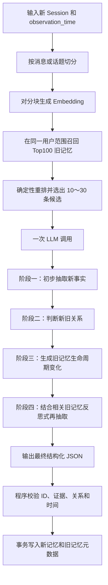

# 单次 LLM 调用的新旧记忆更新与关联方案

> 状态：方案初稿
>
> 日期：2026-08-14
>
> 范围：本文只描述“单次 LLM 调用”版本，不展开两次 LLM 调用方案。

## 1. 目标

在灌入一个新 Session 时，通过一次 LLM 调用同时完成：

1. 从新 Session 中抽取新的事实记忆；
2. 判断新事实与召回旧记忆之间的关系；
3. 识别重复、补充、合并、状态变化和冲突；
4. 利用强关联旧记忆加强对新 Session 的理解，并在同一次调用中反思式再抽取；
5. 输出最终新记忆、关联的旧记忆 ID，以及旧记忆的生命周期变化；
6. 保留旧记忆正文，通过 `replaced_by` 等元数据表达版本变化。

核心思想是：

```text
先广召回旧记忆，再让一个 LLM 请求完成抽取、对齐、消歧和最终写入决策。
```

这里的“再次抽取”是同一个 LLM 请求中的内部处理阶段，不会发起第二次模型调用。

## 2. 设计原则

### 2.1 单次 LLM 调用

系统可以在调用前后执行切分、Embedding、检索、重排、字段校验和数据库事务，但抽取与关系推理只调用一次 LLM。

### 2.2 新事实追加写入

新事实生成新的 memory ID，不通过覆盖旧事实正文来表达状态变化。

### 2.3 旧事实正文保持不变

旧记忆的原始文本和来源证据不修改，只允许更新生命周期元数据，例如：

```json
{
  "lifecycle_state": "superseded",
  "replaced_by": "new-memory-id",
  "valid_to": "2026-07"
}
```

### 2.4 一对一主链接

第一版将每条新记忆最多关联一条旧记忆，并要求记忆尽量原子化：

```text
一条记忆 = 一个主体 + 一个事实槽位 + 一个主要事实
```

新记忆使用 `linked_old_id`，旧记忆使用 `replaced_by` 或 `linked_new_id`。字段使用标量，不使用数组。

### 2.5 关联与替代分开

语义相关不等于冲突或替代。系统必须输出明确的关系类型，不能只输出“强关联”。

## 3. 总体流程



## 4. 调用前处理

### 4.1 输入

一次写入至少包含：

```json
{
  "scope": {
    "tenant_id": "tenant-1",
    "user_id": "user-1"
  },
  "observation_time": "2026-08-14T10:00:00+08:00",
  "messages": [
    {
      "id": "msg-18",
      "role": "user",
      "content": "我上个月从上海搬到杭州了，现在上班近多了。"
    }
  ]
}
```

`observation_time` 是解析“昨天”“上个月”“最近”等相对时间的唯一锚点，不能使用后台实际处理时间替代。

### 4.2 Session 切分

优先按以下边界切分：

1. 消息边界；
2. 明显的话题切换；
3. 长消息中的语义段落；
4. 超长内容才使用固定 token 窗口，并保留重叠区域。

每个分块保留：

```json
{
  "chunk_id": "chunk-1",
  "message_ids": ["msg-18"],
  "text": "我上个月从上海搬到杭州了，现在上班近多了。"
}
```

### 4.3 Top100 旧记忆召回

在相同 tenant、user、agent 或其他业务 scope 内召回，禁止跨用户建立关系。

Top100 是高召回候选池，建议由以下信号组成：

```text
向量语义召回
+ BM25/关键词召回
+ 相同实体召回
+ 最近记忆召回
+ 已有 state_key 精确匹配（如果存在）
```

如果第一版只有向量库，可以先对每个 Session 分块分别召回，再合并去重到 Top100，避免整段 Session 的主话题掩盖次要事实。

### 4.4 从 Top100 压缩到 10～30 条

Top100 不直接全部交给 LLM。调用前通过关联分数、规则或轻量 reranker 选出 10～30 条。

候选分数用于判断“是否值得交给 LLM 比较”，不用于直接判断冲突：

```text
candidate_score =
    semantic_score
  + keyword_score
  + entity_match_boost
  + state_key_match_boost
  + recency_boost
```

不同召回通道的原始分数不可比时，优先使用 RRF；如果使用加权和，应先把各通道分数归一化。

候选选择规则：

- 精确命中相同 `state_key` 的 active 记忆必须保留；
- 相同主体和 predicate 的旧记忆优先；
- 尽量覆盖 Session 中的多个话题，不能让单一主话题占满全部候选；
- 低于最低相关阈值的候选可以删除；
- 最终候选携带短 ID，降低模型伪造 UUID 的概率。

示例：

```json
{
  "candidate_old_memories": [
    {
      "candidate_id": "O1",
      "memory_id": "7d8c-old-memory-id",
      "text": "用户目前居住在上海",
      "created_at": "2024-05-10T12:00:00Z",
      "lifecycle_state": "active",
      "retrieval_score": 0.91
    }
  ]
}
```

`retrieval_score` 只供候选排序参考，不应直接传递为 `SUPERSEDE` 的置信度。

## 5. 单次 LLM 调用的内部阶段

模型可以按照下列阶段进行内部推理，但最终只返回结构化 JSON，不输出完整思维链。

### 5.1 阶段一：从新 Session 初步抽取事实

第一遍只根据新 Session 抽取候选事实，不允许从旧记忆凭空生成新事实。

候选事实至少包括：

```json
{
  "draft_id": "N1",
  "text": "用户于2026年7月从上海搬到杭州",
  "subject": "user",
  "predicate": "residence.city",
  "object": "Hangzhou",
  "memory_kind": "STATE",
  "state_key": "user:residence.city",
  "cardinality": "single",
  "valid_from": "2026-07",
  "source_message_ids": ["msg-18"]
}
```

推荐的 `memory_kind`：

| 类型 | 示例 | 默认行为 |
| --- | --- | --- |
| `STATE` | 当前地址、职位、订阅状态 | 可能替代旧状态 |
| `PREFERENCE` | 饮食、工具、风格偏好 | 可并存，也可能发生转变 |
| `RELATIONSHIP` | 婚姻、汇报关系 | 可能带有效时间 |
| `PLAN` | 出行计划、项目计划 | 可能替换、取消或并存 |
| `EVENT` | 旅行、会议、完成任务 | 通常追加，不替代旧事件 |
| `PROFILE` | 姓名、生日 | 冲突时更可能是纠错 |
| `KNOWLEDGE` | 项目约定、业务规则 | 需要来源和版本 |

### 5.2 阶段二：判断新旧记忆关系

对每条候选新事实，从输入的旧记忆中选择零条或一条主关联记忆。

关系集合：

| Action | 含义 | 写入行为 |
| --- | --- | --- |
| `ADD` | 新的独立事实 | 新增 active 记忆，不链接旧记忆 |
| `LINK` | 互补或后续事实 | 新增 active 记忆，建立一对一弱链接 |
| `NOOP` | 语义等价且没有新增信息 | 不新增事实 |
| `MERGE` | 新事实是同一事实的更完整表达 | 新增 canonical 版本，旧记忆标记 merged |
| `SUPERSEDE` | 同一单值状态自然变化 | 新增 active 版本，旧记忆标记 superseded |
| `RETRACT` | 新 Session 明确指出旧事实从未成立 | 旧记忆标记 retracted，按需新增正确事实 |
| `DISPUTE` | 存在冲突但证据不足 | 两条保留，不自动选择当前真相 |

关系判断需要同时检查：

1. 主体是否相同；
2. 是否描述同一个事实槽位；
3. 槽位是单值还是多值；
4. 两个事实能否在同一时间同时成立；
5. 新 Session 表达的是状态变化、补充还是纠错；
6. 是否存在明确时间证据。

几个关键例子：

```text
旧：用户喜欢咖啡
新：用户也喜欢茶
→ ADD 或 LINK，不是 SUPERSEDE
```

```text
旧：用户目前住在上海
新：用户于2026年7月搬到杭州
→ SUPERSEDE
```

```text
旧：用户住过上海
新：用户现在住在杭州
→ 可以 LINK，但不能把历史事件判断成错误
```

```text
旧：用户曾经住在上海
新：你记错了，我从来没有住过上海
→ RETRACT
```

### 5.3 阶段三：生成旧记忆生命周期变化

旧记忆正文保持不变，只输出元数据变化。

`SUPERSEDE` 示例：

```json
{
  "old_memory_id": "O1",
  "new_lifecycle_state": "superseded",
  "replaced_by": "N1",
  "valid_to": "2026-07",
  "relation_confidence": 0.96,
  "reason_code": "SAME_SINGLE_VALUE_STATE_CHANGED"
}
```

只有新 Session 明确提供变化时间时才能设置 `valid_to`。如果只知道新事实在当前 Session 被观察到，应保留：

```json
{
  "valid_to": null,
  "observed_at": "2026-08-14T10:00:00+08:00"
}
```

不能因为旧记忆创建于某天，就推断事实从那天开始成立。

### 5.4 阶段四：结合相关旧记忆反思式再抽取

模型回看：

- 原始新 Session；
- 阶段一抽取的候选事实；
- 阶段二选中的主关联旧记忆；
- 已判断的关系类型。

这一阶段用于：

1. 解析代词和省略主体；
2. 补全明确表达的状态转移；
3. 修正第一遍抽取遗漏的时间、原因和上下文；
4. 去除重复候选；
5. 将复合记忆拆成原子记忆，以满足一对一链接约束。

严格证据规则：

```text
旧记忆只能帮助理解新 Session，不能成为最终新事实的唯一证据。
```

最终新记忆必须携带新 Session 中的 `source_message_ids`。如果某个细节只能在旧记忆中找到，而新 Session 没有明确引用该细节，则不能把它写入最终新事实。

## 6. LLM 输入结构

```json
{
  "observation_time": "2026-08-14T10:00:00+08:00",
  "scope": {
    "user_id": "user-1"
  },
  "new_session": [
    {
      "id": "msg-18",
      "role": "user",
      "content": "我上个月从上海搬到杭州了，现在上班近多了。"
    }
  ],
  "candidate_old_memories": [
    {
      "candidate_id": "O1",
      "text": "用户目前居住在上海",
      "created_at": "2024-05-10T12:00:00Z",
      "lifecycle_state": "active"
    }
  ]
}
```

真实 UUID 不一定需要直接交给模型。后端维护：

```json
{
  "O1": "7d8c-old-memory-id"
}
```

模型只能引用候选列表中的短 ID，后端再映射回真实 memory ID。

## 7. LLM 输出结构

推荐输出：

```json
{
  "new_memories": [
    {
      "temp_id": "N1",
      "text": "用户于2026年7月从上海搬到杭州，搬家后上班距离更近",
      "memory_kind": "STATE",
      "state_key": "user:residence.city",
      "cardinality": "single",
      "valid_from": "2026-07",
      "observed_at": "2026-08-14T10:00:00+08:00",
      "source_message_ids": ["msg-18"],
      "action": "SUPERSEDE",
      "linked_old_id": "O1",
      "relation_confidence": 0.96,
      "reason_code": "SAME_SINGLE_VALUE_STATE_CHANGED"
    }
  ],
  "old_memory_updates": [
    {
      "old_memory_id": "O1",
      "new_lifecycle_state": "superseded",
      "replaced_by": "N1",
      "valid_to": "2026-07"
    }
  ],
  "noops": []
}
```

### 7.1 一对一约束

输出必须满足：

- `linked_old_id` 为 `null` 或单个字符串；
- 一个 `temp_id` 最多对应一个 `old_memory_id`；
- 同一次写入中，一个旧记忆不能同时被多个新记忆替代；
- 如果一个复合新事实对应多个旧记忆，先把新事实拆成多条原子记忆；
- 如果仍无法拆分，输出 `DISPUTE`，不能随意丢弃次要关系。

### 7.2 `replaced_by` 方向

方向固定为：

```text
旧记忆.replaced_by = 新记忆 ID
```

不要同时混用相反语义。如果需要从新版本回溯旧版本，新记忆可以保存：

```json
{
  "predecessor_id": "old-memory-id"
}
```

`predecessor_id` 可以由后端根据 `linked_old_id` 自动生成，不必要求模型重复输出。

## 8. 调用后校验与事务写入

LLM 只生成写入计划，后端必须校验后才能落库。

### 8.1 必要校验

1. 所有 `linked_old_id` 必须来自候选列表；
2. 所有 `source_message_ids` 必须来自新 Session；
3. 新旧记忆必须属于相同业务 scope；
4. `SUPERSEDE` 只能应用于可演化状态，不能随意替代独立事件；
5. 单值槽位才能默认使用 `SUPERSEDE`；
6. `replaced_by` 必须指向本批次真实写入成功的新 memory ID；
7. 时间只能来自 Session 明示信息或 `observation_time` 的确定性解析；
8. 不允许覆盖旧记忆正文；
9. 低置信度关系不能自动改变旧记忆生命周期。

### 8.2 建议置信度策略

阈值需要通过数据集校准，第一版可以采用保守起点：

```text
confidence >= 0.90：允许自动 SUPERSEDE / MERGE / RETRACT
0.65 <= confidence < 0.90：保留两者，标记 DISPUTE 或待审核
confidence < 0.65：按 ADD 或无链接处理
```

置信度来自 LLM 的 `relation_confidence`，不能直接使用向量检索分数代替。

### 8.3 事务步骤

```text
BEGIN
  1. 为通过校验的新记忆分配真实 UUID
  2. 把 N1 等临时 ID 映射为真实 UUID
  3. 插入新记忆、Embedding 和来源证据
  4. 更新旧记忆 lifecycle_state / replaced_by / valid_to
  5. 写入关系和审计记录
COMMIT
```

任意步骤失败时整体回滚，避免出现“新记忆已写入，但旧记忆没有被标记”或相反情况。

并发更新同一 `state_key` 时，需要使用行锁、版本号或乐观锁，保证最终只有一个 active 当前版本。

## 9. 数据模型

第一版可以使用单表和一对一字段：

```sql
memory (
  memory_id          uuid primary key,
  tenant_id          text not null,
  user_id            text not null,
  text               text not null,

  memory_kind        text,
  state_key          text,
  cardinality        text,

  observed_at        timestamptz,
  valid_from         timestamptz,
  valid_to           timestamptz,
  created_at         timestamptz not null,

  lifecycle_state    text not null,
  predecessor_id     uuid,
  replaced_by        uuid,

  source_message_ids jsonb not null,
  relation_type      text,
  relation_confidence float,
  reason_code        text,
  resolver_version   text,
  metadata           jsonb
)
```

推荐生命周期状态：

```text
active
superseded
merged
retracted
disputed
expired
```

对于第一版，如果希望进一步缩小实现范围，可以只支持：

```text
active
superseded
disputed
```

## 10. 读取语义

写入时建立版本关系后，读取必须区分当前视图和历史视图。

### 10.1 当前事实视图

用于回答“现在”“目前”“当前偏好”等问题：

```sql
WHERE lifecycle_state = 'active'
```

默认不把 superseded、merged 和 retracted 记忆放入回答上下文。

### 10.2 历史视图

用于回答“以前”“当时”“如何变化”等问题：

```text
沿 predecessor_id / replaced_by 读取完整版本链
```

例如：

```text
上海 A → 杭州 B → 北京 C
```

当前问题返回 C，历史问题可以返回 A、B、C 及各自时间。

## 11. 与 Mem0 的关系

### 11.1 与旧版 Mem0 的区别

旧版 Mem0 使用两次 LLM 调用：先抽取事实，再决定 `ADD / UPDATE / DELETE / NONE`。本方案只调用一次 LLM，并避免通过覆盖或删除旧事实来解决冲突。

### 11.2 与当前 Mem0 OSS ADD-only 的区别

当前 Mem0 OSS 的方向是：

```text
召回相关旧记忆
→ 单次 LLM ADD-only 抽取
→ 新事实追加写入
```

本方案在此基础上增加：

- 显式的新旧事实关系分类；
- `SUPERSEDE / MERGE / RETRACT / DISPUTE`；
- 一对一版本链；
- `replaced_by` 生命周期元数据；
- 同一次调用中的反思式再抽取；
- 当前视图和历史视图。

### 11.3 与 Mem0 Platform Dream 的关系

本方案与 Dream 的 Supersede/Merge 思路相近，都是保留旧事实并维护版本关系。区别是本方案明确规定候选召回、关系输出、证据、时间字段、一对一约束和事务校验，不依赖未公开的服务端实现。

## 12. 可行性与主要风险

### 12.1 可行性

该方案工程上可行，优势是：

- 只有一次 LLM 网络调用，延迟和成本较低；
- 抽取和关系判断共享上下文；
- 可以一次性输出完整写入计划；
- 保留旧事实，支持历史问答；
- 关系与原因可审计。

### 12.2 主要风险

#### 注意力稀释

候选旧记忆过多时，模型可能漏掉真正相关的记忆。因此 Top100 只作为候选池，最终输入控制在 10～30 条。

#### 错误耦合

初步抽取错误会继续影响关系判断和最终抽取。需要通过来源证据、结构化字段和调用后校验降低影响。

#### 自我确认偏差

同一个模型在同一次请求中进行初步抽取和反思，可能重复确认自己的错误。Prompt 应明确要求重新核对原始消息，而不是只审查阶段一结果。

#### 旧记忆污染

模型可能把旧记忆内容错误地写成新 Session 的新事实。必须要求最终新记忆携带新消息证据。

#### 时间幻觉

模型可能根据旧记忆创建时间推断事实有效时间。后端必须禁止把 `created_at` 自动当作 `valid_from`。

#### 一对一约束的信息损失

真实世界存在一对多和多对一关系。第一版通过原子化拆分解决；无法拆分时应保守输出 `DISPUTE`，后续再考虑关系表。

## 13. 评测建议

至少评估以下指标：

| 指标 | 说明 |
| --- | --- |
| 新事实抽取 Precision/Recall | 是否准确、完整地抽取 Session 信息 |
| 主链接 Precision/Recall | `linked_old_id` 是否正确 |
| 关系分类 F1 | ADD、MERGE、SUPERSEDE 等动作是否正确 |
| 当前状态准确率 | 是否能回答用户当前事实 |
| 历史状态准确率 | 是否保留并正确使用旧事实 |
| 时间解析准确率 | valid_from/valid_to 是否有证据且正确 |
| 旧事实污染率 | 当前问题是否错误引用 superseded 事实 |
| 新事实污染率 | 是否把旧记忆内容伪装成新 Session 新信息 |
| 写入延迟 | Embedding、召回、LLM、持久化总耗时 |
| 单 Session Token 成本 | 输入旧记忆和输出写入计划的成本 |

建议与以下基线比较：

```text
Baseline A：无旧记忆上下文，仅抽取新事实
Baseline B：Mem0 OSS 单次 ADD-only
Experiment：本文单次调用 + 关系判断 + 生命周期更新
```

## 14. 第一版实现范围

为了快速验证，可以将 MVP 限制为：

1. Top100 向量候选池；
2. 规则或 reranker 压缩到最多 20 条；
3. 一次 LLM 输出新记忆和写入计划；
4. 每条新记忆最多关联一条旧记忆；
5. 只支持 `ADD / NOOP / SUPERSEDE / DISPUTE`；
6. 旧正文不可变；
7. 旧记忆增加 `lifecycle_state` 和 `replaced_by`；
8. 当前问题只召回 active 记忆；
9. 所有自动 Supersede 必须高置信度且保留审计记录。

在 MVP 验证关系分类和下游问答收益后，再增加 `MERGE`、`RETRACT`、完整时间区间以及多对多关系表。

## 15. 总结

本方案保持一次 LLM 调用，同时把一次记忆写入扩展为：

```text
新 Session 切分与召回
→ Top100 候选池
→ 压缩到 10～30 条旧记忆
→ 单次 LLM 内部完成初步抽取
→ 新旧关系判断
→ 旧记忆生命周期规划
→ 结合关联旧记忆反思式再抽取
→ 输出新记忆和一对一版本链接
→ 后端校验并事务写入
```

它不是简单覆盖旧记忆，而是通过“不可变事实正文 + `replaced_by` 版本链 + 当前/历史双视图”表达用户状态随时间的变化。
