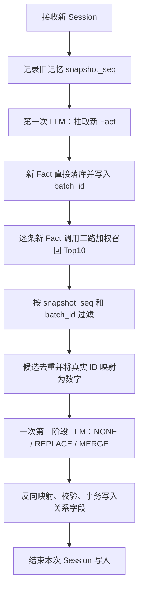

# 同步与异步记忆关联判断调研

> 时间：2026-08
>
> 适用范围：两阶段 LLM 新旧记忆关联更新方案 v3

## 1. 问题与结论

记忆系统完成新 Fact 抽取后，还需要判断新旧 Fact 之间是否属于：

- `NONE`：没有需要处理的关系；
- `REPLACE`：旧 Fact 被新 Fact 取代；
- `MERGE`：新旧 Fact 可以生成一条更完整的合并 Fact。

这里的核心问题不是“是否使用第二次 LLM”，而是第二次关联判断在什么时候执行：

- **同步关联判断**：新 Session 的新 Fact 落库后，立即完成召回、LLM 判断和关系字段写入，再结束本次写入流程；
- **异步关联判断**：新 Fact 先落库并返回，后台任务稍后再召回旧 Fact、判断关系并写入结果。

当前阶段建议采用同步方案，但以 Session 为单位只调用一次第二阶段 LLM，而不是每条新 Fact 单独调用一次。异步方案暂时只作为后续的链路修复和低风险整理能力。

主要原因是：`REPLACE` 和 `MERGE` 会改变后续召回看到的有效记忆集合，属于一致性敏感操作。同步完成关系写入，可以避免用户在新 Fact 已写入、旧 Fact 尚未失效的时间窗口内同时召回新旧结论。

## 2. 开源项目采用的时机

开源项目通常没有统一的 `merge` 字段，也没有统一的触发时机。实际实现大致分为“写入时在线整理”和“会话后或周期性整理”两类。

| 项目 | 触发时机 | 处理方式 | 类型 |
|---|---|---|---|
| A-MEM | 每次新增 Memory 时 | 召回 Top5 邻居，由 LLM 判断 `strengthen` 或 `update_neighbor` | 在线同步演化 |
| Graphiti | 每次写入 Episode 时 | 解析实体和事实边，同时处理重复事实和旧边失效 | 在线更新 |
| LangMem | 调用 Memory Manager 时 | 对已有 Memory 执行 insert、update、delete | 可同步，也可由应用放到后台 |
| Mem0 Dream | 手动或定期运行 Dream | 扫描全部记忆，处理重复、冲突和过期记录 | 异步批处理 |
| Hippo | Session 结束或定时执行 `hippo sleep` | 聚类重复 Episode，生成 Semantic Memory，降低来源记忆权重 | 异步巩固 |
| LycheeMemory | 回答完成后启动后台 ConsolidatorAgent | 抽取 MemoryRecord，再进行向量聚类和 CompositeRecord 构建 | 近实时异步 |

### 2.1 在线处理方案

A-MEM 在新增 Memory 时调用 `process_memory`，使用新记忆召回 5 条近邻，然后由 LLM 判断是否增强链接或更新邻居。它把关系演化放在写入路径中，优点是新关系立即可用，缺点是写入延迟和 LLM 成本会直接暴露给调用方。[A-MEM 源码](https://github.com/agiresearch/A-mem/blob/main/agentic_memory/memory_system.py)

Graphiti 的 `add_episode` 会在单次 Episode 写入过程中完成实体解析、关系解析、去重和旧关系失效。它使用 `reference_time`、`valid_at`、`invalid_at` 等时间字段表达事实的有效区间，从数据模型上降低乱序写入造成的方向错误。[Graphiti 写入流程](https://github.com/getzep/graphiti/blob/main/graphiti_core/graphiti.py) [Graphiti EntityEdge](https://github.com/getzep/graphiti/blob/main/graphiti_core/edges.py)

LangMem 的 Memory Manager 接收新消息和已有 Memory，在一次处理过程中返回插入、更新和删除结果。框架允许应用把 Manager 放在热路径或后台任务中，但单次 Manager 调用内部仍以同一批已有记忆作为判断上下文。[LangMem extraction.py](https://github.com/langchain-ai/langmem/blob/main/src/langmem/knowledge/extraction.py)

### 2.2 异步巩固方案

Mem0 Dream 会获取项目全部记忆，批量寻找近似重复、冲突和过期记录，再删除来源记忆并新增合并结果。它更像周期性维护任务，不承担新 Fact 写入后的立即一致性。[Mem0 Dream](https://github.com/mem0ai/mem0/blob/main/integrations/mem0-plugin/skills/dream/SKILL.md)

Hippo 在 Session 结束或定时执行 `hippo sleep`。三条及以上相关 episodic memories 可以压缩成一条 semantic memory，来源记忆不会立刻删除，而是缩短半衰期并逐步退出召回。这种设计适合重复模式沉淀，不适合要求立即生效的用户状态更新。[Hippo MemoryEntry](https://github.com/kitfunso/hippo-memory/blob/master/src/memory.ts) [Hippo consolidation](https://github.com/kitfunso/hippo-memory/blob/master/src/consolidate.ts)

LycheeMemory 在回答结束后通过后台任务执行语义记忆抽取和 Record Fusion。它使用 `source_record_ids` 和 `child_composite_ids` 保存 CompositeRecord 的来源和层级，适合后台构建复合记忆树。[LycheeMemory](https://github.com/LycheeMem/LycheeMem)

开源实现呈现出的共同规律是：

- 用户状态更新、事实失效等正确性敏感操作，更倾向在写入时完成；
- 去重、压缩、模式总结和层级构建，更适合会话后或周期性异步执行；
- 异步任务如果会修改有效事实，通常需要时间字段、来源链路、软删除或版本控制配合。

## 3. 同步与异步方案对比

| 维度 | 同步关联判断 | 异步关联判断 |
|---|---|---|
| 写入延迟 | 较高，需要等待召回和第二次 LLM | 较低，新 Fact 落库后即可返回 |
| 首次召回一致性 | 高，返回前关系已经写完 | 存在新旧 Fact 同时有效的窗口 |
| 时间方向 | 容易保证，新 Fact 只和当时存在的旧 Fact 比较 | 后台执行时可能召回比目标 Fact 更新的记忆 |
| 并发处理 | 可在 Session 写入事务内控制 | 需要快照、版本校验和幂等任务 |
| 失败处理 | 新 Fact 保留，第二阶段可按原快照重试 | 需要任务状态、重试队列和死信处理 |
| LLM 成本 | 每个 Session 固定增加一次调用 | 可以攒批，但单次输入和误关联范围更大 |
| `REPLACE` 适用性 | 高 | 如果没有时间快照，风险较高 |
| `MERGE` 适用性 | 适合小范围强约束合并 | 适合低峰期深度整理，但需要严格版本控制 |
| 系统复杂度 | 中等 | 较高，需要额外任务和一致性基础设施 |

同步方案的主要代价是延迟。假设第一阶段抽取耗时为 `T1`，召回耗时为 `Tr`，第二阶段 LLM 耗时为 `T2`，则写入总耗时约为：

```text
T_total = T1 + Tr + T2 + T_write
```

异步方案可以让前台耗时接近 `T1 + T_write`，但省下的是用户等待时间，不是总计算成本。关联判断仍然要执行，同时新增了任务队列、快照、重试、并发控制和可观测性成本。

## 4. 异步方案中的“新旧倒挂”问题

异步处理最重要的问题是：后台任务执行时，记忆库可能已经出现了比目标新 Fact 更新的记忆。

例如：

```text
T1：写入 N1 = “用户居住在杭州”
T2：写入 N2 = “用户已经搬到北京”
T3：后台开始处理 N1 的关联任务
```

如果 N1 在 T3 直接调用当前记忆召回接口，Top10 很可能包含 N2。LLM 可能错误地判断：

```text
N1 replaced N2
```

正确方向应该是：

```text
N2 replaced N1
```

这不是通过 Prompt 就能稳定解决的问题，因为候选池本身违反了“旧 Fact 必须早于新 Fact”的前提。

### 4.1 推荐的快照召回

在新 Session 开始写入前，记录该用户记忆空间的高水位：

```text
snapshot_seq = 当前最大 ingest_seq
```

第一阶段完成新 Fact 落库后，第二阶段召回增加过滤条件：

```text
candidate.ingest_seq <= snapshot_seq
candidate.ingestion_batch_id != current_batch_id
```

这样无论第二阶段立即执行还是延迟执行，它看到的“旧记忆集合”都保持不变。N1 之后写入的 N2 不会进入 N1 的候选池；处理 N2 时，N1 会作为旧记忆进入 N2 的候选池，关系方向自然正确。

如果系统允许历史 Session 延迟补录，还需要同时区分：

- `event_time`：事实在会话中实际发生或被表达的时间；
- `created_at`：Fact 写入数据库的时间；
- `ingest_seq`：同一记忆空间内单调递增的写入序号。

通常使用 `(event_time, ingest_seq, fact_id)` 形成稳定顺序；无法可靠获取 `event_time` 时，以写入前捕获的 `snapshot_seq` 作为最低成本方案。

`snapshot_seq` 和任务执行状态可以保存在独立的 `relation_jobs` 表中，不需要继续给 Fact 增加关系字段。

## 5. 当前推荐的同步方案

当前 V3 建议采用“同步 Session 级关联判断”：



### 5.1 LLM 调用次数

假设一个 Session 抽取出 N 条新 Fact：

- 召回接口调用 N 次，每条新 Fact 获取 Top10；
- 相同旧 Fact 在后端去重；
- 第二阶段 LLM 只调用一次，同时接收全部新 Fact 及其候选分组；
- LLM 只输出数字候选 ID，后端使用 Map 反向映射真实 ID。

这样既保持同步一致性，也避免退化成“N 条新 Fact 调用 N 次关联 LLM”。

### 5.2 关系写入

第二阶段只允许写入 V3 已定义的三个 Fact 关系字段：

```json
{
  "linked": [],
  "replaced_by": null,
  "merge": {
    "source_ids": [],
    "target_id": null
  }
}
```

- `linked`：保存强关联参与者，不承担生命周期方向；
- `replaced_by`：旧事实指向取代它的新事实；
- `merge.source_ids`：合并结果保存直接来源；
- `merge.target_id`：来源事实指向合并结果。

关联写入需要满足：

1. 同一 Fact 不能同时设置 `replaced_by` 和 `merge.target_id`；
2. 更新前重新读取当前值，使用版本号或 compare-and-set 防止并发覆盖；
3. 所有 ID 必须来自本次新 Fact 集合或对应 Top10 候选；
4. 新合并 Fact、来源指针和 `linked` 必须在同一事务中写入；
5. 重试使用相同 `snapshot_seq`、Prompt 版本和幂等键。

### 5.3 超时和失败

同步不等于第二阶段失败时回滚新 Fact。第一阶段 Fact 已经表达了用户真实输入，应当继续保留。

推荐处理方式：

```text
第一阶段成功 + 第二阶段成功：正常完成
第一阶段成功 + 第二阶段超时：保留新 Fact，按原 snapshot_seq 重试
第二阶段输出非法 ID：拒绝关系写入，记录错误
事务冲突：重新读取关系状态后有限次数重试
```

重试状态放在独立任务表或日志中，避免为了任务调度继续扩展 Fact Schema。

## 6. 后续异步化建议

后续如果同步延迟成为瓶颈，不建议一次性把全部关系判断迁到异步。可以按风险逐步放开：

### 阶段一：影子运行

同步结果正常落库，同时让异步任务只计算不写入，对比两者的：

- `NONE / REPLACE / MERGE` 一致率；
- 候选 Top10 差异；
- 关系方向错误率；
- Merge 误合并率；
- LongMemEval knowledge-update 和 multi-session 得分变化。

### 阶段二：异步链路修复

异步任务只处理低风险操作：

- 补充遗漏的 `linked`；
- 检测疑似重复或 Merge 候选，但不自动写入；
- 检查断链、环路和无效目标；
- 对历史未处理 Fact 使用固定快照补跑。

这一阶段不自动执行 `REPLACE`，也不直接生成新的 canonical Merge Fact。

### 阶段三：受控异步更新

只有在快照召回、幂等任务、版本校验和回滚机制稳定后，才允许异步任务自动写入 `REPLACE` 或 `MERGE`。对于冲突证据不足、时间顺序不确定或涉及多条活跃链路的情况，继续降级为候选建议或人工审核。

## 7. 最终建议

当前采用同步关联判断是合理的，具体形式应为：

```text
一次新 Fact 抽取 LLM
+ 每条新 Fact 一次 Top10 召回
+ 一次 Session 级关系判断 LLM
+ 一次事务关系写入
```

该方案在复杂度可控的前提下，优先保证 `REPLACE` 和 `MERGE` 的时间方向及首次召回一致性。

异步方案真正值得引入的场景是后台查漏补缺、去重整理和深度巩固，而不是立即替代当前同步主链路。未来进行异步化时，最先实现的基础能力应当是写入前快照 `snapshot_seq`，否则“召回到比目标 Fact 更新的记忆”会持续造成关系反转。
