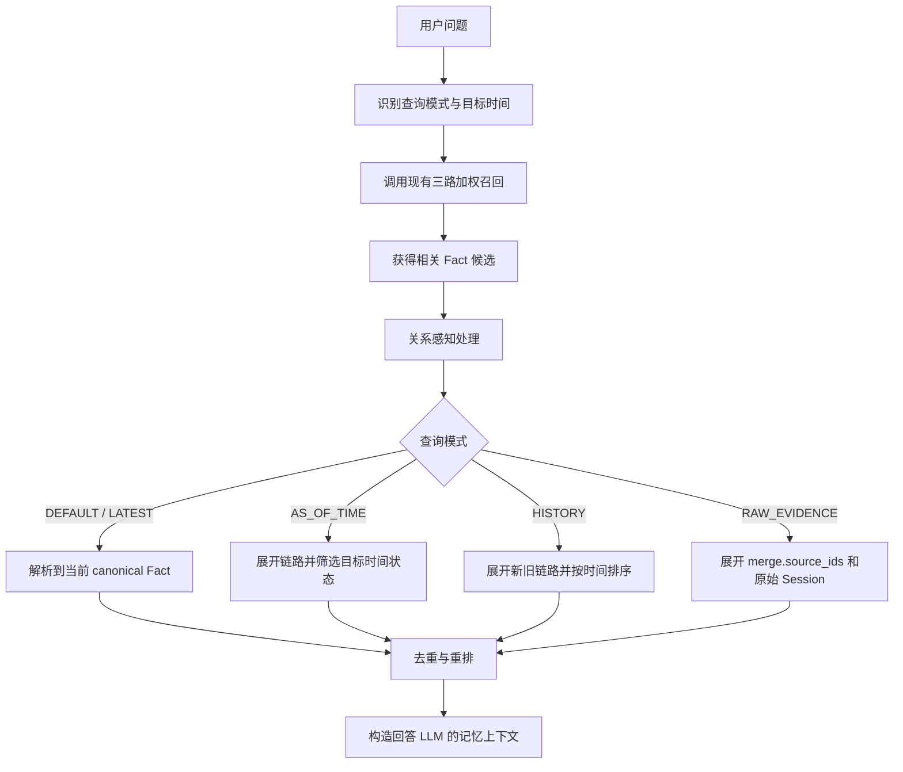

# 记忆关系感知召回方案

> 版本：v1
>
> 目标：在现有三路加权召回之后，利用 `linked`、`replaced_by` 和 `merge` 关系，根据用户问题返回当前事实、指定时间事实、变化历史或原始证据。

## 1. 解决的问题

向量、关键词和其他召回通道只能找出内容相关的 Fact，无法判断这些 Fact 当前是否有效、是否已经被合并，也无法区分用户要的是最新状态还是历史记录。

召回阶段需要解决三件事：

1. 识别用户查询的时间和证据意图；
2. 根据记忆关系折叠或展开召回结果；
3. 避免把重复、失效或不符合时间条件的 Fact 一起交给回答 LLM。

默认原则是：

> 普通问题返回当前有效、信息最完整的 canonical Fact；只有用户明确询问历史、指定时间或原始依据时，才展开旧 Fact 和合并来源。

## 2. 查询模式

| 模式 | 典型问题 | 召回结果 |
|---|---|---|
| `DEFAULT` | “我有什么运动习惯？” | 当前有效的 canonical Fact |
| `LATEST` | “我最新住在哪里？” | 替代链末端的最新 Fact |
| `AS_OF_TIME` | “2024 年我住在哪里？” | 指定时间点当时有效的 Fact |
| `HISTORY` | “我的居住地发生过哪些变化？” | 新旧 Fact 的完整变化链 |
| `RAW_EVIDENCE` | “给我原始记录和依据。” | 合并来源 Fact，必要时继续定位原始 Session |

“指定时间点”和“变化历史”不能混为一类：

- 问“2024 年是什么状态”，只返回 2024 年当时有效的事实；
- 问“这些年发生了什么变化”，才返回全部相关新旧事实。

## 3. 总体流程



查询模式优先使用规则识别，例如“现在”“最新”“曾经”“2024 年”“变化过程”“原始记录”等；规则无法确定时，再由轻量分类模型判断。

## 4. 三类关系的召回规则

| 关系字段 | 默认/最新 | 指定时间 | 历史/原始证据 |
|---|---|---|---|
| `replaced_by` | 沿指针返回替代链末端 | 在链路中选择目标时间当时有效的 Fact | 展开新旧 Fact 并按时间排序 |
| `merge.target_id` | 返回合并结果，隐藏来源 Fact | 展开来源后按目标时间筛选 | 通过合并结果的 `source_ids` 展开来源 |
| `linked` | 默认不展开 | 只补充与目标时间一致的关联 Fact | 用户明确要求或上下文不足时补充 |

合并 Fact 是默认回答层，`source_ids` 指向的 Fact 是证据与审计层。只有来源信息与合并结果完全等价且时间一致时，指定时间查询才可以直接使用合并 Fact。

`linked` 不表示事实有效性和时间方向，进入最终上下文前仍然需要 canonical 解析和时间过滤。

## 5. 关系感知召回算法

### 5.1 候选召回

首先复用现有查询接口进行三路加权召回，得到相关 Fact 候选：

```text
用户问题
→ 三路加权召回
→ TopN Fact 候选
```

这一阶段只负责相关性，不直接决定 Fact 是否有效。

### 5.2 Canonical 解析

对于 `DEFAULT` 和 `LATEST`，每个候选执行：

```text
resolveCanonical(fact):
    while fact.replaced_by != null
       or fact.merge.target_id != null:

        if fact.replaced_by != null:
            fact = load(fact.replaced_by)
        else:
            fact = load(fact.merge.target_id)

        检测环路和最大深度

    return fact
```

同一 Fact 不能同时存在 `replaced_by` 和 `merge.target_id`。多个候选如果最终指向同一 canonical Fact，只保留一次，并继承这些候选中的最高召回分数。

### 5.3 时间解析

时间查询依赖 Fact 已有的时间元数据：

```json
{
  "event_time": "2025-03-01T10:00:00Z",
  "created_at": "2025-03-01T10:00:05Z"
}
```

- `event_time` 表示事实实际发生或在 Session 中被表达的时间；
- `created_at` 表示 Fact 写入数据库的时间；
- 无可靠 `event_time` 时，使用 Session 时间，并在答案中降低时间确定性。

`AS_OF_TIME` 的处理流程是：

1. 展开候选所在的替代链及必要的 Merge 来源；
2. 过滤 `event_time` 晚于目标时间的 Fact；
3. 在同一事实槽位中选择目标时间之前最近的一条；
4. 不返回目标时间之后才成立的新状态。

`HISTORY` 则保留链路中的有效 Fact，并按 `event_time` 排序后交给回答 LLM。

### 5.4 最终重排

关系处理后的 Fact 按以下顺序重排：

1. 是否符合查询模式；
2. 是否符合目标时间；
3. 原始三路召回分数；
4. canonical Fact 优先于被取代或被合并的来源 Fact；
5. 在 `LATEST` 模式下，时间更新的 Fact 优先。

## 6. 给回答 LLM 的输入

召回接口建议将结果区分为回答记忆和证据记忆：

```json
{
  "retrieval_mode": "DEFAULT",
  "answer_memories": [
    {
      "id": "M1",
      "fact": "用户喜欢跑步，通常每周末在西湖跑 5 公里",
      "event_time": "2026-06-01T09:00:00Z",
      "memory_role": "canonical"
    }
  ],
  "evidence_memories": []
}
```

- `answer_memories` 是默认传给回答 LLM 的主要事实；
- `evidence_memories` 只在历史、原始证据或上下文不足时填充；
- 数据库真实 ID 可以继续在进入 LLM 前映射为短数字 ID。

## 7. 一致性约束

召回实现需要满足：

1. 关系遍历必须检测环路并限制最大深度；
2. 指针目标缺失时保留当前 Fact，并记录断链，不继续猜测；
3. `DEFAULT` 和 `LATEST` 不返回已经设置 `replaced_by` 或 `merge.target_id` 的来源 Fact；
4. `AS_OF_TIME` 不直接套用当前 canonical 结果，必须进行时间过滤；
5. `HISTORY` 和 `RAW_EVIDENCE` 展开后必须去重；
6. Merge 结果必须能够追溯到 `source_ids`，否则不能作为唯一证据；
7. linked 扩展不能绕过有效性和时间校验。

## 8. 最终规则

```text
普通问题        → 返回 canonical Fact
最新/当前问题   → 返回替代或合并链末端
指定时间点问题  → 返回该时间点当时有效的 Fact
变化历史问题    → 返回按时间排序的新旧记忆链
原始依据问题    → 展开 Merge 来源和原始 Session
linked          → 只在上下文不足或用户明确要求时补充
```

因此，合并记忆默认用于回答，来源记忆默认隐藏；替代后的旧记忆默认不参与当前答案，但在指定时间、变化历史和证据查询中按需恢复。
